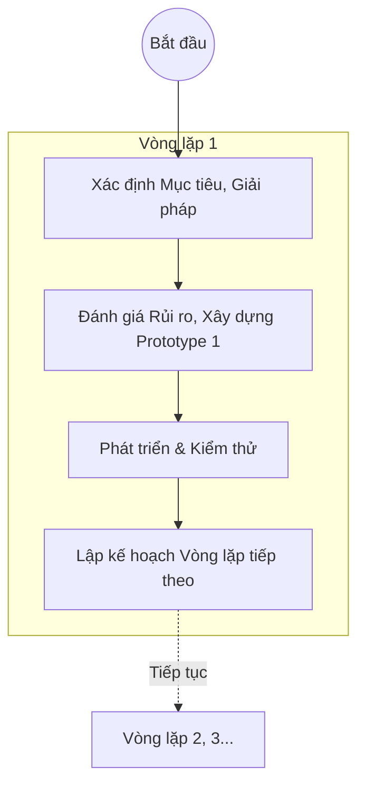
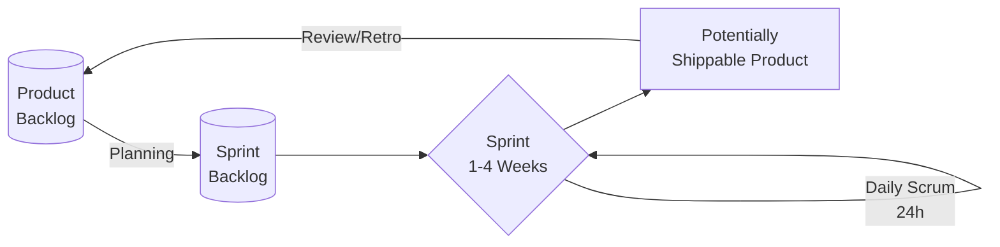
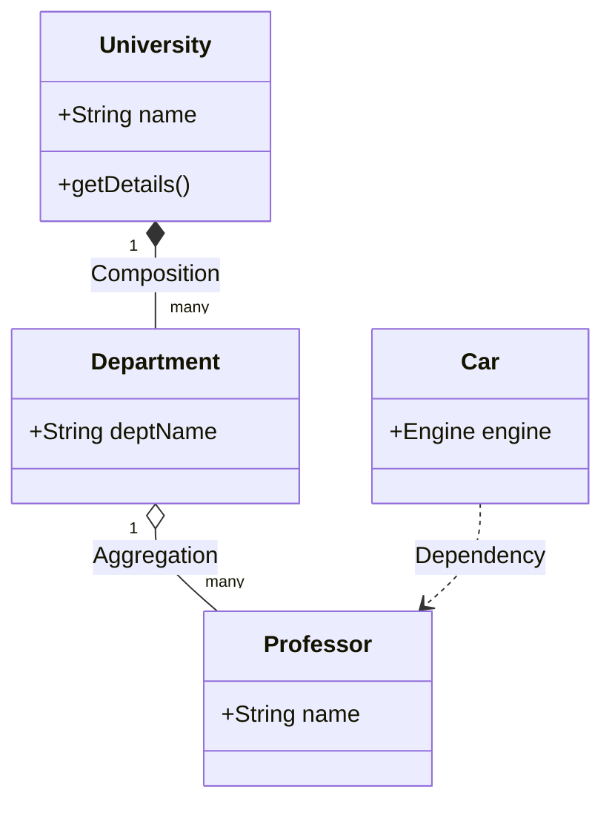
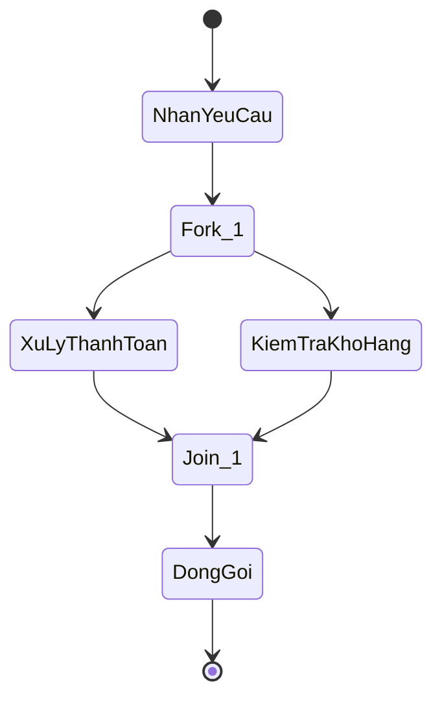
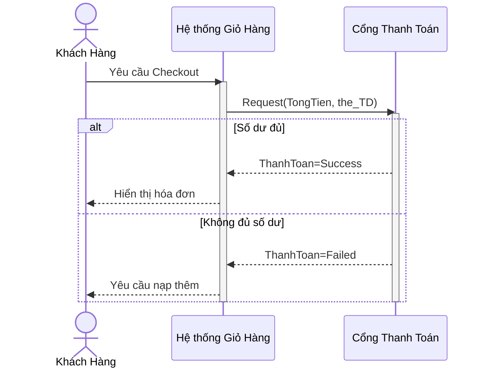
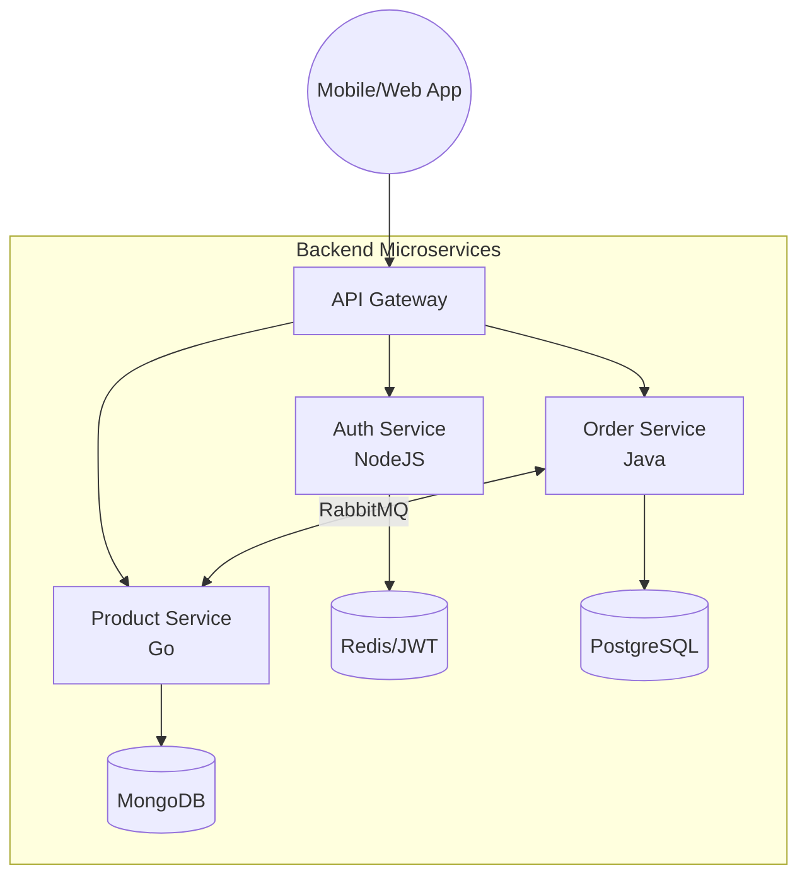
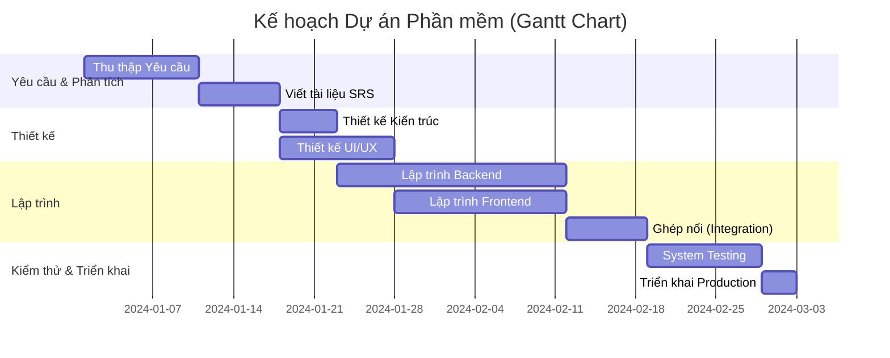

# BÁCH KHOA TOÀN THƯ: KỸ NGHỆ PHẦN MỀM (SOFTWARE ENGINEERING) - PHIÊN BẢN CHUYÊN GIA

Tài liệu này là phiên bản mở rộng toàn diện và cực kỳ chi tiết, được biên soạn nhằm phục vụ cho mục đích nghiên cứu học thuật, ôn thi chuyên sâu, và ứng dụng thực tiễn ở cấp độ Kỹ sư phần mềm (Senior/Architect). Mọi quy trình, kiến trúc, và khái niệm đều được mô hình hóa bằng **Mermaid**.

---

## CHƯƠNG 1: NỀN TẢNG KỸ NGHỆ PHẦN MỀM VÀ ĐẠO ĐỨC NGHỀ NGHIỆP

### 1.1 Kỹ nghệ Phần mềm là gì? (Chuẩn IEEE & SWEBOK)
- Theo chuẩn IEEE 610.12, Kỹ nghệ phần mềm (SE) là sự áp dụng một cách tiếp cận có hệ thống, có kỷ luật, có thể định lượng được đối với việc phát triển, vận hành và bảo trì phần mềm.
- **SWEBOK (Software Engineering Body of Knowledge):** Chỉ ra 15 vùng kiến thức cốt lõi, từ Yêu cầu, Thiết kế, Xây dựng, Kiểm thử, Bảo trì, đến Quản lý cấu hình, Quản lý dự án.

### 1.2 Sự tiến hóa của Phần mềm & Khủng hoảng Phần mềm
- **Khủng hoảng phần mềm (1960s - nay):** Triệu chứng: Ngân sách vượt mức, trễ tiến độ, phần mềm kém chất lượng, chi phí bảo trì vượt xa chi phí phát triển (thường chiếm 60%-80% tổng chi phí vòng đời).
- **Giải pháp SE:** Biến việc "viết code tùy hứng" thành một "ngành kỹ thuật công nghiệp", có đo lường, có kiểm soát rủi ro.

### 1.3 Đạo đức nghề nghiệp (ACM/IEEE Code of Ethics)
Kỹ sư phần mềm phải cam kết bảo vệ lợi ích công cộng:
1. **Public:** Hành động vì lợi ích cộng đồng.
2. **Client and Employer:** Bảo vệ bí mật kinh doanh, lợi ích khách hàng.
3. **Product:** Đảm bảo sản phẩm đạt tiêu chuẩn chuyên môn cao nhất.
4. **Judgment:** Duy trì sự độc lập trong đánh giá chuyên môn (không giấu diếm lỗi).

---

## CHƯƠNG 2: CÁC MÔ HÌNH VÒNG ĐỜI PHÁT TRIỂN PHẦN MỀM (SDLC) NÂNG CAO

SDLC mô tả cách một dự án phần mềm được khởi tạo, xây dựng, và kết thúc.

### 2.1 Các mô hình tuyến tính và lặp

#### A. Waterfall Model (Thác nước)
Phù hợp với các hệ thống nhúng (Embedded Systems), phần mềm y tế, hàng không, nơi yêu cầu phải được "chốt chặt" và sai sót sẽ phải trả giá bằng sinh mạng.

#### B. V-Model (Mô hình chữ V)
Nhấn mạnh vào **Verification và Validation**. Mỗi pha phát triển ở nhánh trái có một pha kiểm thử tương ứng ở nhánh phải.

```mermaid
graph TD
    subgraph Verification (Xác minh)
        A1[Business Requirements] --> A2[System Requirements]
        A2 --> A3[High-level Design<br>Kiến trúc]
        A3 --> A4[Low-level Design<br>Chi tiết]
    end
    
    A4 --> C((Lập Trình))
    
    subgraph Validation (Thẩm định)
        C --> B4[Unit Test]
        B4 --> B3[Integration Test]
        B3 --> B2[System Test]
        B2 --> B1[Acceptance Test]
    end
    
    A1 -.->|Lập Test Plan| B1
    A2 -.->|Lập Test Plan| B2
    A3 -.->|Lập Test Plan| B3
    A4 -.->|Lập Test Plan| B4
```

#### C. Spiral Model (Mô hình Xoắn ốc - Barry Boehm)
Chia dự án thành nhiều vòng lặp. Trọng tâm của Spiral là góc phần tư **Phân tích Rủi ro (Risk Analysis)**. Nếu rủi ro quá cao, dự án có thể bị hủy nghiệm thu sớm để cắt lỗ.



### 2.2 Các phương pháp Agile (Linh hoạt)

#### A. Scrum
Framework phổ biến nhất. Tổ chức theo các **Sprints** (1-4 tuần).
- **Roles:** Product Owner (Đại diện User), Scrum Master (Giữ nhịp độ và loại bỏ rào cản), Development Team.
- **Artifacts:** Product Backlog (Danh sách tính năng), Sprint Backlog, Increment (Phần mềm chạy được).
- **Ceremonies:** Sprint Planning, Daily Stand-up, Sprint Review, Sprint Retrospective.



#### B. Kanban
Bắt nguồn từ hệ thống sản xuất của Toyota. Trực quan hóa công việc lên bảng (Kanban Board), và giới hạn số lượng công việc đang làm (WIP - Work In Progress) để chống nghẽn cổ chai.

#### C. Extreme Programming (XP)
Nhấn mạnh vào chất lượng mã nguồn với các thực hành:
- **Pair Programming:** 2 người cùng viết code trên 1 máy tính.
- **TDD (Test-Driven Development):** Viết Test trước khi viết Code.
- **Continuous Integration (CI):** Tích hợp code liên tục nhiều lần trong ngày.

---

## CHƯƠNG 3: KỸ NGHỆ YÊU CẦU CHUYÊN SÂU (REQUIREMENTS ENGINEERING)

### 3.1 Kỹ thuật Khơi gợi yêu cầu (Elicitation Techniques)
1. **Phỏng vấn (Interviews):** Phỏng vấn đóng (câu hỏi Yes/No) và mở.
2. **Brainstorming:** Thảo luận nhóm tự do.
3. **Use Case & Scenarios:** Viết kịch bản người dùng thao tác.
4. **Prototyping / Wireframing:** Làm bản nháp UI (Figma, Balsamiq) để khách hình dung.
5. **Ethnography (Quan sát dân tộc học):** Đến tận nơi làm việc của user để xem họ đang dùng hệ thống cũ/giấy tờ như thế nào.

### 3.2 Phân tích và Đặc tả (SRS - Software Requirements Specification)
Tài liệu SRS chuẩn IEEE 830 bao gồm:
- **Functional (Chức năng):** Đầu vào là gì, quy trình xử lý ra sao, đầu ra là gì.
- **Non-Functional (Phi chức năng - Tiêu chuẩn FURPS):**
  - **F**unctionality (Tính năng)
  - **U**sability (Độ dễ dùng)
  - **R**eliability (Độ tin cậy: MTBF - Mean Time Between Failures)
  - **P**erformance (Hiệu năng: Response time < 2s, Throughput 1000 req/s)
  - **S**upportability (Khả năng hỗ trợ, bảo trì)

### 3.3 Mẫu Đặc tả Use Case (Use Case Specification Template)
| Thuộc tính | Mô tả |
| :--- | :--- |
| **Use Case ID & Name** | UC01 - Đặt hàng |
| **Actor** | Khách hàng |
| **Pre-conditions** | Khách hàng đã đăng nhập và có item trong giỏ. |
| **Main Flow** | 1. User ấn Checkout. 2. Hệ thống tính tổng tiền. 3. User chọn Cổng thanh toán. 4. Hệ thống trừ tiền thẻ. |
| **Alternative Flows** | 3a. Thẻ hết tiền -> Hủy đặt. |
| **Post-conditions** | Đơn hàng trạng thái "PENDING" được lưu vào DB. |

---

## CHƯƠNG 4: MÔ HÌNH HÓA VÀ UML 2.X TOÀN TẬP

UML (Unified Modeling Language) gồm 14 loại biểu đồ chia làm 2 nhóm: **Cấu trúc (Structural)** và **Hành vi (Behavioral)**.

### 4.1 Biểu đồ Cấu trúc (Structural Diagrams)

#### A. Class Diagram (Biểu đồ Lớp) - Trái tim của OOP
Mô tả kiến trúc tĩnh. Các mối quan hệ (Relationships) phải phân biệt rõ:
- **Dependency (Phụ thuộc):** Lớp A dùng Lớp B tạm thời (VD: Lớp A gọi hàm có tham số Lớp B). Nét đứt, mũi tên hở.
- **Association (Liên kết):** A "biết" B. Nét liền.
- **Aggregation (Tập hợp):** Quan hệ "Whole - Part" (Toàn thể - Bộ phận). Nếu Whole mất, Part VẪN tồn tại. Ký hiệu: Hình thoi rỗng. (VD: XeHơi chứa BánhXe. Bán xe, Bánh xe vẫn gắn sang xe khác được).
- **Composition (Cấu thành):** Quan hệ Whole-Part chặt chẽ. Whole mất thì Part CHẾT THEO. Ký hiệu: Hình thoi đặc. (VD: CănNhà chứa Phòng. Đập nhà thì phòng cũng mất).



#### B. Component Diagram (Biểu đồ Thành phần)
Mô tả hệ thống dưới dạng các khối module lớn và các cổng giao tiếp (Interfaces).

```mermaid
componentDiagram
    [Web Frontend] as UI
    [Payment API] as API
    [Banking System] as Bank
    database "MySQL" as DB
    
    UI --> API : REST/JSON
    API --> Bank : SOAP/XML
    API --> DB : SQL
```

### 4.2 Biểu đồ Hành vi (Behavioral Diagrams)

#### A. Activity Diagram (Biểu đồ Hoạt động)
Tuyệt vời để mô tả thuật toán, luồng nghiệp vụ song song (Sử dụng Fork/Join).



#### B. Sequence Diagram (Biểu đồ Tuần tự nâng cao)
Bao gồm các cấu trúc lặp (Loop), rẽ nhánh (Alt/Opt).



---

## CHƯƠNG 5: KIẾN TRÚC VÀ MẪU THIẾT KẾ PHẦN MỀM (SOFTWARE DESIGN)

### 5.1 Các phong cách kiến trúc hệ thống (Architectural Styles)

#### A. Monolithic (Nguyên khối)
Tất cả UI, Business Logic, Data Access gom chung 1 source code và deploy trên 1 server. Dễ test cục bộ, nhưng khi 1 hàm bị rò rỉ bộ nhớ (Memory Leak), cả server sẽ sập.

#### B. Microservices (Vi dịch vụ)
Chia hệ thống ra thành hàng chục service độc lập (mỗi cái có DB riêng). Giao tiếp qua REST API hoặc Message Queue (RabbitMQ, Kafka).
- **Ưu điểm:** Scale từng phần độc lập (Ví dụ ngày Sale 11/11 chỉ cần scale Service Thanh Toán mà không cần scale Service Tin Tức), dùng nhiều ngôn ngữ khác nhau (NodeJS cho UI, Python cho AI).
- **Nhược điểm:** Phức tạp trong việc quản lý giao dịch phân tán (Saga Pattern), khó trace log.



### 5.2 Các nguyên lý thiết kế hệ thống vững chắc (Design Principles)
- **SOLID (Cực kỳ quan trọng trong OOP):**
  1. **S**ingle Responsibility (SRP): Mỗi Class chỉ chịu 1 trách nhiệm. (Đừng viết class `User` vừa lưu DB vừa in ra PDF).
  2. **O**pen/Closed (OCP): Class nên MỞ để mở rộng, ĐÓNG để sửa đổi (Dùng Interface thay vì dùng `if/else` chằng chịt).
  3. **L**iskov Substitution (LSP): Class con dùng thay class cha không bị lỗi.
  4. **I**nterface Segregation (ISP): 1 Interface to nên chẻ thành nhiều interface nhỏ. (VD: Đừng gộp hàm in màu và in đen trắng vào 1 interface `Printer`, vì máy in đen trắng không implement được in màu).
  5. **D**ependency Inversion (DIP): Class cấp cao không phụ thuộc Class cấp thấp. Tất cả phụ thuộc Abstraction.
- **DRY (Don't Repeat Yourself):** Không bao giờ lặp lại code. Gom code lặp thành hàm chung.
- **KISS (Keep It Simple, Stupid):** Giữ hệ thống đơn giản nhất có thể. Đừng làm phức tạp hóa vấn đề.
- **YAGNI (You Aren't Gonna Need It):** Đừng viết code cho các tính năng "bạn nghĩ là tương lai sẽ cần". Chỉ code những gì cần thiết BÂY GIỜ.

### 5.3 Mẫu thiết kế (Design Patterns - GoF)
Bộ 23 mẫu giải quyết các bài toán kinh điển:
1. **Creational (Khởi tạo):**
   - **Singleton:** Đảm bảo hệ thống chỉ tồn tại DUY NHẤT 1 instance của một class (VD: Object kết nối Database).
   - **Factory Method:** Giao quyền tạo object cho class con.
   - **Builder:** Xây dựng object phức tạp từng bước một (VD: `new Pizza().addCheese().addMeat().build()`).
2. **Structural (Cấu trúc):**
   - **Adapter:** Biến interface này thành interface khác (Giống bộ chuyển nguồn sạc).
   - **Facade:** Cung cấp 1 interface đơn giản che giấu cả 1 hệ thống phức tạp bên dưới.
3. **Behavioral (Hành vi):**
   - **Observer (Publisher-Subscriber):** 1 object thay đổi trạng thái, các object "đăng ký" theo dõi nó sẽ được tự động báo (Mô hình MVC, Event Listener).
   - **Strategy:** Cho phép đổi thuật toán lúc runtime (VD: Thanh toán chọn thẻ hay chọn ví điện tử).

---

## CHƯƠNG 6: CÀI ĐẶT / LẬP TRÌNH (CONSTRUCTION)

### 6.1 Clean Code (Mã sạch) - Của Robert C. Martin (Uncle Bob)
- Code được đọc nhiều hơn viết với tỷ lệ 10:1. Viết code cho NGƯỜI ĐỌC, không phải cho Máy tính đọc.
- **Quy tắc hàm (Functions):** Hàm không được vượt quá độ thâm nhập (indentation) 2 cấp. Hàm không chứa tham số cờ (Boolean Flag).
- **Xử lý ngoại lệ (Exception Handling):** Dùng `try/catch` thay cho trả về mã lỗi (`return -1`). Không bao giờ để `catch` rỗng (Swallowing exception).

### 6.2 Code Smells (Mùi của code) & Refactoring
- **Long Method:** Hàm quá dài (chia nhỏ bằng Extract Method).
- **Large Class / God Object:** Class ôm đồm hàng ngàn dòng code, biết mọi thứ (Tách thành nhiều class bằng SRP).
- **Data Clumps:** Dữ liệu luôn đi chung với nhau thành chùm (Ví dụ 3 tham số: Đường, Phường, Thành phố). Giải pháp: Tạo thành class `Address`.
- **Shotgun Surgery (Phẫu thuật súng hoa cải):** Mỗi lần muốn sửa 1 nghiệp vụ nhỏ, phải đi sửa file ở hàng chục nơi khác nhau.

### 6.3 TDD - Test Driven Development (Lập trình hướng kiểm thử)
Quy trình Đỏ - Xanh - Refactor (Red - Green - Refactor):
1. **Red:** Viết Unit Test cho chức năng CHƯA có code -> Test chắc chắn Fail.
2. **Green:** Viết đoạn code vừa đủ NGẮN NHẤT để Unit Test Pass.
3. **Refactor:** Tối ưu hóa lại đoạn code cho sạch sẽ mà vẫn giữ Test Pass.

---

## CHƯƠNG 7: KIỂM THỬ VÀ ĐẢM BẢO CHẤT LƯỢNG (SOFTWARE TESTING)

### 7.1 Kỹ thuật Thiết kế Ca kiểm thử (Test Design Techniques)

#### A. Black-box Testing (Kiểm thử hộp đen)
Người test không biết code. Test dựa trên Yêu cầu (Specs).
- **Phân hoạch tương đương (Equivalence Partitioning).**
- **Phân tích giá trị biên (Boundary Value Analysis):** Nếu yêu cầu Nhập số tuổi từ 18-60. Các case cần test mạnh nhất là: 17, 18, 19 và 59, 60, 61.
- **Bảng quyết định (Decision Table):** Dùng khi input có nhiều điều kiện logic phụ thuộc nhau (VD: Sale 50% nếu Khách VIP VÀ Mua > 1 triệu).
- **Đoán lỗi (Error Guessing):** Dựa vào kinh nghiệm của Tester già dặn để đoán các case lập trình viên hay sai (VD: Nhập ngày sinh 31/02).

#### B. White-box Testing (Kiểm thử hộp trắng)
Người test (thường là Dev) biết rõ code source.
- **Kiểm thử đường đi cơ bản (Basis Path Testing):** Dựa vào Đồ thị dòng điều khiển (Control Flow Graph), tính Độ phức tạp Cyclomatic (V(G) = Cạnh - Nút + 2) để biết hàm đó cần tối thiểu bao nhiêu test case để quét sạch mọi đường đi (If/Else, Switch/Case).
- **Statement Coverage / Branch Coverage:** Đảm bảo mọi dòng lệnh, mọi nhánh True/False đều được chạy qua ít nhất 1 lần.

### 7.2 Các cấp độ Kiểm thử (Levels) và Loại Kiểm thử (Types)
- **Levels:** Unit Test -> Integration Test -> System Test -> Acceptance Test (Alpha & Beta).
- **Types (Loại kiểm thử phi chức năng):**
  - **Performance Testing:** Load Test (Kiểm tra chịu tải), Stress Test (Đánh sập server xem phục hồi sao), Spike Test (Tăng tải đột ngột).
  - **Security Testing:** Pentest (Kiểm thử xâm nhập), SQL Injection, XSS.
  - **Regression Testing (Kiểm thử hồi quy):** Chạy lại toàn bộ bộ test cũ để đảm bảo code MỚI thêm vào không làm vỡ chức năng CŨ.

### 7.3 Tích hợp liên tục và Giao hàng liên tục (CI/CD) - DevOps
Quy trình tự động hóa việc đưa Code từ máy Dev lên Server cho người dùng.
- **CI (Continuous Integration):** Tự động Build, tự động chạy Unit Test mỗi khi Dev push code lên Git.
- **CD (Continuous Deployment):** Tự động đưa code đã pass test lên môi trường Production (AWS, Docker, Kubernetes).

---

## CHƯƠNG 8 (BỔ SUNG): QUẢN LÝ DỰ ÁN PHẦN MỀM (PROJECT MANAGEMENT)

### 8.1 Quản lý rủi ro (Risk Management)
- Rủi ro dự án (Thiếu hụt tài chính, Nhân sự nghỉ việc).
- Rủi ro sản phẩm (Công nghệ áp dụng quá mới, sai Specs).
- **Chu trình:** Nhận diện -> Phân tích (Xác suất x Hậu quả) -> Lập kế hoạch ứng phó -> Giám sát.

### 8.2 Ước lượng Chi phí & Công sức
- **Lines of Code (LOC):** Dựa trên ước tính số dòng code.
- **Function Point (FP):** Điểm chức năng, đánh giá dựa trên số lượng màn hình input, file, output. Không phụ thuộc vào ngôn ngữ lập trình.
- **Mô hình COCOMO:** Công thức toán học tính số Người-Tháng (Person-Months).

### 8.3 Lập lịch trình dự án (Scheduling) bằng biểu đồ Gantt
Theo dõi thời gian, sự phụ thuộc (Dependencies) của các Task.



---
**TỔNG KẾT:** Kỹ nghệ phần mềm không chỉ là việc gõ những dòng mã lệnh (Coding), mà là một hệ sinh thái các quy trình, kỹ thuật, nghệ thuật thiết kế, kỹ năng giao tiếp, đạo đức nghề nghiệp và tự động hóa. Một kỹ sư phần mềm xuất sắc (Software Engineer) là người làm chủ được cái nhìn toàn cục từ khâu thai nghén ý tưởng, xây dựng kiến trúc mở rộng được, cho đến khi sản phẩm tự động triển khai và phục vụ hàng triệu người dùng một cách không lỗi lầm.