# BỘ ĐỀ THI ÔN TẬP TOÀN DIỆN MÔN KỸ NGHỆ PHẦN MỀM
*(Tài liệu này bao gồm 4 bộ đề tự sinh, được thiết kế bám sát cấu trúc đề thi thực tế và bao phủ toàn bộ kiến thức từ Chương 1 đến Chương 7 của học phần Kỹ nghệ phần mềm)*

---

## BỘ ĐỀ SỐ 1 (Trọng tâm: Chương 1, 2, 3 - Tổng quan, Quy trình, Yêu cầu)

### ĐỀ THI
**Câu I (5 điểm) - Trả lời ngắn gọn, súc tích các câu hỏi sau. Mỗi câu đúng được 0.5 điểm**
1. Phần mềm được định nghĩa như thế nào dưới góc nhìn kỹ nghệ?
2. Nêu 3 thuộc tính quan trọng của một phần mềm tốt?
3. Khủng hoảng phần mềm là hiện tượng gì?
4. Quy trình phát triển phần mềm bao gồm 4 hoạt động cốt lõi nào?
5. Điểm khác biệt lớn nhất giữa mô hình Thác nước (Waterfall) và mô hình Agile là gì?
6. Đặc tả yêu cầu phần mềm (SRS) là gì?
7. Yêu cầu chức năng (Functional Requirement) khác biệt thế nào với yêu cầu phi chức năng (Non-functional Requirement)?
8. Kể tên 3 phương pháp thường dùng để thu thập yêu cầu từ khách hàng?
9. "Stakeholder" (Người có liên quan) trong một dự án phần mềm gồm những đối tượng nào?
10. Sơ đồ Usecase được sử dụng trong giai đoạn nào của quy trình phát triển phần mềm?

**Câu II (5 điểm)**
Giám đốc Thư viện trường Đại học muốn xây dựng phần mềm "Quản lý mượn trả sách" cho phép:
- Thủ thư thực hiện các chức năng:
  + Quản lý thông tin sách (Thêm, sửa, xóa sách)
  + Lập phiếu mượn sách
  + Nhận trả sách và tính phí phạt (nếu có)
  + Lập báo cáo số lượng sách đang cho mượn
- Độc giả (Sinh viên/Giảng viên) thực hiện chức năng:
  + Tra cứu thông tin sách
  + Xem lịch sử mượn sách của bản thân

**THÔNG TIN SÁCH (Form nhập liệu)**
- Mã sách: [điền]
- Tên sách: [điền]
- Tác giả: [điền]
- Thể loại: [điền]
- Năm xuất bản: [điền]
- Số lượng: [điền]
*Ghi chú:*
- Mã sách phải duy nhất. Thể loại được chọn từ danh mục có sẵn.
- Số lượng phải là số nguyên lớn hơn 0.
- Các thuộc tính không được bỏ trống.

1. *(1.5đ)* Hãy vẽ Sơ đồ Usecase cho phần mềm "Quản lý mượn trả sách".
2. *(1.0đ)* Hãy vẽ Sơ đồ màn hình giao diện cho phần mềm này.
3. *(2.5đ)* Hãy thực hiện cho chức năng "Quản lý thông tin sách (Thêm, sửa, xóa sách)" theo các bước sau:
   a. (1.0đ) Vẽ sơ đồ lớp hướng đối tượng cho chức năng này.
   b. (0.5đ) Thiết kế dữ liệu lưu trữ cho chức năng này (cấu trúc bảng dữ liệu).
   c. (0.5đ) Thiết kế Màn hình giao diện thực hiện chức năng này.
   d. (0.5đ) Thiết kế TestCase cho trường hợp "Thêm sách mới thành công".

### ĐÁP ÁN ĐỀ 1
**Câu 1 (5 điểm)**
1. Là tập hợp các chương trình máy tính, cấu trúc dữ liệu và tài liệu liên quan.
2. Tính đúng đắn, tính tin cậy, tính bảo trì được, tính hiệu quả.
3. Các dự án phần mềm vượt quá ngân sách, chậm tiến độ, chất lượng kém và không đáp ứng yêu cầu.
4. Đặc tả phần mềm, Phát triển phần mềm, Thẩm định phần mềm, Tiến hóa phần mềm.
5. Thác nước đi theo tuần tự tuyến tính không lặp lại; Agile làm theo các vòng lặp ngắn, linh hoạt thay đổi.
6. Là tài liệu mô tả chi tiết các yêu cầu về chức năng và phi chức năng mà hệ thống phải đáp ứng.
7. YC chức năng mô tả những gì hệ thống PHẢI LÀM (hành động). YC phi chức năng mô tả HỆ THỐNG HOẠT ĐỘNG NHƯ THẾ NÀO (hiệu năng, bảo mật...).
8. Phỏng vấn, Khảo sát bằng bảng hỏi, Quan sát thực tế, Phân tích tài liệu.
9. Khách hàng, người dùng cuối, nhà quản lý, đội ngũ phát triển (Dev, Tester, BA...).
10. Giai đoạn Phân tích và Đặc tả yêu cầu.

**Câu 2 (5 điểm)**
1. (1.5đ) **Sơ đồ Usecase:**
```mermaid
usecaseDiagram
    actor "Thủ thư" as TT
    actor "Độc giả" as DG
    package "Quản lý mượn trả sách" {
        usecase "Quản lý sách" as UC1
        usecase "Lập phiếu mượn" as UC2
        usecase "Nhận trả sách" as UC3
        usecase "Lập báo cáo" as UC4
        usecase "Tra cứu sách" as UC5
        usecase "Xem lịch sử" as UC6
    }
    TT --> UC1
    TT --> UC2
    TT --> UC3
    TT --> UC4
    DG --> UC5
    DG --> UC6
```
2. (1.0đ) Có menu đăng nhập, phân quyền, giao diện chính hiển thị các tính năng cho từng đối tượng.
3. a. (1.0đ) **Sơ đồ lớp:**
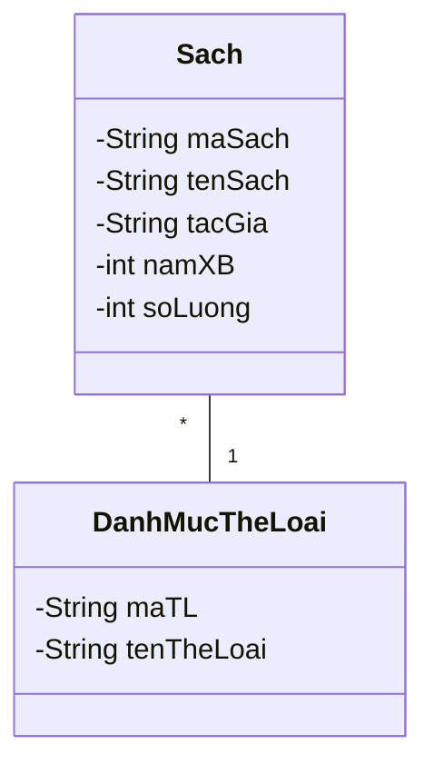
b. (0.5đ) Cấu trúc bảng Sách (Mã, Tên, Tác giả, Mã Thể loại, Năm XB, Số lượng). c. (0.5đ) Giao diện form thêm sửa xóa. d. (0.5đ) Bảng test case với input hợp lệ và expected output là "Lưu thành công".


---

## BỘ ĐỀ SỐ 2 (Trọng tâm: Chương 4, 5 - Mô hình hóa, Thiết kế)

### ĐỀ THI
**Câu I (5 điểm) - Trả lời ngắn gọn, súc tích các câu hỏi sau. Mỗi câu đúng được 0.5 điểm**
1. Mô hình hóa phần mềm mang lại lợi ích gì?
2. Biểu đồ lớp (Class Diagram) trong UML thể hiện khía cạnh nào của hệ thống?
3. Nêu 3 loại mối quan hệ cơ bản trong Biểu đồ lớp?
4. Thiết kế kiến trúc phần mềm là gì?
5. Kể tên 2 mẫu kiến trúc phần mềm (Architecture Patterns) phổ biến?
6. Nguyên lý Cohesion (Độ gắn kết) trong thiết kế module là gì?
7. Nguyên lý Coupling (Độ phụ thuộc) trong thiết kế module là gì?
8. Thiết kế tốt đòi hỏi Coupling và Cohesion như thế nào?
9. Mục đích chính của việc thiết kế cơ sở dữ liệu là gì?
10. Nêu 3 nguyên tắc cơ bản khi thiết kế giao diện người dùng (UI)?

**Câu II (5 điểm)**
Phòng khám đa khoa Tâm An muốn xây dựng phần mềm "Quản lý khám bệnh" cho phép:
- Bác sĩ thực hiện các chức năng:
  + Lập phiếu khám bệnh (ghi nhận chuẩn đoán, kết luận)
  + Kê đơn thuốc
  + Tra cứu lịch sử khám bệnh của bệnh nhân
- Nhân viên Lễ tân thực hiện chức năng:
  + Quản lý thông tin bệnh nhân (Tiếp nhận, thêm, sửa thông tin)
  + Sắp xếp lịch hẹn khám

**THÔNG TIN BỆNH NHÂN (Form nhập liệu)**
- Mã bệnh nhân: [điền]
- Họ và tên: [điền]
- Ngày sinh: [điền]
- Giới tính: [điền]
- Số điện thoại: [điền]
- Tiền sử bệnh nền: [điền]
*Ghi chú:*
- Mã bệnh nhân tự động sinh. Số điện thoại phải đúng định dạng 10 số.
- Họ tên, Ngày sinh không được để trống.

1. *(1.5đ)* Hãy vẽ Sơ đồ Usecase cho phần mềm "Quản lý khám bệnh".
2. *(1.0đ)* Hãy vẽ Sơ đồ màn hình giao diện tổng quan cho phần mềm này.
3. *(2.5đ)* Hãy thực hiện cho chức năng "Quản lý thông tin bệnh nhân" theo các bước sau:
   a. (1.0đ) Vẽ sơ đồ lớp hướng đối tượng cho chức năng này.
   b. (0.5đ) Thiết kế dữ liệu lưu trữ cho chức năng này.
   c. (0.5đ) Thiết kế Màn hình giao diện thêm/sửa bệnh nhân.
   d. (0.5đ) Thiết kế TestCase cho trường hợp "Nhập thiếu số điện thoại" (Thêm bệnh nhân thất bại).

### ĐÁP ÁN ĐỀ 2
**Câu 1 (5 điểm)**
1. Giúp dễ hiểu, dễ giao tiếp, trực quan hóa cấu trúc và hành vi hệ thống trước khi code.
2. Thể hiện cấu trúc tĩnh của hệ thống (các lớp, thuộc tính, phương thức và mối quan hệ giữa chúng).
3. Kế thừa (Inheritance), Kết tập (Aggregation), Phụ thuộc (Dependency), Kết hợp (Association).
4. Là quá trình xác định các thành phần hệ thống chính và sự tương tác của chúng.
5. Kiến trúc Client-Server, Kiến trúc MVC (Model-View-Controller), Kiến trúc Microservices.
6. Độ đo mức độ liên quan mật thiết giữa các thành phần bên trong cùng một module.
7. Độ đo mức độ phụ thuộc và tương tác lẫn nhau giữa các module khác nhau.
8. Cohesion cao (High Cohesion) và Coupling thấp (Low Coupling).
9. Lưu trữ dữ liệu an toàn, toàn vẹn, tránh dư thừa, dễ dàng truy xuất và quản lý.
10. Thân thiện dễ sử dụng, Nhất quán, Có cơ chế phản hồi (Feedback), Cho phép phục hồi lỗi.

**Câu 2 (5 điểm)**
1. (1.5đ) **Sơ đồ Usecase:**
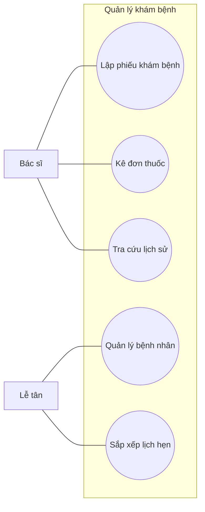
2. (1.0đ) Layout giao diện có sidebar chức năng phân quyền rõ ràng.
3. a. (1.0đ) **Sơ đồ lớp:**
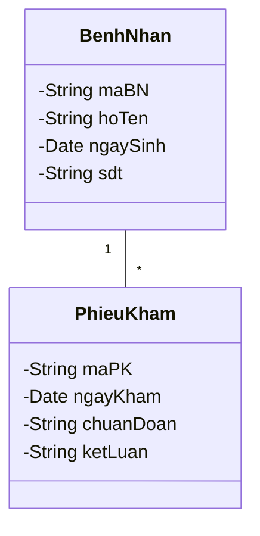
b. (0.5đ) Bảng Bệnh nhân (Mã, Tên, Ngày sinh...). c. (0.5đ) Form nhập thông tin. d. (0.5đ) Test case: Input đủ thông tin nhưng để trống số điện thoại -> Báo lỗi "Vui lòng nhập số điện thoại".


---

## BỘ ĐỀ SỐ 3 (Trọng tâm: Chương 6, 7 - Lập trình, Kiểm thử)

### ĐỀ THI
**Câu I (5 điểm) - Trả lời ngắn gọn, súc tích các câu hỏi sau. Mỗi câu đúng được 0.5 điểm**
1. Mã nguồn sạch (Clean code) mang lại lợi ích gì cho đội phát triển?
2. Trình bày 4 tính chất cơ bản của Lập trình hướng đối tượng (OOP)?
3. Tái cấu trúc mã nguồn (Refactoring) nghĩa là gì?
4. Kiểm thử phần mềm (Software Testing) nhằm mục đích gì?
5. Sự khác biệt cốt lõi giữa Verification (Xác minh) và Validation (Thẩm định) là gì?
6. Kiểm thử hộp đen (Black-box testing) là gì?
7. Kiểm thử hộp trắng (White-box testing) là gì?
8. Nêu 4 cấp độ kiểm thử phần mềm (Levels of Testing) theo thứ tự?
9. Một Test case (Ca kiểm thử) tiêu chuẩn cần có những thành phần nào?
10. Bảo trì phần mềm là gì và nêu 1 loại bảo trì?

**Câu II (5 điểm)**
Cửa hàng siêu thị tiện lợi X muốn xây dựng phần mềm "Quản lý Bán hàng" cho phép:
- Nhân viên bán hàng thực hiện chức năng:
  + Lập hóa đơn thanh toán
  + Tra cứu giá sản phẩm
- Quản lý cửa hàng thực hiện chức năng:
  + Quản lý danh mục sản phẩm (Thêm, sửa, xóa, cập nhật giá)
  + Nhập kho hàng hóa
  + Xem báo cáo doanh thu cuối ngày

**THÔNG TIN SẢN PHẨM (Form nhập liệu)**
- Mã sản phẩm (Barcode): [điền]
- Tên sản phẩm: [điền]
- Đơn vị tính: [điền]
- Đơn giá bán: [điền]
- Số lượng tồn kho: [điền]
*Ghi chú:*
- Mã sản phẩm không được trùng lặp.
- Đơn giá bán và Số lượng tồn kho không được là số âm.

1. *(1.5đ)* Hãy vẽ Sơ đồ Usecase cho phần mềm "Quản lý Bán hàng".
2. *(1.0đ)* Hãy vẽ Sơ đồ màn hình giao diện cho Quản lý cửa hàng.
3. *(2.5đ)* Hãy thực hiện cho chức năng "Quản lý danh mục sản phẩm" theo các bước sau:
   a. (1.0đ) Vẽ sơ đồ lớp hướng đối tượng.
   b. (0.5đ) Thiết kế cấu trúc dữ liệu lưu trữ.
   c. (0.5đ) Thiết kế Màn hình giao diện chức năng cập nhật giá sản phẩm.
   d. (0.5đ) Thiết kế TestCase cho trường hợp "Nhập giá bán là số âm" (Cập nhật thất bại).

### ĐÁP ÁN ĐỀ 3
**Câu 1 (5 điểm)**
1. Dễ đọc, dễ hiểu, dễ mở rộng, giảm thiểu bug, thuận tiện cho việc bảo trì và làm việc nhóm.
2. Tính Đóng gói (Encapsulation), Tính Kế thừa (Inheritance), Tính Đa hình (Polymorphism), Tính Trừu tượng (Abstraction).
3. Quá trình thay đổi cấu trúc mã nguồn bên trong để code tốt hơn mà không làm thay đổi hành vi bên ngoài của hệ thống.
4. Tìm ra lỗi (bug), đảm bảo phần mềm hoạt động đúng yêu cầu và nâng cao chất lượng phần mềm.
5. Verification: "Chúng ta đang làm phần mềm đúng cách chứ?" (đúng quy trình). Validation: "Chúng ta đang làm đúng phần mềm mà khách hàng cần chứ?" (đúng nhu cầu).
6. Kiểm thử dựa trên yêu cầu chức năng mà không cần biết cấu trúc code bên trong.
7. Kiểm thử dựa trên việc xem xét chi trúc logic, thuật toán, mã nguồn bên trong của phần mềm.
8. Kiểm thử đơn vị (Unit Test) -> Kiểm thử tích hợp (Integration Test) -> Kiểm thử hệ thống (System Test) -> Kiểm thử chấp nhận (Acceptance Test).
9. ID, Tên testcase, Tiền điều kiện, Các bước thực hiện, Kết quả mong đợi, Kết quả thực tế.
10. Quá trình thay đổi, sửa lỗi, nâng cấp phần mềm sau khi đã bàn giao. Phân loại: Bảo trì sửa lỗi, Bảo trì thích nghi, Bảo trì hoàn thiện, Bảo trì phòng ngừa.

**Câu 2 (5 điểm)**
1. (1.5đ) Actor: NV Bán hàng, Quản lý. Usecases tương ứng.
2. (1.0đ) Màn hình Dashboard chứa các mục báo cáo và nút quản lý.
3. a. (1.0đ) Lớp Sản phẩm, Lớp Hóa đơn. b. (0.5đ) Bảng Sản phẩm (Mã, Tên, Đơn vị, Giá, Tồn kho). c. (0.5đ) Form chọn sản phẩm và ô nhập giá mới. d. (0.5đ) Input Giá bán = -10000 -> Expected: Báo lỗi "Giá bán không được âm", không lưu CSDL.

---

## BỘ ĐỀ SỐ 4 (Trọng tâm: Đề tổng hợp toàn diện nâng cao)

### ĐỀ THI
**Câu I (5 điểm) - Trả lời ngắn gọn, súc tích các câu hỏi sau. Mỗi câu đúng được 0.5 điểm**
1. Đặc trưng của phần mềm khác với phần cứng máy tính như thế nào?
2. Sprint trong quy trình Scrum (Agile) là gì?
3. Sơ đồ tuần tự (Sequence Diagram) được dùng để biểu diễn điều gì?
4. "Giao diện thân thiện" (User-friendly) thường được đánh giá qua những yếu tố nào?
5. Nêu lợi ích của việc áp dụng Chuẩn lập trình (Coding Convention) trong dự án?
6. Thiết kế dữ liệu bao gồm những mức nào? (Thiết kế mức khái niệm, logic, vật lý).
7. Kiểm thử chấp nhận (Acceptance testing - UAT) do đối tượng nào thực hiện chủ yếu?
8. Tại sao việc phát hiện và sửa lỗi ở giai đoạn Kiểm thử lại tốn kém hơn giai đoạn Phân tích yêu cầu?
9. GitHub, GitLab hay SVN là các công cụ hỗ trợ cho hoạt động gì trong Kỹ nghệ phần mềm?
10. Nêu 1 nguyên tắc đạo đức nghề nghiệp của Kỹ sư phần mềm.

**Câu II (5 điểm)**
Công ty công nghệ ABC cần phần mềm "Quản lý Nhân sự & Chấm công" cho phép:
- Nhân viên thực hiện chức năng:
  + Xin nghỉ phép
  + Xem bảng chấm công cá nhân
- Bộ phận Hành chính nhân sự thực hiện chức năng:
  + Quản lý hồ sơ nhân viên (Thêm, sửa, xóa)
  + Duyệt đơn xin nghỉ phép
  + Xuất báo cáo lương tháng

**HỒ SƠ NHÂN VIÊN (Form nhập liệu)**
- Mã nhân viên: [điền]
- Họ và tên: [điền]
- Căn cước công dân (CCCD): [điền]
- Chức vụ: [điền]
- Phòng ban: [điền]
- Lương cơ bản: [điền]
*Ghi chú:*
- Mã nhân viên và CCCD là duy nhất. CCCD phải đủ 12 số.
- Lương cơ bản không được bỏ trống và phải > 0.

1. *(1.5đ)* Hãy vẽ Sơ đồ Usecase cho phần mềm "Quản lý Nhân sự & Chấm công".
2. *(1.0đ)* Hãy vẽ Sơ đồ màn hình giao diện cho Bộ phận Hành chính.
3. *(2.5đ)* Hãy thực hiện cho chức năng "Quản lý hồ sơ nhân viên" theo các bước sau:
   a. (1.0đ) Vẽ sơ đồ lớp hướng đối tượng.
   b. (0.5đ) Thiết kế cấu trúc bảng dữ liệu.
   c. (0.5đ) Thiết kế Màn hình giao diện chức năng Thêm mới nhân viên.
   d. (0.5đ) Thiết kế TestCase cho trường hợp "Nhập CCCD có 10 số" (Thêm nhân viên thất bại).

### ĐÁP ÁN ĐỀ 4
**Câu 1 (5 điểm)**
1. Phần mềm là logic/trừu tượng, không bị "hao mòn" vật lý, nhưng bị "thoái hóa" do thay đổi môi trường.
2. Là một khung thời gian ngắn hạn (thường từ 1-4 tuần) mà đội phát triển hoàn thành một lượng công việc (chức năng) nhất định.
3. Biểu diễn sự tương tác giữa các đối tượng theo trình tự thời gian (truyền thông điệp).
4. Dễ học, dễ nhớ, làm việc hiệu quả, ít lỗi, gây sự hài lòng.
5. Code đồng nhất, dễ đọc chéo, giảm xung đột khi merge code, dễ bàn giao.
6. Thiết kế CSDL khái niệm (ERD), Thiết kế CSDL logic (Relational Schema), Thiết kế CSDL vật lý.
7. Do khách hàng (Customer) hoặc người dùng cuối (End-user) thực hiện để quyết định có nhận phần mềm hay không.
8. Vì lỗi càng phát hiện muộn thì càng tốn công thay đổi lại từ thiết kế, code, và phải kiểm thử lại toàn bộ.
9. Quản lý phiên bản mã nguồn (Version Control System).
10. Hành động vì lợi ích cộng đồng; Giữ bí mật dữ liệu khách hàng; Cạnh tranh công bằng.

**Câu 2 (5 điểm)**
1. (1.5đ) Actor: Nhân viên, BP Nhân sự. Usecase tương ứng.
2. (1.0đ) Giao diện Dashboard hành chính có các menu Quản lý hồ sơ, Duyệt phép, Báo cáo lương.
3. a. (1.0đ) Lớp Nhân viên, Lớp Đơn nghỉ phép, Lớp Phòng ban. b. (0.5đ) Bảng NhanVien (MaNV, HoTen, CCCD, ChucVu, MaPhanBan, LuongCB). c. (0.5đ) Form nhập liệu với các ràng buộc hiển thị (*). d. (0.5đ) Testcase: Input CCCD = 0123456789 -> Expected output: Báo lỗi "CCCD phải bao gồm 12 chữ số".

# --- Nội dung file: Phan_1_Ly_Thuyet_Tu_Luan.md ---

# TỔNG HỢP ÔN THI KỸ NGHỆ PHẦN MỀM - PHẦN 1
**TOÀN BỘ LÝ THUYẾT TRỌNG TÂM (Trình bày theo phong cách tự luận chi tiết)**

*Lưu ý: Dưới đây là các câu hỏi lý thuyết thường gặp nhất trong đề thi. Đáp án được trình bày dưới dạng một bài thi tự luận hoàn chỉnh của sinh viên (giải thích rõ ràng, có diễn giải, không chỉ gạch đầu dòng vắn tắt như barem giáo viên) để giúp bạn đạt điểm tối đa.*

---

**Câu 1: Hãy nêu những tiêu chí mà người sử dụng đánh giá chất lượng phần mềm?**
**Bài làm:**
Dưới góc nhìn của người sử dụng (người không quan tâm đến mã nguồn hay kiến trúc hệ thống), một phần mềm được đánh giá là có chất lượng tốt khi nó thỏa mãn các tiêu chí cốt lõi sau:
1. **Tính đúng đắn (Correctness):** Phần mềm phải thực hiện chính xác các chức năng mà người dùng mong muốn. Kết quả tính toán hoặc xử lý dữ liệu phải chuẩn xác, không xảy ra sai sót.
2. **Tính tiện dụng (Usability):** Giao diện phải trực quan, thân thiện, dễ học và dễ sử dụng. Hệ thống cần điều hướng logic để người dùng không mất quá nhiều thời gian làm quen.
3. **Tính hiệu quả (Efficiency):** Phần mềm phải phản hồi thao tác nhanh chóng, không bị giật lag, đồng thời không ngốn quá nhiều tài nguyên của thiết bị (như RAM, CPU, hoặc làm hao pin nhanh).
4. **Tính tương thích (Compatibility):** Ứng dụng có thể chạy ổn định trên các nền tảng, hệ điều hành (Windows, macOS) hoặc trình duyệt (Chrome, Safari) mà người dùng đang sử dụng.
5. **Khả năng phục hồi và an toàn (Dependability & Recoverability):** Khi người dùng thao tác sai hoặc rớt mạng, phần mềm không bị "sập" (crash) mà phải đưa ra thông báo lỗi rõ ràng và bảo vệ dữ liệu không bị mất mát.

**Câu 2: Công nghệ phần mềm là gì? Công nghệ phần mềm nghiên cứu những vấn đề gì?**
**Bài làm:**
- **Định nghĩa:** Công nghệ phần mềm (Software Engineering) là một chuyên ngành kỹ thuật áp dụng một cách tiếp cận có hệ thống, có kỷ luật và có thể định lượng được vào việc phát triển, vận hành và bảo trì phần mềm. Nó biến việc lập trình tự phát thành một quy trình sản xuất mang tính công nghiệp nhằm tạo ra phần mềm chất lượng cao, đúng tiến độ và trong phạm vi ngân sách.
- **Những vấn đề nghiên cứu cốt lõi:** Công nghệ phần mềm tập trung nghiên cứu 3 nền tảng chính:
  1. *Phương pháp (Methods):* Cung cấp các kỹ thuật chuyên môn để xây dựng phần mềm (cách thu thập yêu cầu, cách vẽ biểu đồ thiết kế kiến trúc, cách viết mã nguồn và kiểm thử).
  2. *Quy trình (Process):* Nghiên cứu các mô hình vòng đời phát triển phần mềm (như Thác nước, Agile, Scrum) để kết nối các phương pháp lại với nhau, quy định rõ ai làm việc gì, vào lúc nào.
  3. *Công cụ (Tools):* Nghiên cứu và phát triển các phần mềm hỗ trợ tự động hoặc bán tự động cho phương pháp và quy trình (như công cụ quản lý code Git, công cụ vẽ UML, phần mềm test tự động).

**Câu 3: Quy trình phát triển phần mềm gồm có mấy hoạt động cơ bản? Kể tên?**
**Bài làm:**
Bất kể áp dụng mô hình phát triển nào (cổ điển hay hiện đại), một quy trình phát triển phần mềm chuẩn luôn phải đi qua 4 hoạt động cơ bản không thể thiếu:
1. **Đặc tả phần mềm (Software Specification):** Hoạt động định nghĩa phần mềm phải làm những chức năng gì, đáp ứng những ràng buộc nào từ phía người dùng và hệ thống.
2. **Phát triển phần mềm (Software Development/Design & Implementation):** Hoạt động thiết kế cấu trúc hệ thống, cơ sở dữ liệu, giao diện và tiến hành viết mã nguồn (coding) để tạo ra phần mềm.
3. **Thẩm định phần mềm (Software Validation/Testing):** Hoạt động kiểm thử để xác minh rằng phần mềm không có lỗi và đáp ứng chính xác những gì khách hàng đã yêu cầu ban đầu.
4. **Tiến hóa phần mềm (Software Evolution/Maintenance):** Hoạt động bảo trì, sửa lỗi và nâng cấp, thêm tính năng mới cho phần mềm sau khi đã bàn giao để đáp ứng sự thay đổi của môi trường kinh doanh.

**Câu 4: Nêu 3 mô hình quy trình phát triển phần mềm mà em đã tìm hiểu? Phân tích ngắn gọn.**
**Bài làm:**
1. **Mô hình Thác nước (Waterfall Model):** Là mô hình tuần tự tuyến tính. Các pha (Yêu cầu, Thiết kế, Code, Test, Triển khai) nối tiếp nhau như dòng thác. Một pha phải hoàn thành xong 100% và chốt tài liệu thì mới chuyển sang pha tiếp theo. Ưu điểm là dễ quản lý, nhược điểm là không linh hoạt với sự thay đổi.
2. **Mô hình Xoắn ốc (Spiral Model):** Là mô hình phát triển theo vòng lặp, kết hợp giữa yếu tố lặp lại và kiểm soát theo từng pha. Điểm nổi bật nhất của Xoắn ốc là có khâu **Phân tích và Quản trị rủi ro** rất mạnh mẽ ở mỗi vòng lặp, phù hợp cho các dự án lớn, đắt tiền và độ rủi ro cao.
3. **Mô hình Agile / Scrum:** Là mô hình phát triển linh hoạt, chia dự án thành các chu kỳ ngắn (Iterative) gọi là Sprint (2-4 tuần). Cuối mỗi Sprint sẽ giao cho khách hàng một phần mềm chạy được. Agile đề cao sự tương tác với khách hàng, phản hồi nhanh với thay đổi thay vì cứng nhắc bám theo tài liệu ban đầu.

**Câu 5: Trình bày 4 nguyên tắc trong thiết kế giao diện người dùng (UI)?**
**Bài làm:**
Khi thiết kế giao diện người dùng, lập trình viên cần tuân thủ 4 nguyên tắc thiết yếu sau để đảm bảo trải nghiệm tốt nhất (UX):
1. **Tính quen thuộc và Thân thiện (User Familiarity):** Giao diện nên sử dụng các thuật ngữ, biểu tượng và cách bố trí quen thuộc với thói quen của người dùng (ví dụ: biểu tượng đĩa mềm để Lưu, thùng rác để Xóa) thay vì bắt họ học các ký hiệu công nghệ khó hiểu.
2. **Tính nhất quán (Consistency):** Thiết kế phải đồng bộ trên toàn bộ phần mềm. Màu sắc của các nút cảnh báo (đỏ), nút đồng ý (xanh), font chữ, và vị trí các menu phải được giữ nguyên ở tất cả các màn hình để tránh gây bối rối.
3. **Có khả năng phục hồi lỗi (Recoverability / Forgiveness):** Người dùng luôn có xu hướng thao tác sai. Hệ thống phải cho phép họ hoàn tác (Undo) hoặc yêu cầu hộp thoại xác nhận (Ví dụ: "Bạn có chắc chắn muốn xóa không?") trước những thao tác phá hủy dữ liệu.
4. **Cung cấp phản hồi (Feedback):** Mọi thao tác của người dùng phải được hệ thống phản hồi lại ngay lập tức (bằng hình ảnh hoặc âm thanh). Ví dụ: hiển thị vòng xoay loading khi đang tải dữ liệu, hoặc hiện thông báo "Lưu thành công" để người dùng biết lệnh của họ đã được xử lý.

**Câu 6: Trình bày nguyên lý Coupling (Độ phụ thuộc) và nguyên lý Cohesion (Độ gắn kết) trong thiết kế module?**
**Bài làm:**
Trong thiết kế kiến trúc và viết mã nguồn phần mềm, đây là 2 nguyên lý đo lường chất lượng cốt lõi:
- **Nguyên lý Cohesion (Độ gắn kết):** Đo lường mức độ liên quan và tập trung thực hiện nhiệm vụ của các hàm/dữ liệu *bên trong cùng một module* (hoặc một Class). Một thiết kế tốt đòi hỏi **Cohesion cao (High Cohesion)**, nghĩa là module đó chỉ tập trung làm duy nhất một nhiệm vụ chuyên biệt và làm thật tốt nhiệm vụ đó (Single Responsibility), không ôm đồm việc khác.
- **Nguyên lý Coupling (Độ phụ thuộc):** Đo lường mức độ phụ thuộc, ràng buộc chéo lẫn nhau *giữa các module khác nhau* trong hệ thống. Một thiết kế tốt đòi hỏi **Coupling thấp (Low Coupling)**, nghĩa là các module hoạt động độc lập nhất có thể. Nếu Coupling thấp, khi ta sửa lỗi hoặc thay đổi code ở Module A thì Module B không bị sập theo.

**Câu 7: Kể tên các phương pháp sử dụng để thu thập và đặc tả yêu cầu phần mềm?**
**Bài làm:**
Để lấy được yêu cầu chính xác từ khách hàng, Kỹ sư phân tích nghiệp vụ (BA) thường dùng các phương pháp sau:
- **Phỏng vấn (Interviewing):** Gặp gỡ và trao đổi trực tiếp với khách hàng hoặc người dùng cuối để hỏi sâu về mong muốn, khó khăn của họ.
- **Khảo sát bằng bảng hỏi (Questionnaires):** Thiết kế các câu hỏi trắc nghiệm phát cho số lượng lớn người dùng để thống kê nhu cầu chung một cách nhanh chóng.
- **Quan sát thực tế (Observation):** Kỹ sư trực tiếp đến môi trường làm việc của khách hàng để quan sát cách họ làm việc thủ công, từ đó phát hiện ra những yêu cầu ẩn mà khách hàng quên không kể.
- **Nghiên cứu tài liệu (Document Analysis):** Đọc các biểu mẫu, hóa đơn, quy trình giấy tờ hiện tại của công ty khách hàng để ánh xạ vào phần mềm.

**Câu 8: Nêu 2 phương pháp lập trình mà em đã sử dụng trong lập trình phần mềm?**
**Bài làm:**
Trong quá trình học tập và làm việc, em thường áp dụng 2 phương pháp lập trình sau:
1. **Lập trình hướng cấu trúc / thủ tục (Procedural Programming):** Viết mã nguồn bằng cách chia nhỏ bài toán thành các hàm (function/procedure) chạy theo trình tự logic từ trên xuống dưới (sử dụng ngôn ngữ C). Thích hợp cho các bài toán thuật toán nhỏ.
2. **Lập trình hướng đối tượng (Object-Oriented Programming - OOP):** Biến mọi thứ thành các Đối tượng (Object) có thuộc tính và hành vi, tương tác với nhau. Phương pháp này vận dụng 4 tính chất: Đóng gói, Kế thừa, Đa hình và Trừu tượng (sử dụng Java, C# hoặc C++). Nó giúp tổ chức mã nguồn rõ ràng, dễ bảo trì và tái sử dụng cho các dự án lớn.

**Câu 9: Phần mềm được định nghĩa như thế nào dưới góc nhìn của chuyên viên tin học?**
**Bài làm:**
Dưới góc nhìn của chuyên viên tin học, phần mềm không đơn thuần chỉ là những dòng code. Phần mềm là một thực thể hoàn chỉnh bao gồm 3 thành tố:
1. Tập hợp các câu lệnh, chương trình máy tính (Computer Programs) có khả năng thực thi và sinh ra chức năng mong muốn.
2. Cấu trúc dữ liệu (Data Structures) cho phép chương trình xử lý và thao tác thông tin một cách tối ưu.
3. Các tài liệu liên quan (Documentation) như đặc tả yêu cầu, thiết kế kiến trúc, và sổ tay hướng dẫn sử dụng để đảm bảo hệ thống có thể được bảo trì và vận hành lâu dài.

**Câu 10: Nêu 3 công nghệ / nền tảng giao diện mà em biết?**
**Bài làm:**
Trong phát triển ứng dụng, em biết 3 công nghệ giao diện phổ biến sau:
1. **Giao diện Web (Web UI):** Xây dựng bằng HTML, CSS, JavaScript kết hợp với các Framework như ReactJS, VueJS. Ứng dụng chạy trực tiếp trên trình duyệt.
2. **Giao diện Desktop (Window Form / WPF):** Xây dựng bằng C# (.NET) hoặc Java (Swing/JavaFX) để tạo ra các phần mềm cài đặt và chạy trực tiếp trên máy tính Windows/macOS.
3. **Giao diện Di động (Mobile UI):** Xây dựng bằng Kotlin/Swift cho ứng dụng native hoặc Flutter/React Native cho ứng dụng đa nền tảng, chạy trên màn hình cảm ứng của điện thoại smartphone.

# --- Nội dung file: Phan_2_Bai_Tap_Tu_Luan.md ---

# TỔNG HỢP ÔN THI KỸ NGHỆ PHẦN MỀM - PHẦN 2
**GIẢI CHI TIẾT BÀI TẬP THIẾT KẾ HỆ THỐNG (Phong cách tự luận sinh viên)**

*Lưu ý: Dưới đây là lời giải chi tiết cho 3 đề thi bài tập thực hành (Câu II - 5 điểm) xuất hiện trong ảnh đề thi gốc. Lời giải được trình bày rõ ràng từng bước, mô tả cách vẽ sơ đồ để sinh viên có thể chép lại chính xác vào giấy thi.*

---

## BÀI 1: HỆ THỐNG QUẢN LÝ KÝ TÚC XÁ

**Đề bài tóm tắt:** Phần mềm "Quản lý ký túc xá". Nhân viên: Quản lý phòng, Lập hợp đồng, Thanh toán, Báo cáo doanh thu. Ban giám đốc: Cập nhật quy định. Thông tin phòng gồm: Mã phòng, Tầng, Số giường, Dãy phòng (A,B,C).

### 1. Vẽ Sơ đồ Usecase (1.5 điểm)
**Bài làm:**

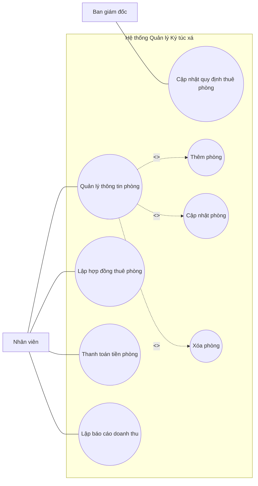


### 2. Vẽ Sơ đồ màn hình giao diện (1.0 điểm)
**Bài làm:**
*(Mô tả bản vẽ trên giấy)*
- Vẽ một khung hình chữ nhật lớn tượng trưng cho màn hình máy tính.
- **Tiêu đề (Header):** Trên cùng ghi "HỆ THỐNG QUẢN LÝ KÝ TÚC XÁ - NHÂN VIÊN". Góc phải có "Tài khoản: Nguyễn Văn A | Đăng xuất".
- **Thanh menu (Sidebar bên trái):** Gồm các nút dọc: [Trang chủ], [Quản lý phòng], [Lập hợp đồng], [Thanh toán], [Báo cáo]. (Nút "Quản lý phòng" đang được bôi đậm vì đang chọn).
- **Vùng làm việc chính (Content bên phải):**
  - Nút [ + Thêm phòng mới ] ở góc trên bên phải vùng content.
  - **Bảng dữ liệu (Data Table):** Vẽ một bảng gồm các cột: `STT | Mã phòng | Dãy phòng | Tầng | Số giường | Thao tác (Sửa/Xóa)`. Vẽ vài dòng dữ liệu giả vào bảng.

### 3. Thực hiện chức năng "Quản lý Thông tin phòng" (2.5 điểm)

#### a. Vẽ sơ đồ lớp hướng đối tượng (1.0 điểm)
**Bài làm:**

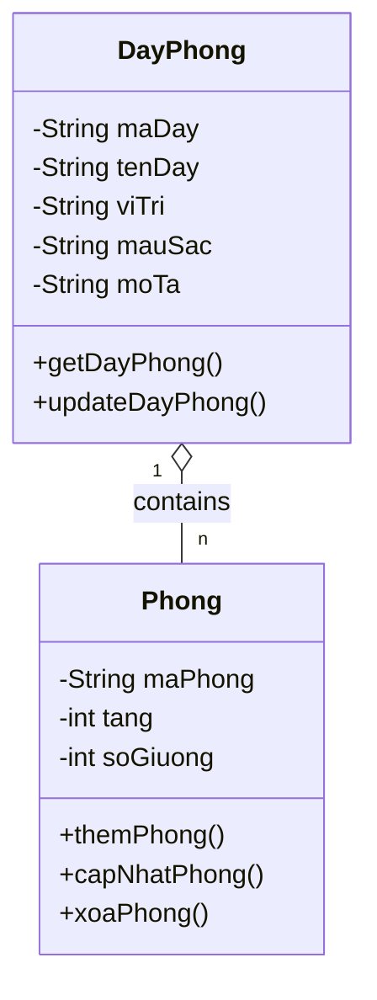

#### b. Thiết kế dữ liệu lưu trữ (0.5 điểm)
**Bài làm:**

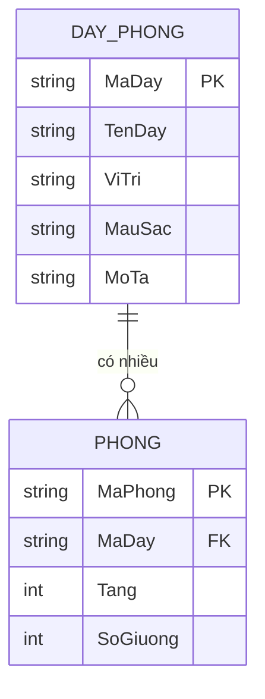


#### c. Thiết kế Màn hình giao diện chức năng này (0.5 điểm)
**Bài làm:**
*(Vẽ một Popup/Form nhập liệu)*
- Tiêu đề Form: "THÊM PHÒNG MỚI"
- Các trường nhập liệu (Label bên trái, Textbox bên phải):
  - Mã phòng: [__________] (*)
  - Dãy phòng: [ Combobox xổ xuống chọn A, B hoặc C v] (*)
  - Tầng: [__________] (Chỉ nhập số) (*)
  - Số giường: [__________] (Chỉ nhập số) (*)
- Bên dưới góc phải có 2 nút: `[ LƯU ]` và `[ HỦY ]`.
- Ghi chú: Dấu (*) là bắt buộc nhập.

#### d. Thiết kế Test Case thêm thành công (0.5 điểm)
**Bài làm:**
| Mã TC | Tên Test Case | Điều kiện tiên quyết | Dữ liệu đầu vào | Kết quả mong đợi |
|---|---|---|---|---|
| TC_PH_01 | Thêm phòng thành công | Người dùng đang ở màn hình Thêm phòng | - Mã phòng: P101<br>- Dãy phòng: A<br>- Tầng: 1<br>- Số giường: 4 | Hệ thống lưu dữ liệu vào CSDL, hiển thị thông báo "Thêm phòng thành công" và cập nhật phòng P101 lên bảng danh sách. |

---

## BÀI 2: HỆ THỐNG QUẢN LÝ HỌC TẬP SINH VIÊN

**Đề bài tóm tắt:** Phần mềm "Quản lý học tập sinh viên". Cán bộ đào tạo: QL sinh viên, QL điểm, QL lịch học, Lập báo cáo. Ban giám hiệu: Cập nhật quy định đánh giá. Form điểm: Mã SV, Họ tên, Môn học, Học kỳ, Điểm (số thực 0-10). Môn học thuộc danh mục.

### 1. Vẽ Sơ đồ Usecase (1.0 điểm)
**Bài làm:**

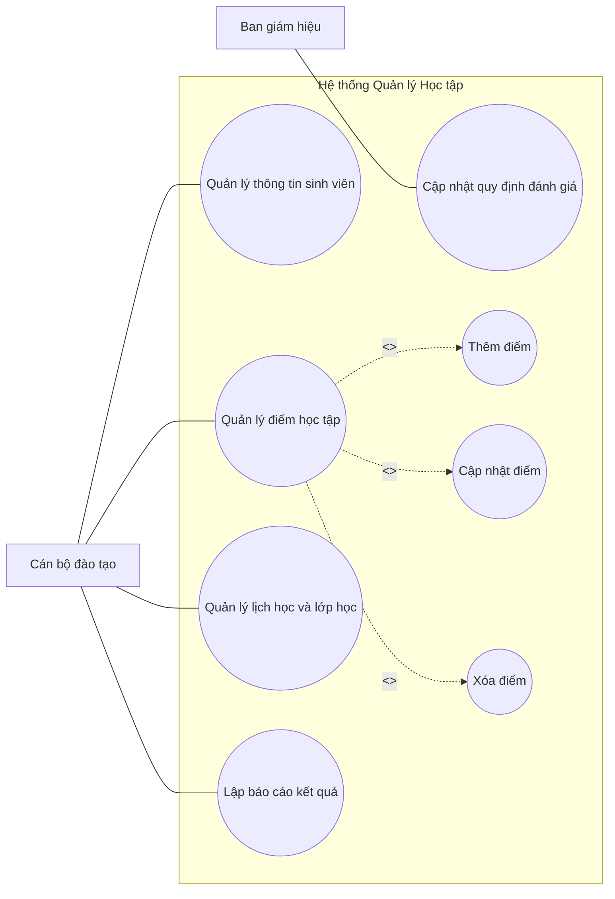

### 2. Vẽ Sơ đồ màn hình giao diện (1.0 điểm)
**Bài làm:**
- Vẽ khung hình chữ nhật lớn (Form chính).
- Trái: Thanh điều hướng (Menu): Thông tin SV, Quản lý Điểm (đang tô đậm), Lịch học, Báo cáo.
- Phải (Vùng chính):
  - Khung tìm kiếm: Ô nhập [Mã sinh viên], Combobox [Chọn học kỳ], Nút `[Tìm kiếm]`.
  - Dưới là Bảng kết quả gồm: `STT | Mã SV | Họ Tên | Môn học | Học kỳ | Điểm thi | Thao tác`.
  - Nút `[ + Nhập điểm mới ]` nằm phía trên bảng.

### 3. Thực hiện chức năng "Quản lý điểm học tập" (3.0 điểm)

#### a. Vẽ sơ đồ lớp hướng đối tượng (1.0 điểm)
**Bài làm:**

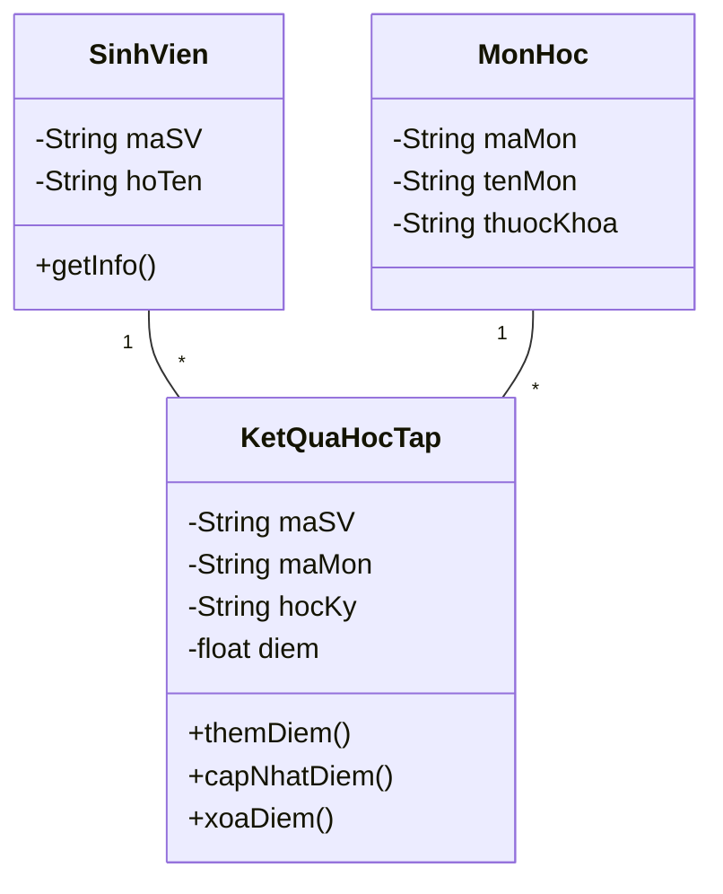

#### b. Thiết kế dữ liệu lưu trữ (1.0 điểm)
**Bài làm:**

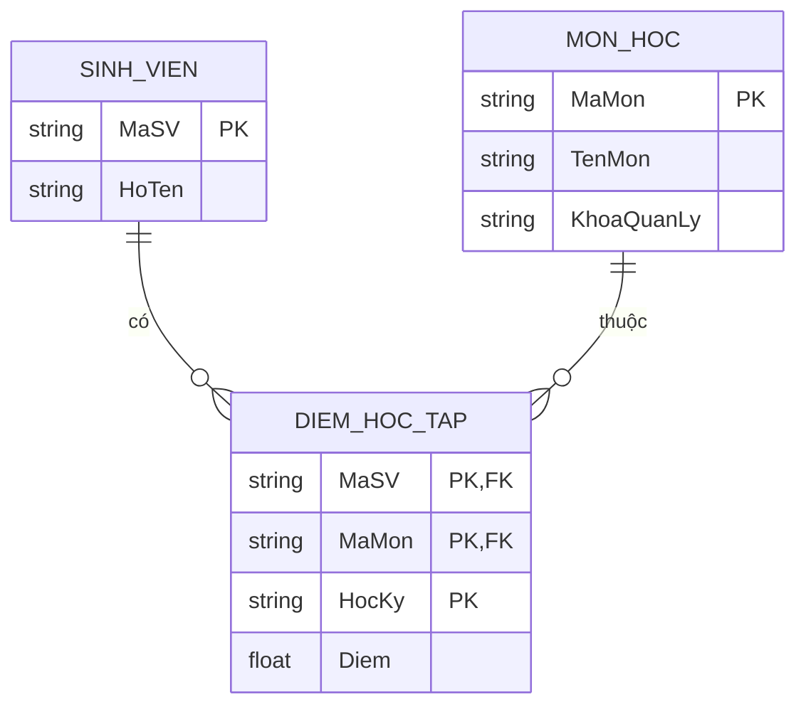


#### c. Thiết kế Màn hình giao diện chức năng này (0.5 điểm)
**Bài làm:**
Vẽ Form popup "NHẬP ĐIỂM SINH VIÊN":
- Ô nhập: Mã sinh viên: [_____] (Khi gõ xong tự động hiển thị mờ Họ tên bên cạnh).
- Combobox: Chọn Môn học [ v ] (Chỉ lấy môn thuộc danh mục khoa).
- Ô nhập: Học kỳ: [_____].
- Ô nhập: Điểm: [_____] (Giới hạn 0 - 10).
- Nút bấm dưới cùng: `[ Lưu điểm ]` và `[ Đóng ]`.

#### d. Thiết kế Test Case thêm thành công (0.5 điểm)
**Bài làm:**
| ID | Tên | Tiền điều kiện | Input | Expected Output |
|---|---|---|---|---|
| TC_DIEM_01 | Thêm điểm hợp lệ | Mã SV 'SV001' tồn tại. Mã Môn 'CS101' tồn tại | Mã SV: SV001, Môn: CS101, Học kỳ: HK1, Điểm: 8.5 | Lưu CSDL thành công. Form đóng lại, bảng dữ liệu hiện dòng điểm 8.5 của SV001. |

---

## BÀI 3: HỆ THỐNG QUẢN LÝ ĐỒ ÁN MÔN HỌC

**Đề bài tóm tắt:** Trưởng bộ môn: Duyệt đề tài, Triển khai đề tài. Giảng viên: QL thông tin đề tài, Theo dõi tiến độ. Sinh viên: Chọn đề tài, Báo cáo tiến độ. Thông tin Đề tài: STT (khác rỗng), Tên (khác rỗng), Ngày ra (<= hiện tại), Loại (ĐA1, ĐA2), GV ra đề (trỏ về bảng GV).

### 1. Vẽ Sơ đồ Usecase (1.5 điểm)
**Bài làm:**

```mermaid
usecaseDiagram
    actor "Trưởng bộ môn" as TBM
    actor "Giảng viên" as GV
    actor "Sinh viên" as SV

    package "Hệ thống Quản lý Đồ án" {
        usecase "Duyệt đề tài" as UC1
        usecase "Triển khai đề tài cho SV" as UC2
        usecase "Quản lý thông tin đề tài" as UC3
        usecase "Theo dõi tiến độ thực hiện" as UC4
        usecase "Chọn đề tài đồ án" as UC5
        usecase "Báo cáo tiến độ thực hiện" as UC6
        usecase "Thêm đề tài" as UC3_1
        usecase "Sửa đề tài" as UC3_2
        usecase "Xóa đề tài" as UC3_3
    }

    TBM --> UC1
    TBM --> UC2
    GV --> UC3
    GV --> UC4
    SV --> UC5
    SV --> UC6

    UC3 ..> UC3_1 : <<include>>
    UC3 ..> UC3_2 : <<include>>
    UC3 ..> UC3_3 : <<include>>
```

### 2. Vẽ Sơ đồ màn hình giao diện (1.0 điểm)
**Bài làm:**
Vẽ layout chuẩn gồm Menu dọc bên trái và Bảng nội dung bên phải (Giao diện dành cho Giảng viên):
- Menu: Quản lý đề tài (Active), Theo dõi tiến độ.
- Thanh công cụ trên bảng: Nút `[Thêm Đề Tài Mới]`, Ô `[Tìm kiếm đề tài...]`.
- Bảng Grid (Lưới dữ liệu): Các cột `STT | Tên đề tài | Loại ĐA | Ngày ra | Trạng thái (Chờ duyệt/Đã duyệt) | Hành động`.

### 3. Thực hiện chức năng "Quản lý thông tin đề tài" (2.5 điểm)

#### a. Vẽ sơ đồ lớp (1.0 điểm)
**Bài làm:**

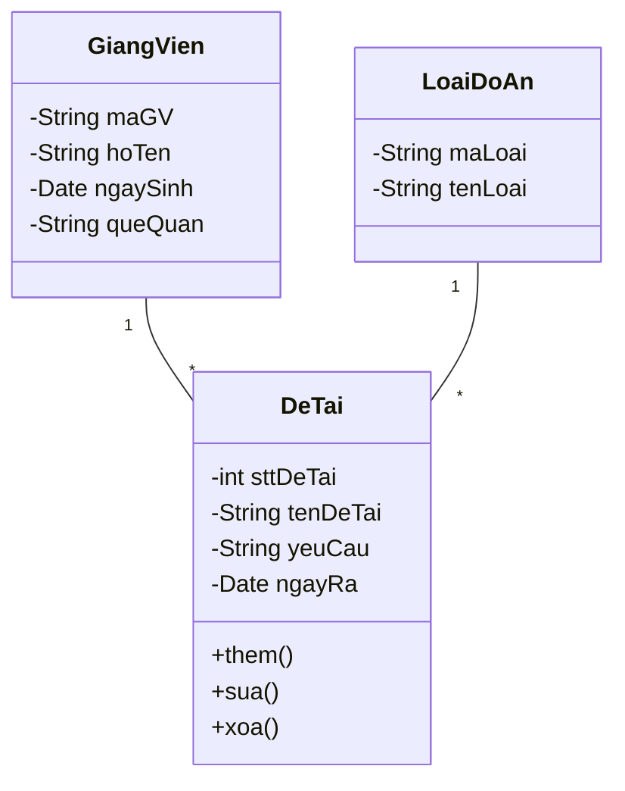

#### b. Thiết kế dữ liệu lưu trữ (0.5 điểm)
**Bài làm:**

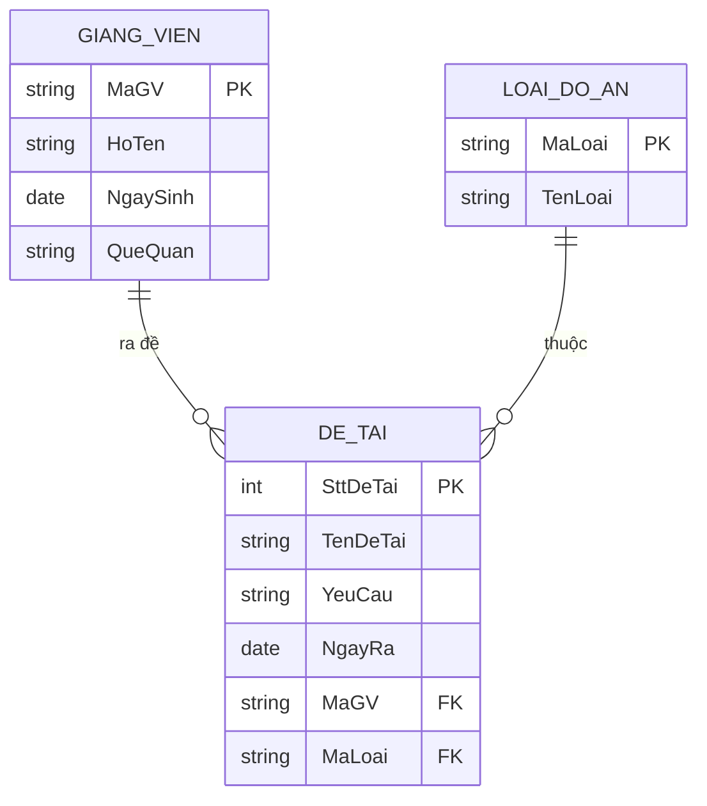


#### c. Thiết kế Màn hình giao diện chức năng (0.5 điểm)
**Bài làm:**
Vẽ Form "THÊM ĐỀ TÀI ĐỒ ÁN":
- Textbox: Số thứ tự Đề tài (*)
- Textbox: Tên đề tài (*)
- Textarea (Ô rộng): Yêu cầu đề tài
- DatePicker: Ngày ra đề tài [ Lịch ] (Tự động set ngày hôm nay, không cho chọn ngày tương lai) (*)
- Combobox: Loại đề tài [Đồ án 1 / Đồ án 2]
- Combobox: Giảng viên ra đề (Danh sách load từ DB)
- Nút `LƯU LẠI` và `ĐÓNG`.

#### d. Thiết kế Test Case (0.5 điểm)
**Bài làm:**
| ID | Tên | Tiền kiện | Input | Kết quả mong đợi |
|---|---|---|---|---|
| TC_DA_01 | Thêm đề tài ĐA1 thành công | Đang ở form thêm Đề tài | STT: 1, Tên: "Web bán hàng", Ngày ra: 12/05/2026, Loại: ĐA 1, GV: Nguyễn Văn A | Lưu thành công. Báo "Thành công", data lưu CSDL bảng DE_TAI, gridview được làm mới. |

# --- Nội dung file: Ngan_Hang_Chi_Tiet_Phan_1_Cau_1_50.md ---

# NGÂN HÀNG CÂU HỎI LÝ THUYẾT SIÊU CHI TIẾT - PHẦN 1 (Câu 1 - 50)
*(Bao gồm Chương 1, Chương 2 và nửa đầu Chương 3)*

---

## CHƯƠNG 1: GIỚI THIỆU CÔNG NGHỆ PHẦN MỀM

**1. Phần mềm được định nghĩa như thế nào dưới góc nhìn chuyên viên tin học?**
- **Định nghĩa đầy đủ:** Phần mềm (Software) không chỉ là những dòng code (chương trình máy tính) mà nó là một tập hợp bao gồm 3 thành phần không thể tách rời:
  1. **Chương trình máy tính (Computer Programs):** Là các đoạn mã chỉ thị cho máy tính thực hiện các chức năng cụ thể.
  2. **Cấu trúc dữ liệu (Data Structures):** Cho phép chương trình thao tác, lưu trữ và quản lý thông tin một cách tối ưu.
  3. **Tài liệu liên quan (Documentation):** Bao gồm tài liệu đặc tả yêu cầu, tài liệu thiết kế, tài liệu hướng dẫn sử dụng và bảo trì. Nếu thiếu tài liệu, phần mềm đó không được coi là một sản phẩm kỹ nghệ hoàn chỉnh.

**2. Công nghệ phần mềm (Software Engineering) là gì?**
- Công nghệ phần mềm là một chuyên ngành kỹ thuật áp dụng các nguyên lý toán học, khoa học máy tính và kỹ thuật vào việc phát triển phần mềm. 
- Nó đặc trưng bởi việc sử dụng một "cách tiếp cận có hệ thống, có kỷ luật và có thể định lượng được" để phát triển, vận hành và bảo trì phần mềm. Mục đích cốt lõi là tạo ra các phần mềm đạt chất lượng cao, đúng tiến độ và trong phạm vi ngân sách cho phép, thay vì viết code một cách tự phát và hỗn loạn.

**3. Khủng hoảng phần mềm (Software Crisis) là hiện tượng gì?**
- **Bối cảnh:** Thuật ngữ này xuất hiện từ những năm 1960 khi phần cứng máy tính phát triển mạnh mẽ, dẫn đến nhu cầu phần mềm lớn và phức tạp hơn.
- **Biểu hiện:** Là tình trạng các dự án phần mềm liên tục gặp thất bại. Các biểu hiện cụ thể bao gồm:
  - Chi phí phát triển vượt xa ngân sách dự kiến.
  - Thời gian hoàn thành trễ hơn rất nhiều so với hạn chót.
  - Chất lượng phần mềm thấp, nhiều lỗi (bug), hoạt động không ổn định.
  - Phần mềm làm ra không đáp ứng đúng nhu cầu thực tế của khách hàng, bảo trì cực kỳ khó khăn.

**4. Hãy nêu 3 tiêu chí cốt lõi mà người sử dụng đánh giá chất lượng phần mềm?**
- Người sử dụng (End-users) thường không quan tâm đến mã nguồn bên trong mà đánh giá qua trải nghiệm:
  1. **Tính đúng đắn (Correctness):** Phần mềm phải thực hiện chính xác các chức năng đã được yêu cầu, không tính toán sai hoặc xuất ra dữ liệu rác.
  2. **Tính tiện dụng (Usability):** Giao diện phải trực quan, dễ học, dễ nhớ và thân thiện. Người dùng có thể hoàn thành công việc của họ một cách mượt mà nhất.
  3. **Tính hiệu quả (Efficiency):** Phần mềm phải chạy nhanh, phản hồi tức thời, không tiêu tốn quá nhiều tài nguyên hệ thống (RAM, CPU, Pin...).

**5. Nêu 3 đặc trưng cơ bản của phần mềm làm nó khác biệt hoàn toàn với phần cứng?**
- **Thứ nhất, phần mềm mang tính logic, không phải vật lý:** Nó là tập hợp các chỉ thị và dữ liệu trừu tượng, không có hình hài, khối lượng hay kích thước vật lý.
- **Thứ hai, phần mềm không bị "hao mòn" cơ học:** Khác với phần cứng sẽ bị cũ hỏng theo thời gian, phần mềm không bị mòn đi. Tuy nhiên, nó bị "thoái hóa" (Deterioration) do môi trường thay đổi (HĐH mới, yêu cầu mới) khiến nó trở nên lỗi thời nếu không được bảo trì.
- **Thứ ba, phần mềm thường được "đo ni đóng giày":** Trong khi phần cứng được lắp ráp từ các linh kiện tiêu chuẩn có sẵn (IC, chip), phần mềm (đặc biệt là phần mềm doanh nghiệp) thường được thiết kế và xây dựng mới hoàn toàn (custom-built) theo yêu cầu đặc thù của từng tổ chức.

**6. Công nghệ phần mềm nghiên cứu những khía cạnh cốt lõi nào?**
- Công nghệ phần mềm xây dựng trên nền tảng 3 trụ cột (cộng thêm 1 nền tảng chất lượng):
  1. **Phương pháp (Methods):** Cách thức kỹ thuật để xây dựng phần mềm (cách thu thập yêu cầu, cách thiết kế kiến trúc, cách viết code, cách kiểm thử).
  2. **Quy trình (Processes):** Các bước tuần tự hoặc lặp lại để gắn kết các phương pháp và công cụ lại với nhau (VD: Quy trình thác nước, Quy trình Scrum), quy định ai làm việc gì, khi nào.
  3. **Công cụ (Tools):** Cung cấp sự hỗ trợ tự động hoặc bán tự động cho quy trình và phương pháp (VD: Git để quản lý mã nguồn, Jira để quản lý task, Selenium để test tự động).

**7. "Stakeholder" (Người có liên quan) trong một dự án phần mềm là những ai?**
- Bất kỳ cá nhân, nhóm người hoặc tổ chức nào có quyền lợi, bị ảnh hưởng hoặc có thể tác động đến dự án phần mềm đều được gọi là Stakeholder.
- **Phân loại chính:**
  - *Khách hàng (Client/Sponsor):* Người bỏ tiền ra thuê viết phần mềm.
  - *Người dùng cuối (End-Users):* Người trực tiếp thao tác trên phần mềm hàng ngày.
  - *Đội ngũ phát triển (Development Team):* Quản trị dự án (PM), Lập trình viên (Dev), Chuyên viên kiểm thử (Tester), Chuyên viên phân tích nghiệp vụ (BA).
  - *Nhà quản lý (Managers):* Quản lý cấp cao của doanh nghiệp sử dụng phần mềm.

**8. Phần mềm tốt (Good Software) cần thỏa mãn 4 thuộc tính chất lượng (properties) quan trọng nào?**
- Theo tài liệu chuẩn của Ian Sommerville, 4 thuộc tính đó là:
  1. **Khả năng bảo trì (Maintainability):** Code phải được viết rõ ràng, có tài trúc tốt để có thể dễ dàng thay đổi nhằm đáp ứng yêu cầu mới của doanh nghiệp.
  2. **Sự tin cậy và An toàn (Dependability and Security):** Phần mềm không được gây thiệt hại về vật chất hoặc kinh tế khi hệ thống bị lỗi; đồng thời phải chống lại được các cuộc tấn công ác ý từ bên ngoài.
  3. **Tính hiệu quả (Efficiency):** Không lãng phí tài nguyên hệ thống như bộ nhớ hay chu kỳ xử lý, thời gian phản hồi (response time) phải tối ưu.
  4. **Tính chấp nhận được (Acceptability):** Phần mềm phải dễ hiểu, hữu dụng và tương thích với các hệ thống hiện có mà người dùng đang sử dụng.

**9. Mã nguồn mở (Open Source) là gì và lợi ích của nó?**
- **Định nghĩa:** Là phần mềm có mã nguồn được công bố công khai dưới các giấy phép mã nguồn mở (như GPL, MIT, Apache). Bất kỳ ai cũng có quyền tải về, nghiên cứu, sửa đổi và phân phối lại phần mềm đó.
- **Lợi ích:** Phát triển nhanh chóng nhờ sức mạnh của cộng đồng, tính minh bạch cao (dễ phát hiện lỗi bảo mật), tiết kiệm chi phí bản quyền, và không bị khóa chặt (vendor lock-in) vào một nhà cung cấp duy nhất.

**10. Thế nào là hệ thống "Legacy" (Hệ thống di sản)? Tại sao các tổ chức vẫn dùng chúng?**
- **Định nghĩa:** Là những hệ thống phần mềm đã cũ, thường được viết bằng các ngôn ngữ lỗi thời (như COBOL, Fortran), kiến trúc nguyên khối và khó bảo trì.
- **Lý do vẫn tồn tại:** Chúng chứa đựng các quy trình nghiệp vụ cốt lõi và dữ liệu lịch sử sống còn của doanh nghiệp (ví dụ: hệ thống ngân hàng cốt lõi). Việc thay thế hoàn toàn một hệ thống Legacy mang rủi ro cực lớn về gián đoạn kinh doanh và chi phí khổng lồ, nên các tổ chức thường chọn cách "chắp vá" hoặc xây API bọc bên ngoài để duy trì.

**11. Có những loại ứng dụng phần mềm cơ bản nào? (Nêu ví dụ cụ thể)**
- **Ứng dụng Web (Web Applications):** Chạy trên trình duyệt (VD: Facebook, Shopee, hệ thống CRM nội bộ).
- **Ứng dụng Di động (Mobile Apps):** Chạy trên hệ điều hành smartphone như iOS/Android (VD: Tiktok, Grab).
- **Phần mềm Nhúng (Embedded Software):** Code được nạp thẳng vào chip để điều khiển thiết bị phần cứng (VD: Phần mềm trong máy giặt, phanh ABS của ô tô, lò vi sóng).
- **Ứng dụng Trí tuệ nhân tạo (AI Software):** Phần mềm có khả năng học máy, phân tích dữ liệu lớn (VD: ChatGPT, hệ thống nhận diện khuôn mặt).
- **Phần mềm độc lập (Stand-alone/Desktop Apps):** Chạy trực tiếp trên máy tính cá nhân (VD: MS Word, Photoshop).

**12. Đạo đức nghề nghiệp của kỹ sư phần mềm đòi hỏi điều gì về "Bảo mật thông tin" (Confidentiality)?**
- Kỹ sư phần mềm thường xuyên tiếp cận với dữ liệu nhạy cảm của khách hàng (thông tin tài chính, mật khẩu, chiến lược kinh doanh).
- **Quy tắc đạo đức:** Phải tuyệt đối tôn trọng tính bảo mật của thông tin này. Kỹ sư không được phép tiết lộ, mua bán hay sử dụng dữ liệu khách hàng cho mục đích cá nhân, ngay cả khi tổ chức không có hợp đồng bảo mật (Non-Disclosure Agreement - NDA) bằng văn bản chính thức. Đó là sự liêm chính nghề nghiệp.

**13. Lỗi phần mềm (Software Bug) thường phát sinh từ những nguyên nhân sâu xa nào?**
- **Thiếu sót trong phân tích yêu cầu:** Hiểu sai ý khách hàng, dẫn đến lập trình đúng kỹ thuật nhưng sai nghiệp vụ (lỗi này tốn kém nhất).
- **Lỗi logic lập trình:** Developer code sai thuật toán, thiếu kiểm soát vòng lặp, tràn bộ nhớ, quên xử lý ngoại lệ (Exception).
- **Thiết kế tồi:** Kiến trúc chắp vá dẫn đến khi sửa tính năng A lại làm hỏng tính năng B (lỗi hồi quy).
- **Kiểm thử không đầy đủ:** Thiếu Unit test, không test kỹ các trường hợp giá trị biên hoặc trường hợp người dùng thao tác bất thường.

**14. Việc áp dụng phương pháp tiếp cận có hệ thống (Systematic approach) mang lại những lợi ích thiết thực nào?**
- Tránh được sự hỗn loạn của tư duy "code and fix" (vừa viết vừa sửa).
- Cho phép tổ chức chia nhỏ dự án lớn thành các phần việc quản lý được (WBS - Work Breakdown Structure).
- Đảm bảo chất lượng phần mềm được kiểm soát qua từng giai đoạn (ví dụ: có review thiết kế trước khi code, có test trước khi release).
- Giúp việc luân chuyển nhân sự dễ dàng hơn (vì mọi thứ đều được tài liệu hóa và làm theo chuẩn mực chung).

**15. Thách thức lớn nhất hiện nay của chuyên ngành Công nghệ phần mềm là gì?**
- **Tính đa dạng (Heterogeneity):** Phần mềm ngày nay phải chạy trên nhiều nền tảng, thiết bị, tích hợp với vô số API của bên thứ 3 và phải liên kết mượt mà với các hệ thống cũ (Legacy).
- **Giao hàng nhanh (Delivery / Time-to-market):** Áp lực từ kinh doanh đòi hỏi phần mềm phải ra mắt cực nhanh để bắt kịp đối thủ cạnh tranh, làm giảm thời gian dành cho thiết kế và kiểm thử.
- **Sự thay đổi liên tục của doanh nghiệp (Business Change):** Yêu cầu khách hàng không bao giờ tĩnh, chúng thay đổi ngay cả khi dự án đang code.

---

## CHƯƠNG 2: QUY TRÌNH PHÁT TRIỂN PHẦN MỀM (SDLC)

**16. Vòng đời phát triển phần mềm (SDLC) bao gồm 4 hoạt động cơ bản nào?**
- Dù sử dụng bất kỳ mô hình nào (Thác nước hay Agile), mọi phần mềm đều phải trải qua 4 hoạt động lõi:
  1. **Đặc tả phần mềm (Software Specification):** Trả lời câu hỏi "Phần mềm cần làm cái gì?". Khách hàng và kỹ sư xác định các chức năng và ràng buộc của hệ thống.
  2. **Phát triển phần mềm (Software Development/Design & Implementation):** Trả lời câu hỏi "Làm như thế nào?". Bao gồm việc thiết kế kiến trúc, cấu trúc dữ liệu và viết mã nguồn (coding).
  3. **Thẩm định phần mềm (Software Validation/Testing):** Kiểm tra xem phần mềm có thỏa mãn yêu cầu của khách hàng không, phát hiện và sửa lỗi.
  4. **Tiến hóa phần mềm (Software Evolution/Maintenance):** Sửa chữa, nâng cấp phần mềm để đáp ứng các yêu cầu thay đổi trong quá trình sử dụng thực tế.

**17. Phân tích chi tiết về Mô hình Thác nước (Waterfall Model)?**
- **Khái niệm:** Là mô hình cổ điển nhất, trong đó các pha phát triển (Yêu cầu -> Thiết kế -> Lập trình -> Kiểm thử -> Triển khai) diễn ra tuần tự như dòng thác chảy từ trên xuống.
- **Đặc trưng:** Một pha phải hoàn thành 100% (và có tài liệu đóng băng/sign-off) thì mới được chuyển sang pha tiếp theo. Không có sự quay lui (hoặc quay lui rất khó khăn và tốn kém).
- **Phù hợp cho:** Các dự án có yêu cầu cực kỳ rõ ràng ngay từ đầu, ít rủi ro thay đổi, hoặc các dự án phần mềm nhúng, hệ thống an toàn sinh mạng (hàng không, y tế) cần tài liệu chứng minh nghiêm ngặt.

**18. Những nhược điểm chí mạng của Mô hình Thác nước là gì?**
- Không linh hoạt: Việc thay đổi yêu cầu ở giai đoạn giữa hoặc cuối dự án là cực kỳ tốn kém và phá vỡ cấu trúc.
- Chậm thấy sản phẩm: Khách hàng chỉ nhìn thấy phần mềm chạy được ở giai đoạn rất muộn (cuối dự án), nếu lúc đó mới phát hiện sai lệch thì coi như thất bại toàn tập.
- Ảo tưởng về sự đóng băng yêu cầu: Thực tế, khách hàng rất hiếm khi biết chính xác họ muốn gì ở đầu dự án.

**19. Mô hình Bản mẫu (Prototyping) hoạt động như thế nào và dùng khi nào?**
- **Hoạt động:** Thay vì đi làm sản phẩm thật ngay, team dev làm nhanh một bản nháp (Prototype - có thể là mockup giao diện click được, hoặc code khung) để khách hàng dùng thử. Khách hàng dùng thử sẽ đưa ra feedback. Sau khi chốt được yêu cầu từ bản mẫu, bản mẫu thường bị vứt bỏ để xây dựng hệ thống thật từ đầu.
- **Sử dụng khi:** Yêu cầu quá mơ hồ, khách hàng không rành về kỹ thuật, hoặc dự án liên quan nhiều đến trải nghiệm giao diện người dùng (UI/UX).

**20. Điểm khác biệt lớn nhất giữa mô hình Xoắn ốc (Spiral Model) với các mô hình khác?**
- Điểm sáng cốt lõi của Xoắn ốc là việc tập trung vào **Quản trị Rủi ro (Risk Analysis)**.
- Dự án được phát triển theo nhiều vòng lặp (vòng xoắn). Mỗi vòng đều có 4 pha: Lập kế hoạch, Phân tích rủi ro, Phát triển & Kiểm thử, và Đánh giá. Nếu tại bước phân tích rủi ro thấy dự án không khả thi, dự án có thể bị hủy bỏ ngay lập tức để tiết kiệm chi phí. Phù hợp với dự án lớn, phức tạp và đắt tiền.

**21. Tuyên ngôn Agile (Agile Manifesto) ra đời nhằm mục đích gì và có 4 giá trị cốt lõi nào?**
- Ra đời để khắc phục sự quan liêu, chậm chạp và quá nặng về tài liệu của các quy trình truyền thống (Thác nước).
- **4 giá trị cốt lõi:**
  1. Đề cao **Cá nhân và sự tương tác** hơn là *quy trình và công cụ*.
  2. Đề cao **Phần mềm chạy tốt** hơn là *tài liệu đầy đủ*.
  3. Đề cao **Cộng tác với khách hàng** hơn là *đàm phán hợp đồng*.
  4. Đề cao **Phản hồi với sự thay đổi** hơn là *bám sát một kế hoạch đã định*.

**22. Tại sao Mô hình Agile lại cực kỳ phù hợp với thế giới công nghệ hiện đại?**
- Môi trường kinh doanh ngày nay thay đổi theo từng ngày. Agile chia dự án thành các vòng lặp ngắn (Iterative & Incremental). 
- Ở mỗi chu kỳ (thường 2 tuần), một phần của phần mềm (có thể chạy được) sẽ được giao cho khách hàng. Điều này giúp khách hàng liên tục thấy tiến độ, dễ dàng điều chỉnh yêu cầu mới, giúp sản phẩm ra mắt thị trường nhanh (time-to-market) và tối đa hóa giá trị nghiệp vụ.

**23. Scrum là gì và nó liên quan thế nào đến Agile?**
- Agile là một triết lý (mindset), còn Scrum là một bộ khung thực hành (Framework) cụ thể và phổ biến nhất để áp dụng triết lý Agile.
- Scrum tổ chức công việc thông qua các chu kỳ nước rút gọi là **Sprint**, đảm bảo tính minh bạch, kiểm tra và thích nghi liên tục thông qua các cuộc họp định kỳ có cấu trúc chặt chẽ.

**24. Phân tích chi tiết về khái niệm "Sprint" trong Scrum?**
- Sprint là một "hộp thời gian" (Time-box) cố định, thường kéo dài từ 1 đến 4 tuần.
- Trong Sprint, nhóm cam kết hoàn thành một số yêu cầu nhất định để tạo ra một phần sản phẩm (Increment) có khả năng phát hành được.
- Khi một Sprint bắt đầu, mục tiêu của Sprint đó không được phép thay đổi. Khi Sprint kết thúc, nhóm tổ chức họp Đánh giá (Review) và Cải tiến (Retrospective) rồi lập tức bắt tay vào Sprint mới.

**25. Trình bày chi tiết về 3 vai trò (Roles) chính trong một nhóm Scrum?**
- **Product Owner (PO):** Đại diện cho tiếng nói của khách hàng/nghiệp vụ. Quyết định phần mềm sẽ có tính năng gì, sắp xếp độ ưu tiên của chúng trong Product Backlog để tối đa hóa ROI (Lợi tức đầu tư).
- **Scrum Master (SM):** Là một "người phục vụ dẫn dắt" (Servant-Leader). SM không quản lý con người mà quản lý quy trình Scrum, đảm bảo mọi người hiểu và làm đúng Scrum, loại bỏ các trở ngại (impediments) cản bước nhóm lập trình.
- **Development Team (Đội phát triển):** Các chuyên gia (Dev, QA, UI/UX) tự quản lý, tự tổ chức công việc để biến các yêu cầu trong Backlog thành sản phẩm chạy được ở cuối mỗi Sprint.

**26. Trách nhiệm sinh tử của Product Owner là gì?**
- Quản lý **Product Backlog** (Danh sách các yêu cầu). PO phải đảm bảo Backlog luôn rõ ràng, minh bạch và các tính năng mang lại giá trị cao nhất phải được đưa lên đầu để team ưu tiên làm trước. Nếu PO làm sai, team có thể code rất nhanh nhưng sản phẩm làm ra không ai cần.

**27. Một Scrum Master khác với một Project Manager (PM) truyền thống như thế nào?**
- PM truyền thống: Giao việc cho từng người, theo dõi tiến độ (timesheet), kiểm soát ngân sách, chịu trách nhiệm chính về sự thành bại của dự án.
- Scrum Master: Không giao việc (team tự nhận việc), không đánh giá KPI cá nhân. SM tập trung vào việc huấn luyện (coaching), bảo vệ team khỏi sự can thiệp của các bên ngoài trong lúc đang chạy Sprint, và tối ưu hóa môi trường làm việc.

**28. Product Backlog và Sprint Backlog khác nhau ở điểm nào?**
- **Product Backlog:** Là danh sách "ước mơ", chứa TẤT CẢ mọi yêu cầu, ý tưởng, bug của toàn bộ dự án từ đầu đến cuối. Nó do Product Owner giữ và thay đổi liên tục.
- **Sprint Backlog:** Là một danh sách công việc "thực tế", được đội Development trích xuất từ Product Backlog ra để cam kết hoàn thành TRONG MỘT SPRINT cụ thể. Khi Sprint bắt đầu, Sprint Backlog bị đóng băng (không được thêm tính năng mới).

**29. Sự kiện Daily Scrum (Họp giao ban hằng ngày) có mục đích và nguyên tắc gì?**
- **Mục đích:** Để đội phát triển đồng bộ hóa công việc, kiểm tra tiến độ hướng tới mục tiêu Sprint và điều chỉnh kế hoạch trong 24 giờ tới.
- **Nguyên tắc:** Thường họp đứng (Stand-up meeting), chỉ diễn ra tối đa 15 phút. Mỗi người trả lời 3 câu: (1) Hôm qua đã làm gì để đạt mục tiêu? (2) Hôm nay sẽ làm gì? (3) Có khó khăn rào cản nào không? Đây không phải là cuộc họp để giải quyết vấn đề kỹ thuật sâu.

**30. Quá trình RUP (Rational Unified Process) là gì và có điểm gì nổi bật?**
- RUP là một quy trình phát triển phần mềm cung cấp một bộ công cụ nghiêm ngặt hơn Agile nhưng linh hoạt hơn Thác nước.
- **Đặc trưng:** Nó dựa trên ngôn ngữ UML, lấy kiến trúc làm trung tâm (Architecture-centric), được dẫn dắt bởi Use-case (Use-case driven) và phát triển theo hướng Lặp và Tăng dần. RUP chia dự án thành 4 pha: Khởi tạo (Inception), Lập chi tiết (Elaboration), Xây dựng (Construction), và Chuyển giao (Transition).

**31. Đặc tả yêu cầu phần mềm (SRS - Software Requirements Specification) là tài liệu gì?**
- Đây là "bản hợp đồng kỹ thuật" giữa khách hàng và nhóm phát triển. Nó mô tả một cách hoàn chỉnh, nhất quán, không mơ hồ về TẤT CẢ những gì phần mềm phải thực hiện (Yêu cầu chức năng) và các giới hạn, ràng buộc mà phần mềm phải tuân thủ (Yêu cầu phi chức năng). Tài liệu này là cơ sở để thiết kế, lập trình và viết kịch bản kiểm thử (Test Case).

**32. Yêu cầu chức năng (Functional Requirement) được hiểu sâu sắc như thế nào?**
- Là các báo cáo trực tiếp về những dịch vụ mà hệ thống phải cung cấp. Nó trả lời cho câu hỏi: "Người dùng có thể làm gì với hệ thống?".
- **Ví dụ:** "Hệ thống phải cho phép người dùng đăng nhập bằng Email và Mật khẩu", "Hệ thống phải tự động tính toán tổng tiền đơn hàng bao gồm 10% thuế VAT", "Admin có quyền xóa tài khoản vi phạm".

**33. Yêu cầu phi chức năng (Non-functional Requirement) quan trọng ra sao? Hãy nêu ví dụ.**
- Nếu Yêu cầu chức năng là "Hệ thống phải làm gì", thì YC phi chức năng là "Hệ thống phải làm việc đó TỐT NHƯ THẾ NÀO". Nó bao gồm các ràng buộc về hệ thống. Đôi khi, YC phi chức năng còn quan trọng hơn chức năng, vì nếu hệ thống có đủ chức năng nhưng quá chậm hoặc không bảo mật thì sẽ bị tẩy chay.
- **Ví dụ phân loại:**
  - *Hiệu năng (Performance):* Thời gian load trang không quá 3 giây.
  - *Bảo mật (Security):* Mật khẩu phải được băm (hash) bằng SHA-256.
  - *Độ tin cậy (Reliability):* Hệ thống phải hoạt động 99.9% thời gian trong năm (Uptime).
  - *Môi trường (Environmental):* Phần mềm phải chạy được trên iOS 15 trở lên.

**34. Nêu và phân tích ưu/nhược điểm của 3 phương pháp thu thập yêu cầu phổ biến?**
1. **Phỏng vấn (Interviews):** Gặp gỡ trực tiếp (1-1 hoặc nhóm). *Ưu điểm:* Khai thác được thông tin sâu, ý kiến cá nhân. *Nhược điểm:* Tốn thời gian, người được phỏng vấn có thể nói theo cảm tính.
2. **Khảo sát bằng bảng hỏi (Questionnaires):** Phát phiếu câu hỏi cho diện rộng người dùng. *Ưu điểm:* Nhanh, thu thập được số liệu thống kê lớn. *Nhược điểm:* Câu trả lời hời hợt, không hỏi đào sâu thêm được.
3. **Quan sát thực tế (Observation / Ethnography):** BA xuống tận nơi làm việc của user để xem họ làm việc. *Ưu điểm:* Phát hiện ra những thói quen thực tế mà user quên không kể. *Nhược điểm:* Tốn rất nhiều thời gian.

**35. Tại sao bước "Nghiên cứu tính khả thi" (Feasibility Study) lại mang tính chất sống còn trước khi nhận dự án?**
- Đây là bước phân tích sơ bộ để quyết định "GO" hay "NO-GO" (Tiếp tục hay Dừng lại). 
- Cần đánh giá 3 góc độ:
  1. *Khả thi kỹ thuật:* Công nghệ hiện tại có làm được yêu cầu của khách không?
  2. *Khả thi kinh tế:* Lợi ích thu về có lớn hơn chi phí phát triển không? Dự án có đủ ngân sách không?
  3. *Khả thi thời gian:* Có kịp làm xong trước thời điểm vàng để tung ra thị trường (ví dụ: kịp dịp lễ Tết) không?
- Bỏ qua bước này dễ dẫn đến dự án "chết yểu" vì hết tiền hoặc đụng giới hạn công nghệ.

**36. Các bên liên quan (Stakeholders) thường gây ra những thảm họa gì trong việc thu thập yêu cầu?**
- **Hiểu biết mơ hồ:** Khách hàng biết họ đang có vấn đề gì, nhưng không biết phần mềm giải quyết nó thế nào, nên đưa ra yêu cầu rất mông lung ("Tôi muốn một phần mềm quản lý thông minh").
- **Xung đột quyền lợi:** Trưởng phòng A muốn luồng đi thế này, nhưng Trưởng phòng B lại muốn thế khác để có lợi cho bộ phận của họ.
- **Dùng từ lóng (Jargon):** Khách hàng dùng ngôn ngữ chuyên ngành y tế/tài chính khiến đội IT nghe không hiểu gì.
- **Thay đổi chóng mặt:** Yêu cầu đã chốt hôm qua, hôm nay khách hàng đi hội thảo về lại đổi ý muốn làm kiểu khác.

**37. Yêu cầu nghiệp vụ (Business Requirements) khác gì Yêu cầu người dùng (User Requirements)?**
- **Business Requirements (Mức cao nhất):** Mô tả mục tiêu chiến lược của công ty. Vd: "Tăng doanh số bán hàng online lên 30% trong năm nay". Nó không mô tả phần mềm làm gì.
- **User Requirements (Mức người dùng):** Mô tả các tác vụ người dùng cần làm để đạt được mục tiêu kinh doanh đó. Vd: "Người mua hàng phải dễ dàng tìm kiếm và lọc sản phẩm theo giá và thương hiệu".

**38. Đặc tả yêu cầu tốt cần đạt được những tính chất cốt lõi nào?**
- **Rõ ràng và Không mơ hồ (Unambiguous):** Chỉ có một cách hiểu duy nhất. Không dùng các từ như "nhanh", "tốt", "đẹp".
- **Đầy đủ (Complete):** Mô tả mọi kịch bản, kể cả kịch bản lỗi (ví dụ: nhập đúng thì sao, nhập sai password thì hệ thống báo gì).
- **Nhất quán (Consistent):** Yêu cầu ở trang 5 không được đá nhau/mâu thuẫn với yêu cầu ở trang 20.
- **Kiểm thử được (Testable):** Có thể viết ra một Test Case để chạy và xác nhận là Đạt hay Trượt.

**39. Kịch bản (Scenario) trong phân tích yêu cầu được sử dụng để làm gì?**
- Rất khó để khách hàng hiểu các mô hình kỹ thuật trừu tượng. Kịch bản là mô tả dạng câu chuyện về cách một người dùng thực tế tương tác với hệ thống. 
- *Cấu trúc kịch bản:* Bắt đầu bằng bối cảnh -> Hành động của người dùng -> Phản hồi của hệ thống -> Kết thúc. Điều này giúp khách hàng dễ dàng mường tượng và xác nhận xem "Câu chuyện này có đúng với thực tế không?".

**40. Phân biệt Validation (Thẩm định/Xác nhận) và Verification (Kiểm chứng) trong Quản lý Yêu cầu?**
- **Validation (Are we building the right product?):** Đi gặp khách hàng để xác nhận lại "Tài liệu SRS này đã ghi ĐÚNG và ĐỦ những gì anh/chị mong muốn chưa?". Mục đích là đảm bảo sản phẩm giải quyết đúng nỗi đau của khách hàng.
- **Verification (Are we building the product right?):** Việc nội bộ của team (BA, PM) xem xét lại tài liệu SRS xem nó có được viết đúng format công ty không, có lỗi chính tả không, các yêu cầu có đánh số thứ tự đàng hoàng chưa. Mục đích là đảm bảo tài liệu chuẩn chỉ về mặt hình thức và logic.

**41. Tại sao Verification (Kiểm chứng yêu cầu) lại quan trọng?**
- Giúp loại bỏ sớm các mâu thuẫn (VD: Yêu cầu 1 ghi "Chỉ admin được xóa tài khoản", Yêu cầu 25 lại ghi "Hệ thống tự động xóa tài khoản không đăng nhập 30 ngày"). Nếu không Verify, Developer sẽ bị bối rối và code sai logic, dẫn đến phải đập đi làm lại.

**42. Quản lý yêu cầu (Requirements Management) đóng vai trò gì trong suốt vòng đời dự án?**
- Yêu cầu KHÔNG BAO GIỜ đứng yên. Nhiệm vụ của Quản lý yêu cầu là: Khi khách hàng đòi thêm một tính năng C ở giữa dự án, hệ thống quản lý phải phân tích xem tính năng C sẽ tốn thêm bao nhiêu giờ làm, tốn bao nhiêu tiền, và nó có làm hỏng tính năng A, B đang có hay không. Từ đó mới quyết định có chấp nhận thay đổi hay không.

**43. Ma trận truy vết yêu cầu (Traceability Matrix - RTM) dùng để làm gì?**
- Là một bảng tính (thường là Excel) lập bản đồ liên kết giữa Yêu cầu gốc ban đầu với Thiết kế, Code, và Test Case.
- **Tác dụng 1:** Đảm bảo 100% yêu cầu của khách hàng đều đã được thiết kế, code và test (không bị bỏ sót).
- **Tác dụng 2:** Khi một yêu cầu thay đổi, nhìn vào ma trận sẽ biết ngay phải cập nhật những bản thiết kế nào và phải sửa những Test Case nào.

**44. "Mô hình ngôn ngữ tự nhiên" (viết đặc tả bằng lời văn bình thường) thường gặp rủi ro gì lớn nhất?**
- **Sự mơ hồ (Ambiguity):** Tiếng Việt hay Tiếng Anh đều có tính đa nghĩa. 
- **Thiếu cấu trúc:** Dễ dẫn đến viết lan man, nhầm lẫn giữa Yêu cầu (phần mềm làm gì) và Thiết kế (màn hình màu gì, đặt nút ở đâu).
- **Trộn lẫn (Confusion):** Viết gộp chung yêu cầu chức năng và phi chức năng vào một câu gây khó khăn cho việc phân tích và chia task cho lập trình viên.

**45. Giải pháp thay thế ngôn ngữ tự nhiên là Ngôn ngữ đặc tả hình thức (Formal Specification). Nó là gì?**
- Là phương pháp sử dụng các ký hiệu toán học, logic học và tập hợp để định nghĩa hệ thống. 
- *Lợi ích:* Tuyệt đối chính xác, không thể hiểu sai, có thể dùng máy tính để tự động kiểm tra tính đúng đắn của logic.
- *Hạn chế:* Rất khó học, tốn nhiều thời gian, và khách hàng (người không rành toán/IT) hoàn toàn không thể đọc hiểu để xác nhận được. Chỉ dùng cho các hệ thống mang tính sinh tử (như điều khiển tàu vũ trụ, nhà máy điện hạt nhân).

**46. Trong biểu đồ Class, dấu "-" và "+" trước thuộc tính có ý nghĩa gì?**
- **"-" (Private):** Thể hiện thuộc tính/phương thức ở trạng thái Private. Nó chỉ có thể được truy cập và chỉnh sửa bởi chính các hàm nằm bên trong class đó. Đây là nền tảng của Tính Đóng Gói (Encapsulation).
- **"+" (Public):** Thể hiện trạng thái Public. Bất kỳ đối tượng, class nào bên ngoài cũng có thể gọi phương thức hoặc xem/sửa thuộc tính này.

**47. Dấu "#" trong biểu đồ Class nghĩa là gì?**
- **"#" (Protected):** Một trạng thái trung gian giữa Private và Public. Các thuộc tính/phương thức Protected chỉ cho phép chính class đó và **các class con (kế thừa từ nó)** được phép truy cập. Các class ngoại đạo hoàn toàn không thể gọi được.

**48. Quan hệ "Composition" (Kết tập toàn phần) khác "Aggregation" (Kết tập bộ phận) như thế nào? Cung cấp ví dụ.**
- **Composition (Sống cùng sống, chết cùng chết):** Thể hiện mối quan hệ phụ thuộc cấu thành cực kỳ chặt chẽ. Nếu đối tượng cha bị hủy, các đối tượng con bên trong lập tức bị hủy theo. Ký hiệu: Hình thoi ĐEN đặc.
  - *Ví dụ:* Ngôi nhà và Căn phòng. Nếu Ngôi nhà bị phá bỏ, các Căn phòng bên trong cũng không còn tồn tại.
  - *Ví dụ IT:* Hóa đơn và Chi tiết hóa đơn.
- **Aggregation (Tập hợp lỏng lẻo):** Đối tượng con có thể tồn tại độc lập ngay cả khi đối tượng cha bị hủy. Ký hiệu: Hình thoi TRẮNG rỗng.
  - *Ví dụ:* Khoa CNTT và Giảng viên. Nếu Khoa CNTT giải thể, các Giảng viên vẫn tồn tại và có thể chuyển sang khoa khác.

**49. Sơ đồ tuần tự (Sequence Diagram) đọc theo thứ tự và trục nào?**
- Biểu đồ tuần tự được ánh xạ qua 2 chiều không gian:
  - **Trục tung (Từ trên xuống dưới):** Thể hiện sự trôi qua của thời gian. Thông điệp (Message) nào nằm bên trên sẽ được thực thi trước.
  - **Trục hoành (Từ trái sang phải):** Thể hiện danh sách các đối tượng (Objects) hoặc Actor tham gia vào quá trình tương tác, được phân tách bằng các đường đời (Lifelines).

**50. "Lifeline" (Đường đời) và "Activation box" trong Sequence Diagram mang ý nghĩa gì?**
- **Lifeline:** Là đường đứt nét thả dọc xuống dưới tên của Đối tượng. Nó biểu hiện rằng đối tượng này đang "sống" và tồn tại trong bộ nhớ tại khoảng thời gian đó. Nếu đối tượng bị hủy, lifeline sẽ kết thúc bằng dấu "X".
- **Activation box (Hộp kích hoạt):** Là một hình chữ nhật dài (hình trụ) vẽ đè lên Lifeline. Nó biểu thị khoảng thời gian chính xác mà đối tượng đó đang chiếm quyền điều khiển CPU để xử lý một hàm, chạy một thuật toán, hoặc chờ đợi phản hồi từ database.

# --- Nội dung file: Ngan_Hang_Chi_Tiet_Phan_1_Cau_1_80.md ---

# NGÂN HÀNG CÂU HỎI LÝ THUYẾT SIÊU CHI TIẾT - PHẦN 1 (Câu 1 - 80)
*(Bao gồm Chương 1, Chương 2, Chương 3 và Chương 4)*

---

## CHƯƠNG 1, 2, 3 (Các câu 1 - 50 đã có ở file trước, dưới đây là tiếp nối)

**51. Mô hình hóa phần mềm (Software Modeling) mang lại những lợi ích cốt lõi nào cho dự án?**
- Mô hình hóa giống như việc vẽ bản vẽ thiết kế (blueprint) trước khi xây nhà. Lợi ích bao gồm:
  1. **Trực quan hóa (Visualization):** Giúp nhìn thấy hệ thống một cách trực quan, hình dung được hệ thống sẽ hoạt động ra sao trước khi viết một dòng code nào.
  2. **Đặc tả kiến trúc (Specification):** Chỉ định rõ cấu trúc dữ liệu và hành vi của hệ thống.
  3. **Tài liệu hóa (Documentation):** Lưu lại các quyết định thiết kế cho thế hệ Lập trình viên sau này bảo trì hệ thống.
  4. **Giao tiếp (Communication):** Là ngôn ngữ chung để Khách hàng, BA, Dev và Tester thảo luận mà không bị rào cản về thuật ngữ ngôn ngữ lập trình.

**52. UML (Unified Modeling Language) là gì và có phải là một ngôn ngữ lập trình không?**
- **Định nghĩa:** UML là Ngôn ngữ Mô hình hóa Thống nhất. Nó là một ngôn ngữ chuẩn mực bao gồm tập hợp các biểu đồ, ký hiệu đồ họa dùng để trực quan hóa, đặc tả, thiết kế và lập tài liệu cho các hệ thống phần mềm hướng đối tượng.
- **Lưu ý:** UML KHÔNG PHẢI là ngôn ngữ lập trình (như Java hay Python). Nó không tạo ra chương trình thực thi được, nó chỉ tạo ra "Bản thiết kế" hệ thống.

**53. Sơ đồ Use-case (Usecase Diagram) có mục đích chính là gì?**
- Mục đích chính là nắm bắt các **Yêu cầu chức năng** của hệ thống dưới lăng kính của người dùng (End-users).
- Nó không mô tả cách phần mềm hoạt động bên trong hay luồng dữ liệu (thuật toán), mà chỉ mô tả "Hệ thống cung cấp những giá trị/tính năng gì" và "Ai là người được phép sử dụng những tính năng đó". Sơ đồ này cực kỳ hữu ích để thảo luận trực tiếp với khách hàng.

**54. Trong Sơ đồ Use-case, "Actor" (Tác nhân) có những đặc điểm gì?**
- Actor đại diện cho một vai trò (Role) tương tác với hệ thống, chứ không phải một con người cụ thể. (VD: "Thủ thư", "Sinh viên" là vai trò).
- Actor luôn nằm bên ngoài ranh giới hệ thống (System Boundary).
- Actor có thể là người dùng, một phần cứng bên ngoài, hoặc một phần mềm/API bên ngoài (Ví dụ: Cổng thanh toán VNPay, Máy quẹt thẻ).

**55. Phân tích chi tiết sự khác biệt giữa quan hệ "Include" và "Extend" trong sơ đồ Use-case?**
- Cả hai đều dùng để kết nối giữa 2 Use-case (không kết nối Actor với Use-case).
- **<<include>> (Sự bao hàm - Bắt buộc):** Một Use-case cơ sở bắt buộc phải thực thi Use-case bị include thì chức năng mới hoàn tất. Nó giống như việc gọi một hàm tái sử dụng.
  - *Ví dụ:* UC "Rút tiền", UC "Chuyển khoản", UC "Xem số dư" đều có mũi tên đứt nét mũi tên trỏ vào UC "Xác thực mã PIN" với nhãn <<include>>. Vì nếu không nhập mã PIN thì không làm được 3 việc kia.
- **<<extend>> (Sự mở rộng - Tùy chọn):** Use-case mở rộng chỉ được thực thi khi một điều kiện nhất định xảy ra. Mũi tên đứt nét hướng TỪ Use-case phụ về Use-case cơ sở.
  - *Ví dụ:* UC cơ sở là "Lập hóa đơn thanh toán". Nếu khách hàng có thẻ VIP, họ sẽ kích hoạt thêm UC "Áp dụng mã giảm giá" (nhãn <<extend>>). Nếu không có thẻ, UC cơ sở vẫn hoàn tất bình thường.

**56. Biểu đồ lớp (Class Diagram) thể hiện khía cạnh nào của hệ thống?**
- Thể hiện khía cạnh **Tĩnh (Static)** của hệ thống hướng đối tượng.
- Nó mô tả các loại đối tượng (Class) sẽ được tạo ra trong code, bao gồm: Tên Class, Danh sách thuộc tính (Attributes - các biến), Danh sách phương thức (Operations - các hàm), và mối quan hệ giữa các Class (Class này kế thừa Class nào, kết nối với Class nào).

**57. Sơ đồ hoạt động (Activity Diagram) có vai trò gì và giống với công cụ nào trong tin học cơ bản?**
- **Vai trò:** Dùng để mô tả luồng công việc (Workflow) của một nghiệp vụ từ đầu đến cuối, hoặc mô tả luồng thực thi (thuật toán) chi tiết bên trong một Use-case/Phương thức phức tạp. Nó biểu diễn hành động, các luồng phân nhánh (If/Else) và các luồng chạy song song (Parallel/Concurrent).
- **Tương đồng:** Nó rất giống với Sơ đồ khối (Flowchart) truyền thống nhưng mạnh mẽ hơn nhiều nhờ hỗ trợ các luồng đồng thời (qua thanh Fork/Join) và phân chia trách nhiệm (qua Swimlane).

**58. Khái niệm "Swimlane" (Làn bơi) trong Activity Diagram dùng để làm gì?**
- Swimlane là kỹ thuật vẽ các đường thẳng dọc/ngang chia biểu đồ thành nhiều cột/hàng. Mỗi cột đại diện cho một Actor, một bộ phận phòng ban hoặc một hệ thống con cụ thể.
- **Tác dụng:** Giúp người xem nhìn ngay vào biểu đồ là biết hành động A do ai thực hiện (VD: Khách hàng "Đặt hàng" -> Hệ thống "Kiểm tra tồn kho" -> Kế toán "Xác nhận thanh toán").

**59. Sơ đồ trạng thái (State Machine Diagram) tập trung vào điều gì?**
- Nó tập trung mô tả **Vòng đời (Lifecycle)** của duy nhất một đối tượng cụ thể (Object) từ khi nó được tạo ra cho đến khi bị hủy bỏ.
- Nó biểu diễn các "Trạng thái" (States) mà đối tượng có thể trải qua, và các "Sự kiện/Hành động" (Transitions/Triggers) khiến đối tượng chuyển từ trạng thái này sang trạng thái khác. 
- *Ví dụ đối với đối tượng "Đơn hàng":* Khởi tạo -> Chờ thanh toán -> Đã thanh toán -> Đang giao hàng -> Hoàn thành.

**60. UML được chia làm 2 nhóm biểu đồ chính là gì? Hãy kể tên một vài biểu đồ trong mỗi nhóm.**
- **Nhóm biểu đồ Cấu trúc (Structural Diagrams):** Mô tả các thành phần tĩnh, không phụ thuộc thời gian. (VD: Class Diagram, Component Diagram, Deployment Diagram, Object Diagram).
- **Nhóm biểu đồ Hành vi (Behavioral Diagrams):** Mô tả cách hệ thống vận hành, thay đổi theo thời gian và tương tác với nhau. (VD: Use-case Diagram, Sequence Diagram, Activity Diagram, State Machine Diagram).

**61. Thiết kế kiến trúc phần mềm (Software Architecture Design) là gì?**
- Là quy trình sáng tạo kỹ thuật đầu tiên sau khi đã chốt yêu cầu. 
- Đây là quá trình định nghĩa các khối hệ thống (Subsystems/Components) lớn, sự liên kết, giao tiếp và nguyên tắc hoạt động chung giữa chúng. Nó quyết định các nền tảng công nghệ sẽ dùng, tổ chức phân bổ dữ liệu, và cấu trúc vật lý của hệ thống. Nếu kiến trúc sai từ đầu, dự án gần như không thể cứu vãn.

**62. Kể tên và giải thích ngắn gọn 2 mẫu kiến trúc phần mềm (Architecture Patterns) kinh điển?**
1. **Kiến trúc Client-Server (Khách-Chủ):** Hệ thống được chia thành 2 phần tách biệt. Máy chủ (Server) tập trung, mạnh mẽ, quản lý dữ liệu và xử lý nghiệp vụ lõi. Các máy khách (Client - như app mobile, trình duyệt) xử lý giao diện người dùng và gửi request lên Server lấy dữ liệu.
2. **Kiến trúc phân lớp (Layered Architecture):** Mã nguồn được tổ chức thành các lớp ngang chồng lên nhau (thường là 3 lớp: Presentation/UI Layer -> Business Logic Layer -> Data Access Layer). Mỗi lớp chỉ giao tiếp với lớp ngay bên dưới nó. Rất dễ bảo trì vì thay đổi DB ở lớp Data không làm hỏng giao diện ở lớp UI.

**63. Mô hình MVC (Model-View-Controller) phân chia công việc như thế nào?**
- Đây là một Architectural Pattern siêu phổ biến cho thiết kế UI/Web:
  - **Model:** Đại diện cho Cấu trúc dữ liệu và Logic nghiệp vụ cốt lõi. Chịu trách nhiệm truy xuất/cập nhật DB.
  - **View:** Là giao diện (HTML/CSS, nút bấm). Nó lắng nghe và hiển thị dữ liệu từ Model, không chứa bất kỳ thuật toán tính toán nào.
  - **Controller:** Đóng vai trò làm "Bộ điều phối". Nhận Request từ người dùng trên View, gọi Model để xử lý, lấy kết quả từ Model và chỉ định một View phù hợp để render kết quả trả về cho user.

**64. Nguyên lý "Cohesion" (Độ gắn kết) trong thiết kế module là gì?**
- Cohesion đo lường mức độ tập trung và thống nhất của các dòng code, các hàm bên trong một Class hoặc một Module.
- Nếu một Module có **High Cohesion (Gắn kết cao)**, nghĩa là nó chỉ thực hiện ĐÚNG MỘT nhiệm vụ duy nhất và hoàn thành xuất sắc nhiệm vụ đó (Single Responsibility). Ví dụ: Class "Máy tính toán" chỉ chứa các hàm + - * /, không chứa hàm kết nối Database. Gắn kết cao là mục tiêu thiết kế tối thượng.

**65. Nguyên lý "Coupling" (Độ phụ thuộc) trong thiết kế module là gì?**
- Coupling đo lường mức độ phụ thuộc, ràng buộc chéo lẫn nhau giữa các Modules/Classes khác nhau trong hệ thống.
- Nếu hệ thống có **High Coupling (Phụ thuộc cao)**, các class gọi hàm và truy cập trực tiếp biến nội bộ của nhau quá nhiều. Hậu quả là khi bạn thay đổi code ở Class A, Class B và C sẽ bị lỗi theo (hiệu ứng domino). 
- Mục tiêu thiết kế là **Low Coupling (Phụ thuộc thấp)**: Các class độc lập nhất có thể, chỉ giao tiếp với nhau qua các Interface chuẩn mực.

**66. Thiết kế giao diện người dùng (UI) cần tuân thủ nguyên tắc "Nhất quán" (Consistency) nghĩa là gì?**
- **Nhất quán:** Là sự đồng bộ trong toàn bộ phần mềm.
  - *Trực quan:* Màu sắc (ví dụ nút Lưu luôn màu xanh, Xóa luôn màu đỏ), Font chữ, Kích thước icon phải giống nhau ở mọi màn hình.
  - *Hành vi:* Các phím tắt (Ctrl+C, Ctrl+V), luồng cảnh báo lỗi, vị trí đặt Menu phải ở những nơi người dùng dễ đoán nhất. Sự nhất quán giúp người dùng mới học cách sử dụng phần mềm cực kỳ nhanh.

**67. Nguyên tắc "Phản hồi" (Feedback) trong thiết kế UI quan trọng như thế nào?**
- Không có gì tệ hơn việc nhấn một nút và hệ thống... đứng im, khiến người dùng không biết hệ thống bị đơ, mất mạng hay đang xử lý ngầm.
- **Nguyên tắc Phản hồi:** Mọi thao tác của người dùng phải được đáp lại ngay lập tức bằng tín hiệu thị giác/thính giác. Ví dụ: Đổi màu nút bấm khi hover, hiển thị thanh tiến trình (Loading/Spinner) khi thao tác mất > 1 giây, hiện thông báo "Lưu thành công" (Toast message) ở góc màn hình.

**68. UX (User Experience - Trải nghiệm người dùng) khác UI (User Interface - Giao diện người dùng) như thế nào?**
- **UI:** Là bề nổi, những gì mắt thấy tay chạm (Nút bấm này màu gì? Font chữ này to bao nhiêu? Bố cục sắp xếp thế nào?). UI chú trọng vào tính thẩm mỹ.
- **UX:** Là bề chìm, cảm xúc và trải nghiệm tổng thể của user khi dùng phần mềm (Luồng mua hàng này có mượt không? Có khiến user bực mình vì phải click quá nhiều không? Trang web có tải nhanh không?). Một sản phẩm UI rất đẹp nhưng UX tồi (khó dùng) thì vẫn là sản phẩm thất bại.

**69. Giai đoạn thiết kế hệ thống đứng ở vị trí nào trong quy trình phần mềm chuẩn?**
- Thiết kế luôn là cầu nối. Nó nằm **sau** giai đoạn "Phân tích và Đặc tả Yêu cầu" (Biết cần làm gì) và nằm **trước** giai đoạn "Lập trình/Coding" (Bắt tay vào gõ code). Nhiệm vụ của nó là vạch ra con đường kiến trúc tối ưu để lập trình viên cứ thế mà code theo, không cần vừa code vừa suy nghĩ thuật toán.

**70. "Design Pattern" (Mẫu thiết kế) trong lập trình OOP là gì?**
- Khi thiết kế phần mềm trong nhiều thập kỷ, các kỹ sư nhận ra có những "bài toán khó" lặp đi lặp lại rất nhiều lần ở các dự án khác nhau.
- Design Pattern (Mẫu thiết kế) là **các giải pháp tổng quát, chuẩn mực và đã được chứng minh tính hiệu quả** để giải quyết các bài toán lặp lại đó. Áp dụng Pattern giúp mã nguồn dễ hiểu, dễ mở rộng và tránh các sai lầm thiết kế ngớ ngẩn (Antipatterns).
- *Ví dụ:* Mẫu Singleton, Mẫu Factory, Mẫu Observer, Mẫu Strategy.

**71. Phân tích Mẫu thiết kế Singleton (Singleton Pattern)?**
- **Vấn đề:** Trong ứng dụng, có những đối tượng mà nếu tạo ra nhiều phiên bản (instances) sẽ gây xung đột tài nguyên hoặc tốn RAM khủng khiếp (ví dụ: Kết nối Database, Trình ghi Log hệ thống).
- **Giải pháp Singleton:** Khóa chặt Constructor (Private Constructor) để ngăn không cho lệnh `new` hoạt động từ bên ngoài. Tạo một hàm tĩnh (Static method) chuyên trả về ĐÚNG MỘT instance duy nhất đã khởi tạo từ trước. Mọi nơi trong dự án khi gọi đến Class đó đều đang thao tác trên cùng 1 instance duy nhất ở bộ nhớ.

**72. Mục đích chính của việc Thiết kế Cơ sở dữ liệu (Database Design) là gì?**
- Thiết kế CSDL (Đặc biệt là Relational DB) nhằm tổ chức lưu trữ lượng lớn dữ liệu nghiệp vụ một cách hiệu quả nhất:
  - **Giảm dư thừa dữ liệu (Data Redundancy):** Chuẩn hóa bảng để thông tin không lặp lại vô ích (Tiết kiệm ổ cứng).
  - **Bảo đảm toàn vẹn dữ liệu (Data Integrity):** Dùng Khóa chính, Khóa ngoại, Ràng buộc Check để không bao giờ có dữ liệu rác/vô lý chui vào CSDL.
  - **Tối ưu tốc độ truy xuất:** Cấu trúc bảng hợp lý, gắn Index đúng chỗ để câu truy vấn SQL tìm kiếm mất mili-giây thay vì vài phút.

**73. Mô hình hóa dữ liệu thường dùng biểu đồ gì? (ERD)**
- Biểu đồ Thực thể - Mối kết hợp (ERD - Entity Relationship Diagram). 
- Nó vẽ ra các Thực thể (Entities - ví dụ: Khách hàng, Sản phẩm), các Thuộc tính (Attributes - ví dụ: Tên, SĐT), và vẽ đường kẻ nối mô tả Quan hệ (Relationships - ví dụ: Khách hàng *Mua* Sản phẩm, Tỷ lệ 1-N).

**74. Trong thiết kế CSDL quan hệ, "Khóa chính" (Primary Key) hoạt động như thế nào?**
- **Định nghĩa:** Là một thuộc tính (hoặc nhóm thuộc tính) mang giá trị ĐỘC NHẤT dùng để định danh riêng biệt cho TỪNG bản ghi (dòng) trong một bảng.
- **Tính chất bắt buộc:** Giá trị của Khóa chính không bao giờ được phép trùng lặp (Unique) và tuyệt đối không bao giờ được rỗng (NOT NULL). Ví dụ: CCCD, Mã Sinh viên.

**75. "Khóa ngoại" (Foreign Key) đảm nhiệm vai trò gì trong CSDL?**
- Khóa ngoại là cầu nối "bắt tay" giữa hai bảng dữ liệu. 
- Nó là một cột trong bảng A (bảng con), chứa giá trị trỏ trực tiếp đến Khóa chính của bảng B (bảng cha). Nhờ Khóa ngoại, CSDL bảo vệ được tính Toàn vẹn tham chiếu (Referential Integrity) - nghĩa là bạn không thể nhập một sinh viên vào "Lớp X" nếu Lớp X đó không tồn tại ở bảng Danh Mục Lớp.

**76. Thiết kế dữ liệu bao gồm 3 mức thiết kế nào?**
1. **Thiết kế mức Khái niệm (Conceptual Design):** Trừu tượng hóa nghiệp vụ khách hàng thành các biểu đồ ERD (vẽ hình chữ nhật, hình thoi). Không dính dáng gì đến công nghệ.
2. **Thiết kế mức Logic (Logical Design):** Chuyển đổi ERD thành Lược đồ quan hệ (Relational Schema) gồm các Table, Cột, Khóa chính, Khóa ngoại. Vẫn độc lập với phần mềm hệ quản trị.
3. **Thiết kế mức Vật lý (Physical Design):** Triển khai lược đồ logic đó vào một Hệ quản trị CSDL cụ thể (như MySQL, SQL Server, Oracle). Ở đây sẽ xét đến Kiểu dữ liệu (INT, VARCHAR), tạo Index, chia vùng đĩa (Partitioning).

**77. Chuẩn hóa CSDL (Database Normalization) là gì và tại sao cần thiết?**
- **Chuẩn hóa:** Là quá trình phân rã một bảng dữ liệu lớn (chứa nhiều thông tin hỗn độn, dư thừa) thành nhiều bảng nhỏ hơn, kết nối chúng qua Khóa ngoại theo các quy tắc nghiêm ngặt (Các Dạng chuẩn - Normal Forms: 1NF, 2NF, 3NF).
- **Sự cần thiết:** Khắc phục các hiện tượng "Dị thường" (Anomalies) khi Thêm/Sửa/Xóa. (Ví dụ dị thường sửa: Một khách hàng đổi SĐT, nếu thiết kế bảng không chuẩn hóa, ta phải đi Update SĐT đó ở 1000 dòng hóa đơn cũ, rất dễ sót dữ liệu dẫn đến sai lệch).

**78. Nguyên tắc "Cho phép phục hồi lỗi" (Forgiveness/Reversibility) trong UI được thực hiện bằng cách nào?**
- Người dùng luôn có xu hướng nhấp chuột nhầm hoặc gõ phím nhầm. UI tốt phải "khoan dung" với lỗi lầm này:
  - Cung cấp nút tính năng "Hoàn tác" (Undo - Ctrl+Z).
  - Yêu cầu xác nhận (Confirmation Dialog) trước các hành động nguy hiểm không thể đảo ngược (VD: "Bạn có chắc chắn muốn xóa toàn bộ database không?").
  - Xóa mềm (Soft Delete - đưa vào thùng rác) thay vì Xóa cứng (Hard Delete - xóa vĩnh viễn trong CSDL).

**79. Kiến trúc Microservices giải quyết nhược điểm gì của kiến trúc Monolithic (Nguyên khối)?**
- **Nhược điểm Monolithic:** Toàn bộ code (UI, DB logic, Xử lý thanh toán, Gửi mail) gộp chung vào 1 source code duy nhất. Khi code quá lớn, thời gian build app rất lâu; 1 module nhỏ bị lỗi tràn RAM có thể kéo sập TOÀN BỘ hệ thống; không thể scale độc lập 1 tính năng.
- **Giải pháp Microservices:** Chia nhỏ phần mềm thành hàng chục ứng dụng (services) tí hon chạy hoàn toàn độc lập trên các server khác nhau (Ví dụ: Service Thanh toán riêng, Service Kho riêng). Giao tiếp qua API. Nếu Module Thanh Toán sập, người dùng vẫn có thể xem Giỏ Hàng bình thường. Dễ dàng dùng nhiều ngôn ngữ lập trình cho nhiều service.

**80. API (Application Programming Interface) là khái niệm thiết kế vô cùng quan trọng. Nó là gì?**
- Giao diện lập trình ứng dụng (API) là các bộ quy tắc, giao thức và định dạng dữ liệu (thường là JSON/XML) cho phép các ứng dụng/phần mềm ĐỘC LẬP có thể "nói chuyện", gọi hàm và chia sẻ dữ liệu với nhau mà không cần biết mã nguồn bên trong của nhau.
- *Ví dụ:* Ứng dụng Grab không tự vẽ bản đồ mà gọi Google Maps API; App bán hàng gọi Momo API để thanh toán. Mọi thiết kế hiện đại đều là "API-first".

# --- Nội dung file: Ngan_Hang_Chi_Tiet_Phan_1_Va_2_Cau_1_100.md ---

# NGÂN HÀNG CÂU HỎI LÝ THUYẾT SIÊU CHI TIẾT - PHẦN 1 & 2 (Câu 1 - 100)
*(Tài liệu này là bản tổng hợp đầy đủ từ Câu 1 đến Câu 100 của toàn bộ học phần)*

---

## CÁC CÂU 81 - 100 (Phần lập trình & Kiểm thử)

**81. Trình bày chi tiết về 4 tính chất cơ bản của Lập trình hướng đối tượng (OOP)?**
- OOP được xây dựng dựa trên 4 trụ cột không thể thiếu:
  1. **Tính Đóng gói (Encapsulation):** Gói gọn dữ liệu (thuộc tính) và các hàm thao tác trên dữ liệu đó vào trong một khoang chứa (Class). Bảo vệ dữ liệu bằng các access modifiers (Private) và chỉ cho phép giao tiếp qua các kênh Public (Getter/Setter).
  2. **Tính Kế thừa (Inheritance):** Cho phép một Class con (Sub-class) thừa hưởng lại toàn bộ thuộc tính và phương thức của một Class cha (Super-class) đã có sẵn. Giúp tái sử dụng code tối đa (Ví dụ: Class Chó kế thừa Class ĐộngVật).
  3. **Tính Đa hình (Polymorphism):** Cùng một tên hàm, nhưng khi gọi trên các đối tượng khác nhau (hoặc truyền tham số khác nhau) sẽ thực thi các hành động khác nhau. Nó được thực hiện qua Ghi đè hàm (Overriding) và Ghi chồng hàm (Overloading).
  4. **Tính Trừu tượng (Abstraction):** Bỏ qua các chi tiết triển khai phức tạp bên trong, chỉ bộc lộ ra ngoài những đặc điểm thiết yếu, giao diện cốt lõi mà người sử dụng cần biết (thông qua Abstract Class hoặc Interface).

**82. Mã nguồn sạch (Clean Code) là thuật ngữ rất nổi tiếng trong phát triển phần mềm. Nó ám chỉ điều gì?**
- Đoạn code được máy tính biên dịch và chạy đúng chưa chắc đã là code tốt. Theo triết lý của Robert C. Martin (Uncle Bob), **Clean Code** là đoạn code được viết ra để "Con người có thể đọc và hiểu được một cách dễ dàng", giống như đọc một bài văn xuôi rõ ràng.
- Đặc trưng của Clean Code: Tên biến/hàm mang ý nghĩa rõ ràng (không dùng a, b, x, y), các hàm rất ngắn (thường < 20 dòng) và thực hiện duy nhất 1 nhiệm vụ, cấu trúc thụt lề chuẩn, không có các khối mã bị lặp lại dư thừa (DRY) và hạn chế lạm dụng comment giải thích (vì code tốt tự nó giải thích cho nó).

**83. Tái cấu trúc mã nguồn (Refactoring) nghĩa là gì và tại sao lại cần thiết?**
- **Định nghĩa:** Là quá trình "dọn dẹp" và tổ chức lại cấu trúc mã nguồn bên trong để code sạch hơn, tối ưu hơn, dễ bảo trì hơn, **NHƯNG tuyệt đối không làm thay đổi hành vi bên ngoài** hay tính năng của phần mềm đối với người dùng cuối.
- **Sự cần thiết:** Dự án phần mềm càng chạy lâu, code càng phình to, lộn xộn, bị "bốc mùi" (Code Smells). Nếu không thường xuyên Refactoring (ví dụ: tách 1 class khổng lồ 2000 dòng thành 3 class nhỏ), mã nguồn sẽ chết yểu vì kỹ sư không ai dám chạm vào để sửa lỗi.

**84. Coding Convention (Chuẩn lập trình) mang lại lợi ích thực tế nào cho đội phát triển (Team)?**
- Khi dự án có 10 developer, mỗi người có thói quen đặt tên biến, thụt lề, để dấu ngoặc nhọn `{` ở vị trí khác nhau sẽ tạo ra mớ hỗn độn, đọc chéo code cực kỳ ức chế.
- **Lợi ích:** Áp dụng Coding Convention (Chuẩn chung của công ty hoặc cộng đồng - VD: PEP8 cho Python, PSR cho Python, CamelCase cho Java) giúp code của toàn team trông như do 1 người viết duy nhất. Điều này giúp đẩy nhanh tốc độ Code Review, phát hiện bug lẩn khuất dễ hơn, hạn chế các xung đột (Merge Conflict) vô lý khi gộp code trên Git.

**85. Nguyên lý SOLID trong thiết kế và lập trình OOP là viết tắt của 5 nguyên tắc vàng nào?**
- Đây là 5 nguyên tắc giúp thiết kế hệ thống OOP cực kỳ mạnh mẽ, dễ bảo trì, dễ thay đổi:
  - **[S] Single Responsibility Principle (Đơn trách nhiệm):** Một Class chỉ nên có duy nhất 1 lý do để thay đổi (Chỉ làm 1 việc duy nhất).
  - **[O] Open/Closed Principle (Đóng/Mở):** Class nên Đóng đối với việc sửa đổi trực tiếp (sửa code cũ dễ gây bug), nhưng Mở đối với việc mở rộng (thêm tính năng mới bằng cách kế thừa).
  - **[L] Liskov Substitution Principle (Thay thế Liskov):** Đối tượng thuộc Class con có thể thay thế hoàn hảo cho Class cha trong mọi tình huống mà không làm gãy logic hệ thống.
  - **[I] Interface Segregation Principle (Phân tách Interface):** Đừng ép các class phải implements một Interface khổng lồ chứa những hàm mà nó không dùng. Hãy băm nhỏ Interface ra.
  - **[D] Dependency Inversion Principle (Đảo ngược phụ thuộc):** Các module cấp cao (Logic nghiệp vụ) không được phụ thuộc vào các module cấp thấp (Database/UI). Cả 2 đều phải phụ thuộc vào Abstraction (Interface).

**86. Git và Quản lý phiên bản (Version Control System - VCS) sinh ra để giải quyết vấn đề gì?**
- **Vấn đề:** Khi nhiều người cùng sửa chung 1 file code, nếu copy qua USB thì sẽ ghi đè xóa sạch code của nhau. Khi code bị lỗi nghiêm trọng, không thể "Undo" về phiên bản ổn định của tuần trước.
- **Giải pháp:** Git lưu trữ mọi lịch sử thay đổi của từng dòng code, ai sửa, lúc nào. Nó cho phép các lập trình viên làm việc song song trên các "nhánh" (Branches) khác nhau. Sau khi hoàn thiện, tính năng tự động hòa trộn (Merge) sẽ gom code lại một cách an toàn mà không làm mất dữ liệu. GitHub/GitLab là các máy chủ lưu trữ nền tảng Git.

**87. Tự động hóa tích hợp và triển khai liên tục (CI/CD) trong lập trình hiện đại nhằm mục đích gì?**
- **CI (Continuous Integration):** Khi dev đẩy code mới lên Git, hệ thống CI tự động build app và chạy hàng ngàn bài Unit Test tự động. Nếu có dòng code nào phá hỏng hệ thống, nó sẽ báo đỏ (Fail) ngay lập tức từ chối nhận code.
- **CD (Continuous Deployment):** Nếu CI xanh (Pass), hệ thống tự động đóng gói ứng dụng và đẩy (Deploy) thẳng lên Server cho khách hàng sử dụng mà không cần con người copy/dán file thủ công ban đêm.
- **Mục đích:** Phóng thích tính năng mới siêu nhanh, an toàn tuyệt đối, loại bỏ rủi ro do thao tác thủ công (Human Error).

**88. Mục đích tối thượng của Kiểm thử phần mềm (Software Testing) là gì?**
- Kiểm thử KHÔNG THỂ chứng minh phần mềm không có lỗi (vì không thể test cạn kiệt), nhưng nó nhằm các mục đích:
  1. Phát hiện càng nhiều lỗi (Defects/Bugs) càng tốt trước khi sản phẩm đến tay khách hàng.
  2. Xác minh rằng hệ thống đáp ứng ĐÚNG và ĐỦ các yêu cầu đã ghi trong tài liệu đặc tả (SRS).
  3. Cung cấp thông tin khách quan, đo lường được về chất lượng phần mềm để Quản lý dự án quyết định có nên phát hành (Release) hay không.

**89. Kiểm thử hộp đen (Black-box testing) có phương pháp luận như thế nào?**
- **Góc nhìn:** Tester đóng vai trò như một người dùng cuối. Phần mềm là một "Chiếc hộp đen" mù mịt, tester không cần biết ngôn ngữ lập trình là gì, thuật toán bên trong code viết ra sao.
- **Cách test:** Tester chỉ cung cấp Đầu vào (Input) -> Chờ phần mềm chạy -> Kiểm tra Đầu ra (Output) có giống với Kết quả mong đợi trong tài liệu thiết kế hay không. Các kỹ thuật phổ biến: Phân vùng tương đương, Phân tích giá trị biên, Bảng quyết định.

**90. Kiểm thử hộp trắng (White-box testing) thì dành cho đối tượng nào và test cái gì?**
- **Góc nhìn:** Phần mềm là "Chiếc hộp trong suốt". Người test (thường là Developer hoặc Automation Tester chuyên sâu) có quyền truy cập vào mã nguồn (Source Code).
- **Cách test:** Kiểm tra cấu trúc logic nội bộ, rẽ nhánh thuật toán, vòng lặp for/while. Dùng để xem tất cả các dòng code đã được chạy (Coverage) qua chưa, có đoạn code "chết" nào không. Đây là cốt lõi của Unit Testing.

**91. Hãy kể tên và giải thích 4 cấp độ kiểm thử phần mềm (Testing Levels) từ thấp đến cao?**
1. **Kiểm thử đơn vị (Unit Testing):** Test mức nhỏ nhất (từng hàm, từng class). Thường do Lập trình viên tự viết tự chạy (Hộp trắng). Giúp tìm lỗi rễ sớm nhất.
2. **Kiểm thử tích hợp (Integration Testing):** Ghép các Unit lại với nhau (VD: Ghép Module Thanh toán với Database) để xem chúng tương tác, truyền dữ liệu qua lại có bị gãy hay mất mát gì không.
3. **Kiểm thử hệ thống (System Testing):** Test toàn bộ hệ thống phần mềm hoàn chỉnh chạy trong môi trường giống thực tế. (Hộp đen).
4. **Kiểm thử chấp nhận (Acceptance Testing - UAT):** Do chính Khách hàng (End-Users) thực hiện. Họ kiểm tra xem hệ thống có giải quyết được quy trình kinh doanh nghiệp vụ của họ không. Nếu họ "Pass", công ty phần mềm mới được nhận tiền thanh toán.

**92. Phân biệt Error, Defect (Bug) và Failure trong kiểm thử phần mềm?**
- Mọi thứ bắt nguồn từ con người.
  - **Error (Lỗi lầm):** Là sự nhầm lẫn trong suy nghĩ hoặc hành động của Developer/BA (Ví dụ: Dev hiểu sai công thức tính thuế).
  - **Defect / Bug (Khuyết tật):** Là kết quả của Error, nó biến thành một đoạn code sai bị chôn vùi bên trong mã nguồn hệ thống.
  - **Failure (Sự thất bại):** Khi hệ thống đang chạy (Runtime), đoạn code chứa Bug vô tình được người dùng kích hoạt, dẫn đến phần mềm bị sập (Crash) hoặc hiện ra số liệu sai. Lúc này Bug đã trở thành Failure hiển hiện ra ngoài.

**93. Kỹ thuật "Phân tích giá trị biên" (Boundary Value Analysis) hoạt động dựa trên triết lý gì?**
- Qua thực tiễn, người ta phát hiện rằng các Lập trình viên hay code sai nhất ở các phép toán so sánh điều kiện (`>`, `<`, `>=`, `<=`).
- Do đó, số lượng Bug tập trung dày đặc nhất ở ranh giới (Biên) giữa vùng giá trị hợp lệ và vùng giá trị không hợp lệ. Thay vì test các số ở giữa an toàn, Tester sẽ tập trung test các giá trị sát sát mép biên (VD: Giới hạn độ tuổi 18 - 60. Các giá trị biên cần test cực gắt là: 17, 18, 60, 61). Kỹ thuật này giúp phát hiện lỗi hiệu quả nhất với số lượng Test case ít nhất.

**94. Kiểm thử khói (Smoke Testing) có vai trò gì trong quá trình nhận bản Build mới?**
- Thuật ngữ "Khói" bắt nguồn từ kỹ thuật phần cứng (Cắm điện vào board mạch, nếu không bốc khói thì mới tiếp tục test chi tiết).
- Tương tự trong phần mềm, trước khi Tester bỏ ra hàng ngày trời để test chi tiết 500 Test Cases, họ sẽ chạy vài Test case cơ bản nhất (Mất 15 phút) để xem: Ứng dụng có cài đặt được không? Nút Login có chạy không? Màn hình chính có load lên không? Nếu những chức năng sống còn này mà chết (Fail), bản Build này bị trả về (Reject) ngay lập tức cho Dev, từ chối test tiếp để khỏi mất thời gian.

**95. Kiểm thử hồi quy (Regression Testing) giải quyết rủi ro tâm lý cực kỳ phổ biến nào của lập trình viên?**
- Lập trình viên vừa sửa xong Bug A, hoặc thêm tính năng B mới toanh. Do tính chất phụ thuộc lỏng lẻo của code (Coupling), việc sửa ở chỗ này rất dễ làm vô tình gãy (vỡ code) ở một chức năng C cũ kĩ đã chạy ngon lành từ tháng trước.
- **Kiểm thử hồi quy:** Là hành động chạy lại toàn bộ (hoặc một phần) các Test Case cũ đang "Pass" để đảm bảo rằng phần code mới thêm vào không "đầu độc" phần mềm hiện tại. Quá trình này cực kỳ nhàm chán nếu làm bằng tay, nên Automation Test là cứu cánh tuyệt đối cho Regression Test.

**96. Tại sao người ta nói "Kiểm thử cạn kiệt 100% (Exhaustive Testing) là điều bất khả thi"?**
- Để test cạn kiệt, bạn phải quét qua TẤT CẢ các tổ hợp đầu vào và các nhánh logic luồng thuật toán của phần mềm. Đối với một trang web đơn giản có 10 ô nhập liệu, số tổ hợp biến ngẫu nhiên có thể lên tới hàng tỷ trường hợp. Mất hàng chục năm để test xong 1 nút bấm.
- Do đó, Tester giỏi không phải là test tất cả, mà là người biết dùng các kỹ thuật (Phân vùng, Giá trị biên, Phân tích rủi ro) để chọn ra một lượng ít Test Case nhất (Representative sample) có khả năng phát hiện được nhiều Bug nhất.

**97. Một Test case (Ca kiểm thử) tiêu chuẩn, dùng để nghiệm thu chuyên nghiệp, phải chứa các trường thông tin sống còn nào?**
1. **ID Test Case:** Mã định danh duy nhất (VD: TC_LOGIN_001) để dễ truy vết.
2. **Tiêu đề / Mục đích Test:** Câu ngắn gọn (VD: Kiểm tra đăng nhập với password sai).
3. **Tiền điều kiện (Pre-conditions):** Trạng thái bắt buộc trước khi test (VD: Đã có account tồn tại, Đang ở màn hình Login).
4. **Các bước thực hiện (Test Steps):** Cụ thể từng bước click chuột, gõ phím.
5. **Dữ liệu kiểm thử (Test Data):** Account: "user1", Pass: "sai123".
6. **Kết quả mong đợi (Expected Result):** Hệ thống hiện thông báo đỏ "Mật khẩu không đúng" và không cho chuyển trang.
7. **Kết quả thực tế (Actual Result) & Status:** Khi chạy thực tế nó ra sao, đánh dấu là PASS (Đạt) hay FAIL (Thất bại).

**98. Bug Report (Báo cáo lỗi) chất lượng cao dành cho Developer cần có gì?**
- Đừng bao giờ chỉ báo "App bị lỗi rồi em ơi". Một Bug Report chuẩn phải giúp Developer hiểu và "tái hiện" (Reproduce) được lỗi trên máy của họ:
  1. *Tóm tắt lỗi rõ ràng.*
  2. *Môi trường bị lỗi:* Hệ điều hành gì, Trình duyệt gì, Test trên mạng Wifi hay 4G. Lỗi có hay xảy ra ngẫu nhiên (Intermittent) không.
  3. *Các bước tái hiện (Steps to Reproduce):* Cực kỳ quan trọng, ghi từng bước 1, 2, 3 dẫn đến crash.
  4. *Bằng chứng (Evidence):* Đính kèm ảnh chụp màn hình (Screenshot), video quay màn hình hoặc File Log của hệ thống.

**99. Bảo trì phần mềm (Software Maintenance) - Tại sao chi phí bảo trì thường chiếm đến 60%-80% tổng chi phí vòng đời dự án?**
- Một phần mềm có thể mất 6 tháng để viết, nhưng có thể phải vận hành trong 10 năm. Việc bảo trì không chỉ đơn thuần là "Sửa bug" mà nó còn khổng lồ hơn:
  - **Bảo trì thích nghi (Adaptive):** Khi HĐH Windows nâng cấp lên bản mới, hoặc đổi Server CSDL, phần mềm phải viết lại code để chạy được trên nền tảng mới.
  - **Bảo trì hoàn thiện (Perfective):** Khách hàng kinh doanh phát triển, đòi thêm tính năng mới, báo cáo mới, cải tiến tốc độ UI nhanh hơn. Chiếm phần lớn thời gian bảo trì.
  - **Bảo trì sửa lỗi (Corrective):** Sửa các Bug ẩn sâu, chỉ lòi ra khi người dùng làm thao tác dị.
  - **Bảo trì phòng ngừa (Preventive):** Tái cấu trúc code (Refactoring), dọn rác bộ nhớ để tránh phần mềm sập trong tương lai. Lập trình viên mới vào dự án đọc code cũ cũng làm chi phí đội lên.

**100. Vai trò thực sự của Kỹ sư Kiểm thử (QA/QC) có phải chỉ là tìm ráng tìm lỗi để hạ bệ Lập trình viên (Dev)?**
- Hoàn toàn KHÔNG. Định kiến QA và Dev là "kẻ thù" là tư duy cổ hủ. Trong Công nghệ phần mềm hiện đại (đặc biệt là Agile/Scrum), QA và Dev là một đội (One Team). 
- QA giúp Dev đảm bảo an toàn tâm lý trước khi đưa code ra thị trường. QA thậm chí phân tích yêu cầu ngay từ đầu dự án cùng BA, đặt ra các câu hỏi để lấp lỗ hổng tư duy của Dev trước khi Dev gõ dòng code đầu tiên (Shift-left testing). Đảm bảo chất lượng (Quality Assurance) là trách nhiệm của toàn bộ team chứ không phải của riêng Tester.

# --- Nội dung file: Danh_Sach_De_Thi_KNPM.md ---

# TỔNG HỢP ĐỀ THI VÀ ĐÁP ÁN MÔN KỸ NGHỆ PHẦN MỀM

Dựa trên 9 hình ảnh được cung cấp, hệ thống đã nhận diện được 3 bộ Đề thi + Đáp án môn Kỹ nghệ phần mềm. Dưới đây là nội dung chi tiết:

---

## BỘ 1: QUẢN LÝ KÝ TÚC XÁ

### ĐỀ THI
**Câu I (5 điểm) - Trả lời ngắn gọn, súc tích các câu hỏi sau. Mỗi câu đúng được 0.5 điểm**
1. Hãy nêu những tiêu chí mà người sử dụng đánh giá chất lượng phần mềm?
2. Công nghệ phần mềm là gì?
3. Công nghệ phần mềm nghiên cứu những vấn đề gì?
4. Nêu 2 yêu cầu chức năng của phần mềm mà em biết?
5. Nhà phát triển phần mềm cần thiết kế những nội dung gì?
6. Nêu tên 3 mô hình quy trình phát triển phần mềm mà em đã tìm hiểu?
7. Trình bày 4 nguyên tắc trong thiết kế giao diện người dùng (UI)?
8. Nêu 2 phương pháp lập trình mà em đã sử dụng trong lập trình phần mềm?
9. Nêu 3 phương pháp sử dụng để đặc tả yêu cầu?
10. Nêu tên 3 công nghệ giao diện mà em biết?

**Câu II (5 điểm)**
Giám đốc trung tâm dịch vụ muốn xây dựng phần mềm ứng dụng "Quản lý ký túc xá" cho phép:
- Nhân viên thực hiện các chức năng:
  + Quản lý thông tin phòng
  + Lập hợp đồng thuê phòng
  + Thanh toán tiền phòng
  + Lập báo cáo doanh thu
- Ban giám đốc thực hiện chức năng: Cập nhật quy định thuê phòng

**Thông tin phòng (Form nhập liệu)**
- Mã phòng: [điền]
- Tầng: [điền] | Số giường: [điền]
- Dãy phòng: [điền]
*Ghi chú:*
- Ký túc xá có 3 dãy phòng: Dãy A, Dãy B, Dãy C. Dãy phòng ngoài tên dãy, cần quản lý thêm vị trí, màu sắc, mô tả
- Các thuộc tính đều không được rỗng
- Thuộc tính Tầng và Số giường phải là số nguyên dương

1. *(1.5đ)* Hãy vẽ Sơ đồ Usecase cho phần mềm "Quản lý ký túc xá".
2. *(1.0đ)* Hãy vẽ Sơ đồ màn hình giao diện cho phần mềm "Quản lý ký túc xá".
3. *(2.5đ)* Hãy thực hiện cho chức năng "Quản lý Thông tin phòng (Thêm mới, cập nhật, xóa)" các bước sau:
   a. (1.0đ) Vẽ sơ đồ lớp hướng đối tượng cho chức năng này.
   b. (0.5đ) Thiết kế dữ liệu lưu trữ cho chức năng này (cấu trúc dữ liệu).
   c. (0.5đ) Thiết kế Màn hình giao diện thực hiện chức năng này.
   d. (0.5đ) Thiết kế TestCase cho trường hợp Thêm phòng thành công.

### ĐÁP ÁN (BỘ 1)
**Câu 1: (5.0 điểm)**
- Ý 1: tính đúng đắn, tiện dụng, hiệu quả, tương thích, tiến hóa (0.5đ)
- Ý 2: nghiên cứu việc xây dựng phần mềm có chất lượng (0.5đ)
- Ý 3: Phương pháp, Quy trình, công cụ (0.5đ)
- Ý 4: Đăng ký học phần, lập kế hoạch học tập, xem thời khóa biểu,... (0.5đ)
- Ý 5: kiến trúc, giao diện, xử lý, dữ liệu (0.5đ)
- Ý 6: Thác nước, Scrum, xoắn ốc,... (0.5đ)
- Ý 7: thân thiện, nhất quán, ít bất ngờ, phục hồi được, hướng dẫn sử dụng, đa dạng người dùng (0.5đ)
- Ý 8: hướng đối tượng, hướng cấu trúc,... (0.5đ)
- Ý 9: ngôn ngữ tự nhiên, ngôn ngữ hình thức, mô hình (0.5đ)
- Ý 10: console, web, window form,... (0.5đ)

**Câu 2: (5.0 điểm)**
- Ý 1: Sơ đồ usecase (1.5đ)
- Ý 2: Sơ đồ màn hình giao diện (1.0đ)
- Ý 3: a. (1.0đ) sơ đồ lớp (Phòng + Dãy phòng); b. (0.5đ); c. (0.5đ); d. (0.5đ)

---

## BỘ 2: QUẢN LÝ HỌC TẬP SINH VIÊN

### ĐỀ THI (Đề số 1)
**Câu I (5 điểm) - Trả lời ngắn gọn, súc tích các câu hỏi sau. Mỗi câu đúng được 0.5 điểm**
1. Hãy nêu ra các tiêu chí đánh giá chất lượng phần mềm của người sử dụng?
2. Công nghệ phần mềm là gì?
3. Công nghệ phần mềm nghiên cứu những vấn đề gì?
4. Quy trình phát triển phần mềm gồm có mấy hoạt động cơ bản? Kể tên?
5. Nhà phát triển phần mềm cần thiết kế những nội dung gì?
6. Nêu tên 3 mô hình quy trình phát triển phần mềm mà em đã tìm hiểu?
7. Trình bày 4 nguyên tắc trong thiết kế giao diện người dùng (UI)?
8. Nêu 2 phương pháp lập trình mà em đã sử dụng trong lập trình phần mềm?
9. Hãy nêu các phương pháp sử dụng để đặc tả yêu cầu?
10. Trình bày nguyên lý Coupling và nguyên lý Cohension?

**Câu II (5 điểm)**
Phòng đào tạo muốn xây dựng một phần mềm "Quản lý học tập sinh viên" với các chức năng:
- Cán bộ đào tạo thực hiện các chức năng:
  + Quản lý thông tin sinh viên
  + Quản lý điểm học tập
  + Quản lý lịch học và lớp học
  + Lập báo cáo kết quả học tập
- Ban giám hiệu thực hiện chức năng: Cập nhật quy định đánh giá kết quả học tập

**Thông tin điểm học tập (Form nhập liệu)**
- Mã sinh viên: [điền] | Họ tên: [điền]
- Môn học: [điền] | Học kỳ: [điền]
- Điểm: [điền]
*Ghi chú:*
- Mã sinh viên phải tồn tại trong hệ thống
- Điểm phải là số thực từ 0 đến 10
- Các thuộc tính đều không được rỗng
- Môn học phải thuộc danh mục môn học khoa quản lý

1. *(1.0đ)* Hãy vẽ Sơ đồ Usecase cho phần mềm "Quản lý học tập sinh viên".
2. *(1.0đ)* Hãy vẽ Sơ đồ màn hình giao diện cho phần mềm "Quản lý học tập sinh viên".
3. *(3.0đ)* Đối với chức năng "Quản lý điểm học tập (Thêm điểm, cập nhật điểm, xóa điểm)" hãy:
   a. (1.0đ) Vẽ sơ đồ lớp hướng đối tượng cho chức năng này.
   b. (1.0đ) Thiết kế dữ liệu lưu trữ cho chức năng này (cấu trúc dữ liệu).
   c. (0.5đ) Thiết kế Màn hình giao diện thực hiện chức năng này.
   d. (0.5đ) Thiết kế TestCase cho trường hợp Thêm điểm thành công.

### ĐÁP ÁN (BỘ 2)
**Câu 1: (5.0 điểm)**
- Ý 1: tính đúng đắn, tiện dụng, hiệu quả, tương thích, tiến hóa (0.5đ)
- Ý 2: nghiên cứu việc xây dựng phần mềm có chất lượng (0.5đ)
- Ý 3: Phương pháp, Quy trình, công cụ (0.5đ)
- Ý 4: có 4 hoạt động: đặc tả, phát triển, thẩm định, cải tiến (0.5đ)
- Ý 5: kiến trúc, giao diện, xử lý, dữ liệu (0.5đ)
- Ý 6: Thác nước, Scrum, xoắn ốc,... (0.5đ)
- Ý 7: thân thiện, nhất quán, ít bất ngờ, phục hồi được, hướng dẫn sử dụng, đa dạng người dùng (0.5đ)
- Ý 8: hướng đối tượng, hướng cấu trúc,... (0.5đ)
- Ý 9: ngôn ngữ tự nhiên, ngôn ngữ hình thức, mô hình (0.5đ)
- Ý 10: tối thiểu hóa coupling, tối đa hóa cohension (0.5đ)

**Câu 2: (5.0 điểm)**
- Ý 1: sơ đồ usecase (2 actor và 5 use case) (1.0đ)
- Ý 2: sơ đồ màn hình giao diện (1.0đ)
- Ý 3: a. (1.0đ) sơ đồ lớp có 2 lớp: sinh viên + môn học; b. (1.0đ) có 3 bảng: sinh viên + môn học + kết quả; c. (0.5đ); d. (0.5đ)

---

## BỘ 3: QUẢN LÝ ĐỒ ÁN MÔN HỌC

### ĐỀ THI
**Câu I (5 điểm) - Trả lời ngắn gọn, súc tích các câu hỏi sau. Mỗi câu đúng được 0.5 điểm**
1. Phần mềm được định nghĩa như thế nào dưới góc nhìn của chuyên viên tin học?
2. Người sử dụng đánh giá chất lượng phần mềm dựa vào những tiêu chí nào?
3. Nêu các yếu tố mà ngành công nghệ phần mềm nghiên cứu?
4. Quy trình phát triển phần mềm gồm những hoạt động cơ bản nào?
5. Nêu tên 2 mô hình quy trình phần mềm mà em đã tìm hiểu?
6. Nêu 3 phương pháp thường sử dụng để đặc tả yêu cầu?
7. Nêu 2 phương pháp thu thập yêu cầu mà em thường sử dụng?
8. Nêu 4 nguyên lý trong thiết kế giao diện người dùng (UI)?
9. Nêu 2 phương pháp lập trình mà em đã sử dụng trong lập trình phần mềm?
10. Nêu 3 đặc trưng của phần mềm?

**Câu II (5 điểm)**
Bộ môn CNTT muốn xây dựng phần mềm "Quản lý Đồ án môn học của sinh viên ngành CNTT" cho phép:
- Trưởng bộ môn thực hiện các chức năng:
  + Duyệt đề tài
  + Triển khai đề tài cho sinh viên
- Giảng viên thực hiện chức năng:
  + Quản lý thông tin đề tài (thêm, sửa, xóa đề tài)
  + Theo dõi tiến độ thực hiện đề tài của sinh viên
- Sinh viên thực hiện chức năng:
  + Chọn đề tài đồ án
  + Báo cáo tiến độ thực hiện với giảng viên hướng dẫn

**QUẢN LÝ THÔNG TIN ĐỀ TÀI (Form nhập liệu)**
- Số thứ tự đề tài: [điền]
- Tên đề tài: [điền]
- Yêu cầu đề tài: [điền]
- Ngày ra đề tài: [điền]
- Giảng viên ra đề tài: [điền]
- Loại đề tài: [điền]
*Ghi chú:*
- Loại đề tài: chỉ có 2 loại là Đồ án 1 và Đồ án 2
- Giảng viên ra đề lấy từ bảng giảng viên gồm mã Giảng viên, họ tên, ngày sinh, quê quán,...

**Quy tắc kiểm tra tính hợp lệ**
- Số thứ tự đề tài: không được rỗng
- Tên đề tài: không được rỗng
- Ngày ra đề tài: <= ngày hiện tại

1. *(1.5đ)* Hãy vẽ Sơ đồ Use-case cho phần mềm "Quản lý Đồ án môn học của sinh viên ngành CNTT".
2. *(1.0đ)* Hãy vẽ Sơ đồ màn hình giao diện cho phần mềm "QL Đồ án môn học của SV ngành CNTT".
3. *(2.5đ)* Hãy thực hiện cho chức năng "Quản lý thông tin đề tài (Thêm, sửa, xóa)" theo các bước sau:
   a. Vẽ sơ đồ lớp hướng đối tượng cho chức năng này
   b. Thiết kế dữ liệu lưu trữ cho chức năng này (cấu trúc dữ liệu).
   c. Thiết kế Màn hình giao diện thực hiện chức năng này.
   d. Thiết kế Test Case cho trường hợp "Thêm thông tin đề tài" thành công.

###  (BỘ 3)
**Câu 1: (5.0 điểm)**
- Ý 1: giao diện, xử lý, lưu trữ (0.5đ)
- Ý 2: đúng đắn, tiện dụng, hiệu quả, tương thích, tiến hóa (0.5đ)
- Ý 3: quy trình, phương pháp, công cụ (0.5đ)
- Ý 4: Đặc tả, phát triển, thẩm định, cải tiến (0.5đ)
- Ý 5: thác nước, xoắn ốc,... (0.5đ)
- Ý 6: ngôn ngữ tự nhiên, hình thức, mô hình (0.5đ)
- Ý 7: phỏng vấn, quan sát, nghiên cứu tài liệu, quan sát,... (0.5đ)
- Ý 8: thân thiện, nhất quán, ít bất ngờ, phục hồi được, hướng dẫn sử dụng, đa dạng người dùng,... (0.5đ)
- Ý 9: hướng đối tượng, hướng cấu trúc,... (0.5đ)
- Ý 10: không mòn cũ nhưng thoái hóa theo thời gian, không được lắp ráp từ mẫu có sẵn, phức tạp khó hiểu vô hình, thay đổi là bản chất, cần phát triển theo nhóm (0.5đ)

**Câu 2: (5.0 điểm)**
- Ý 1: sơ đồ usecase (1.5đ)
- Ý 2: sơ đồ màn hình giao diện (1.0đ)
- Ý 3: a. (1.0đ) sơ đồ lớp (Đề tài + Loại đồ án + Giảng viên); b. (0.5đ); c. (0.5đ); d. (0.5đ)

# --- Nội dung file: Ngan_Hang_Cau_Hoi_Phan_2.md ---

# NGÂN HÀNG CÂU HỎI LÝ THUYẾT & TÌNH HUỐNG - PHẦN 2 (Câu 101 - 200)
*(Tài liệu này bổ sung thêm 100 câu hỏi đào sâu vào phân tích tình huống, vẽ UML nâng cao, CSDL và Kiểm thử thực hành, giúp bạn hoàn thành mốc 200 câu hỏi ôn tập toàn diện môn Kỹ nghệ phần mềm)*

---

## 1. PHÂN TÍCH TÌNH HUỐNG YÊU CẦU (Câu 101 - 120)
**101. Tình huống: Khách hàng muốn "Phần mềm phải thật nhanh". Đây là yêu cầu loại gì và có đạt chuẩn không?**
=> Đây là yêu cầu Phi chức năng nhưng KHÔNG đạt chuẩn vì chữ "nhanh" quá mơ hồ, không đo lường được. (Sửa thành: Hệ thống phản hồi < 2s).

**102. Khi thu thập yêu cầu từ kế toán và thủ kho, hai người có ý kiến mâu thuẫn về quy trình nhập hàng. Bạn xử lý thế nào?**
=> Tổ chức một cuộc họp chung (workshop/JAD) với cả hai bên và người quản lý chung để thống nhất luồng quy trình (workflow).

**103. Khách hàng thay đổi yêu cầu liên tục khi bạn đang code. Bạn nên áp dụng mô hình nào?**
=> Mô hình Agile (đặc biệt là Scrum) vì nó chấp nhận sự thay đổi yêu cầu ở cả những giai đoạn muộn.

**104. Trong bảng đặc tả SRS, phần "Assumptions and Dependencies" (Giả định và Ràng buộc) dùng để ghi gì?**
=> Ghi các yếu tố bên ngoài mà dự án phụ thuộc (ví dụ: dùng API của bên thứ 3, người dùng phải có mạng internet).

**105. "Hệ thống phải mã hóa mật khẩu người dùng trước khi lưu". Đây là yêu cầu chức năng hay phi chức năng?**
=> Là yêu cầu Phi chức năng (ràng buộc về mặt Bảo mật / Security).

**106. Tại sao cần tạo Prototype (Bản mẫu) cho hệ thống E-commerce trước khi lập trình?**
=> Giúp khách hàng trải nghiệm UI/UX sớm, xác nhận lại yêu cầu giỏ hàng/thanh toán, tránh hiểu nhầm luồng xử lý.

**107. Làm thế nào để biết một Yêu cầu có "Testable" (Có thể kiểm thử được) hay không?**
=> Yêu cầu đó phải có tiêu chí đánh giá rõ ràng, input cụ thể và output có thể quan sát hoặc đo đếm được.

**108. Phân biệt "User Story" và "Use Case"?**
=> User Story là mô tả yêu cầu ngắn gọn dưới góc độ người dùng (Agile). Use Case là mô tả chi tiết các bước tương tác giữa người và hệ thống (UML).

**109. Cấu trúc chuẩn của một User Story là gì?**
=> "Là một [Vai trò], tôi muốn [Tính năng], để [Lợi ích mang lại]".

**110. Trong Scrum, Yêu cầu nào sẽ được đưa vào thực hiện trong Sprint tiếp theo?**
=> Những yêu cầu nằm ở đầu Product Backlog (ưu tiên cao nhất) do Product Owner quyết định.

**(Câu 111-120: Tương tự - Xoay quanh phân tích Requirement rủi ro, phân quyền...)**
**111. Tại sao cần xác định rõ Actor (Tác nhân) trước khi lấy yêu cầu?** => Để không bỏ sót bất kỳ nhóm người dùng nào, mỗi nhóm có quyền và nhu cầu khác nhau.
**112. Tài liệu SRS thường được phê duyệt (Sign-off) bởi ai?** => Khách hàng (Customer) hoặc Đại diện doanh nghiệp (Sponsor).
**113. Rủi ro lớn nhất nếu bỏ qua bước "Feasibility Study" (Nghiên cứu khả thi)?** => Dự án có thể hết tiền giữa chừng hoặc công nghệ hiện tại không đáp ứng được yêu cầu nghiệp vụ.
**114. "Hệ thống cho phép admin xem danh sách đơn hàng". Có lỗi gì trong câu này?** => Thiếu thông tin: "xem danh sách" nhưng theo tiêu chí nào (ngày, tháng, trạng thái)?
**115. Requirement "Tương thích với mọi trình duyệt" tại sao lại tốn kém?** => Vì phải test trên rất nhiều phiên bản cũ/mới của Chrome, Edge, Safari, Firefox...
**116. Làm thế nào để ưu tiên yêu cầu (Prioritization)?** => Dùng phương pháp MoSCoW (Must have, Should have, Could have, Won't have).
**117. Nghiệp vụ "Thanh toán qua Momo" là Yêu cầu gì?** => Yêu cầu chức năng.
**118. Ràng buộc "Chỉ dùng ngôn ngữ Java" là yêu cầu gì?** => Yêu cầu về môi trường / kỹ thuật.
**119. Cần làm gì khi có một Requirement quá phức tạp?** => Chia nhỏ nó ra thành các Sub-requirements hoặc nhiều User Stories nhỏ hơn.
**120. Trách nhiệm của Business Analyst (BA) là gì?** => Cầu nối giữa khách hàng (hiểu nghiệp vụ) và đội kỹ thuật (hiểu công nghệ).

---

## 2. NÂNG CAO VỀ BIỂU ĐỒ UML (Câu 121 - 150)
**121. Trong Use-case Diagram, Actor có thể là một phần mềm khác không?**
=> Có. Actor có thể là Con người (User) hoặc một Hệ thống bên ngoài (External System) tương tác với hệ thống.

**122. Phân biệt quan hệ Include và Extend bằng ví dụ?**
=> Include (Bắt buộc): "Rút tiền" Include "Xác thực mã PIN". Extend (Tùy chọn): "Thanh toán" có thể Extend "Áp dụng mã giảm giá".

**123. Trong biểu đồ Class, dấu "-" và "+" trước thuộc tính có ý nghĩa gì?**
=> "-" là Private (chỉ truy cập trong class đó). "+" là Public (truy cập từ bên ngoài).

**124. Dấu "#" trong biểu đồ Class nghĩa là gì?**
=> "#" là Protected (chỉ truy cập trong class đó và các class con kế thừa nó).

**125. Quan hệ "Composition" (Kết tập toàn phần) khác "Aggregation" (Kết tập bộ phận) như thế nào?**
=> Composition: Phụ thuộc sống còn (Bệnh án và Bệnh nhân - Bệnh nhân xóa thì Bệnh án bị xóa). Aggregation: Phụ thuộc lỏng lẻo (Giảng viên và Khoa - Xóa khoa, giảng viên vẫn tồn tại).

**126. Biểu diễn Composition và Aggregation trong Class Diagram bằng hình gì?**
=> Composition: Hình thoi ĐEN (đặc) ở đầu class chứa. Aggregation: Hình thoi TRẮNG (rỗng).

**127. Sequence Diagram đọc theo thứ tự nào?**
=> Đọc từ trên xuống dưới (theo trục thời gian) và từ trái sang phải (giữa các đối tượng).

**128. "Lifeline" (Đường đời) trong Sequence Diagram là gì?**
=> Là đường đứt nét thẳng đứng kéo xuống từ một đối tượng, biểu thị sự tồn tại của đối tượng đó theo thời gian.

**129. "Activation box" (Hình chữ nhật rỗng trên Lifeline) thể hiện điều gì?**
=> Thể hiện khoảng thời gian mà đối tượng đang thực hiện một hàm/hành động xử lý.

**130. Activity Diagram rất giống với biểu đồ nào trong lập trình căn bản?**
=> Sơ đồ khối (Flowchart).

**131. Khái niệm "Swimlane" (Làn bơi) trong Activity Diagram dùng làm gì?**
=> Dùng để chia các hoạt động ra theo từng đối tượng/bộ phận chịu trách nhiệm thực hiện hành động đó.

**132. Trạng thái (State) và Hoạt động (Activity) khác nhau thế nào?**
=> Trạng thái là tình trạng tĩnh của đối tượng tại 1 thời điểm (Đang chờ, Đã duyệt). Hoạt động là hành động xảy ra (Nhấn nút duyệt).

**133. Hình thoi trong Activity Diagram đại diện cho gì?**
=> Khối rẽ nhánh (Decision node), nơi luồng đi chia ra theo điều kiện (If/Else).

**134. Thanh ngang màu đen (Fork / Join node) trong Activity Diagram đại diện cho gì?**
=> Sự phân chia hoặc gộp lại của các luồng xử lý song song (chạy đồng thời).

**135. UML có tự động tạo ra code được không?**
=> Tùy thuộc vào công cụ (Tool). Một số IDE (như Visual Paradigm, Enterprise Architect) có thể generate khung code từ Class Diagram.

**(Câu 136-150: Hỏi về các Case Study cụ thể)**
**136. Đăng nhập sai 3 lần thì khóa tài khoản. Vẽ UML nào để mô tả tốt nhất?** => State Machine Diagram (Trạng thái: Bật -> Khóa) hoặc Activity Diagram.
**137. Trong Use-case Quản lý phòng khám, Actor "Bệnh nhân" có tham gia Use-case "Kê đơn thuốc" không?** => Không, chỉ Bác sĩ mới kê đơn.
**138. Ký hiệu mũi tên nét đứt trong Sequence Diagram là gì?** => Thông điệp trả về (Return message).
**139. Ký hiệu mũi tên đầu rỗng (Tam giác) trong Class Diagram là gì?** => Quan hệ Kế thừa (Generalization/Inheritance).
**140. Quan hệ "Tác giả" và "Cuốn sách" thường là loại quan hệ gì?** => Kết hợp nhiều-nhiều (Many-to-Many Association).
**141. Abstract Class được in nghiêng tên. Nó khác Class thường chỗ nào?** => Không thể tạo ra thực thể (instance/object) trực tiếp từ nó.
**142. Giao diện (Interface) trong UML khác Class như thế nào?** => Interface chỉ chứa khai báo phương thức rỗng (không có thân hàm).
**143. State "Final" trong sơ đồ trạng thái biểu diễn bằng hình gì?** => Hình tròn đen có viền tròn trắng bao quanh.
**144. Activity "Initial" bắt đầu bằng hình gì?** => Hình tròn đen đặc.
**145. Cửa hàng trực tuyến: "Giỏ hàng" và "Sản phẩm" có quan hệ gì?** => Aggregation (Kết tập). Giỏ hàng bị hủy, sản phẩm trong kho vẫn còn.
**146. Cửa hàng trực tuyến: "Đơn hàng" và "Chi tiết đơn hàng" quan hệ gì?** => Composition. Đơn hàng xóa thì chi tiết đơn hàng cũng mất ý nghĩa.
**147. Trong Sequence, nếu có vòng lặp (Loop) thì dùng ký hiệu gì?** => Khung Interaction Frame (khung chữ nhật có nhãn "loop").
**148. Trong Sequence, lệnh rẽ nhánh if/else dùng ký hiệu gì?** => Khung Interaction Frame (nhãn "alt" hoặc "opt").
**149. Package Diagram (Biểu đồ gói) dùng để làm gì?** => Nhóm các class/phần tử UML có liên quan lại với nhau thành các module/thư mục.
**150. Deployment Diagram (Biểu đồ triển khai) mô tả gì?** => Mô tả kiến trúc phần cứng vật lý mà phần mềm sẽ chạy trên đó (Server, Database node...).

---

## 3. THIẾT KẾ CƠ SỞ DỮ LIỆU & KIẾN TRÚC (Câu 151 - 175)
**151. Chuẩn hóa CSDL (Database Normalization) nhằm mục đích gì?**
=> Loại bỏ dữ liệu dư thừa, đảm bảo tính nhất quán và toàn vẹn của cơ sở dữ liệu.

**152. Dạng chuẩn 1 (1NF) yêu cầu điều gì?**
=> Các thuộc tính (cột) phải có giá trị nguyên tử (không thể chia nhỏ) và không có mảng hay danh sách trong một ô.

**153. Khóa ngoại (Foreign Key) có thể chứa giá trị NULL không?**
=> Có thể chứa giá trị NULL (nếu bản ghi đó chưa hoặc không liên kết với bảng cha).

**154. Ràng buộc toàn vẹn (Integrity Constraint) là gì?**
=> Là các quy tắc áp dụng lên cột để dữ liệu nhập vào luôn chính xác (ví dụ: Điểm phải >= 0 và <= 10).

**155. Mối quan hệ N-N (Nhiều-Nhiều) được giải quyết như thế nào trong CSDL quan hệ?**
=> Tạo thêm một "Bảng trung gian" (Junction Table) chứa 2 Khóa ngoại trỏ về 2 bảng gốc.

**156. Kiến trúc Microservices khác gì Monolithic (Nguyên khối)?**
=> Monolithic gom tất cả logic vào 1 app duy nhất; Microservices chia ứng dụng thành nhiều dịch vụ nhỏ, độc lập, giao tiếp qua API.

**157. Ưu điểm của Microservices là gì?**
=> Dễ mở rộng (scale) từng phần, một dịch vụ sập không làm sập toàn hệ thống, có thể dùng nhiều ngôn ngữ lập trình khác nhau.

**158. API (Application Programming Interface) đóng vai trò gì trong kiến trúc phần mềm?**
=> Là cầu nối cho phép các phần mềm, module khác nhau giao tiếp, trao đổi dữ liệu với nhau.

**159. RESTful API thường sử dụng định dạng dữ liệu nào để truyền tải?**
=> JSON (phổ biến nhất) hoặc XML.

**160. Index (Chỉ mục) trong Cơ sở dữ liệu giúp ích gì?**
=> Giúp tăng tốc độ tìm kiếm dữ liệu (tra cứu nhanh) nhưng làm chậm quá trình Thêm/Sửa/Xóa.

**(Câu 161 - 175: Hỏi về nguyên lý thiết kế DRY, KISS, MVC...)**
**161. Nguyên tắc DRY (Don't Repeat Yourself) nghĩa là gì?** => Tránh lặp lại mã nguồn; nếu một đoạn code xuất hiện ở 2 nơi, hãy gom nó thành 1 hàm dùng chung.
**162. Nguyên tắc KISS (Keep It Simple, Stupid) khuyên điều gì?** => Giữ cho code và thiết kế đơn giản nhất có thể, tránh làm phức tạp hóa vấn đề.
**163. Nguyên tắc YAGNI (You Aren't Gonna Need It) là gì?** => Đừng viết code cho tính năng mà hiện tại chưa thực sự cần đến (chỉ tốn công bảo trì).
**164. Tách biệt View và Model trong MVC mang lại lợi ích gì?** => Developer làm UI và Developer làm Backend/DB có thể làm việc song song mà không ảnh hưởng nhau.
**165. ORM (Object-Relational Mapping) là gì?** => Là kỹ thuật ánh xạ trực tiếp các bảng trong CSDL thành các Class trong OOP (VD: Entity Framework, Hibernate).
**166. Một Bệnh án chỉ thuộc về một Bệnh nhân. Quan hệ trong CSDL là gì?** => Quan hệ Một-Nhiều (1-N).
**167. Sinh viên và Môn học có quan hệ gì trong CSDL?** => Quan hệ Nhiều-Nhiều (N-N), cần bảng trung gian "Đăng ký" hoặc "Kết quả thi".
**168. Ràng buộc "UNIQUE" khác "PRIMARY KEY" chỗ nào?** => Cả 2 đều chống trùng lặp, nhưng 1 bảng chỉ có 1 PK, trong khi có thể có nhiều cột UNIQUE; PK không được NULL, UNIQUE có thể NULL.
**169. Design Pattern "Factory" thuộc nhóm nào?** => Nhóm khởi tạo đối tượng (Creational Pattern).
**170. Caching (Bộ nhớ đệm) dùng để giải quyết vấn đề gì của kiến trúc?** => Giảm tải cho CSDL, tăng tốc độ phản hồi đối với các dữ liệu được truy cập thường xuyên nhưng ít thay đổi.
**171. Load Balancer (Bộ cân bằng tải) dùng để làm gì?** => Phân phối đều lượng truy cập của User lên nhiều Server khác nhau để tránh 1 server bị sập do quá tải.
**172. Giao thức HTTP thường có 4 phương thức chính nào tương ứng với CRUD?** => POST (Create), GET (Read), PUT (Update), DELETE (Delete).
**173. Kiến trúc Layered (Phân lớp) thường gồm 3 lớp nào?** => Presentation (Giao diện), Business Logic (Nghiệp vụ), Data Access (Dữ liệu).
**174. Rule "Depend on abstractions, not concretions" thuộc nguyên lý nào trong SOLID?** => Dependency Inversion Principle (DIP).
**175. Code "Hardcode" (Gắn cứng dữ liệu vào code) gây ra hậu quả gì?** => Khi dữ liệu thay đổi phải sửa code và build lại toàn bộ app (VD: hardcode chuỗi kết nối DB, hardcode tỷ giá thuế).

---

## 4. KIỂM THỬ THỰC HÀNH VÀ CHẤT LƯỢNG (Câu 176 - 200)
**176. Để kiểm thử trường "Độ tuổi (18 - 60)", phương pháp Phân vùng tương đương tạo ra mấy vùng?**
=> 3 vùng: < 18 (Không hợp lệ), 18-60 (Hợp lệ), > 60 (Không hợp lệ).

**177. Trong trường hợp trên, phương pháp Phân tích giá trị biên sẽ test các giá trị nào?**
=> Các giá trị: 17, 18, 60, 61.

**178. Test Case bị "Failed" khi nào?**
=> Khi Kết quả thực tế (Actual Result) chạy trên phần mềm không giống với Kết quả mong đợi (Expected Result) đã viết.

**179. Bug Report (Báo cáo lỗi) do Tester viết bắt buộc phải có thông tin gì để Dev sửa được?**
=> Bước tái hiện lỗi (Steps to reproduce), Kết quả mong đợi, Kết quả thực tế, và Môi trường test (Browser, HĐH).

**180. Smoke Test (Kiểm thử khói) là gì?**
=> Là bài test nhanh, nông để kiểm tra xem các chức năng sống còn của phần mềm có chạy được không trước khi test sâu hơn.

**181. Stress Test (Kiểm thử sức chịu tải) là gì?**
=> Bắt hệ thống hoạt động vượt quá giới hạn thiết kế (ví dụ: tạo ra 20.000 user truy cập cùng lúc) để xem hệ thống sập như thế nào và phục hồi ra sao.

**182. Security Test (Kiểm thử bảo mật) bao gồm các kỹ thuật gì phổ biến?**
=> SQL Injection, Cross-Site Scripting (XSS), kiểm tra phân quyền.

**183. Phân biệt Error, Defect (Bug) và Failure?**
=> Error: Sai lầm của lập trình viên. Defect (Bug): Dấu vết của Error trong code. Failure: Bug bị bộc lộ ra ngoài khi phần mềm đang chạy.

**184. Tự động hóa kiểm thử (Automation Test) mang lại lợi ích gì?**
=> Chạy test nhanh, chạy được nhiều lần không mỏi, rất phù hợp cho Regression Test (Kiểm thử hồi quy).

**185. Tại sao không thể kiểm thử cạn kiệt 100% (Exhaustive Testing) phần mềm?**
=> Vì số lượng đường dẫn logic và tổ hợp input dữ liệu là vô hạn; làm thế sẽ tốn thời gian và chi phí khổng lồ.

**(Câu 186-200: Hỏi về Alpha/Beta test, bảo trì, chất lượng phần mềm...)**
**186. Form yêu cầu "Mật khẩu >= 8 ký tự". Nhập "1234567" là đang dùng kỹ thuật test gì?** => Test giá trị biên (Boundary Value Analysis).
**187. Alpha Testing do ai thực hiện?** => Đội ngũ nội bộ (Dev, Tester) đóng vai khách hàng để test tại cty phần mềm.
**188. Beta Testing do ai thực hiện?** => Người dùng cuối (End-users) test tại môi trường thực tế của họ trước khi phát hành chính thức.
**189. Càng sửa nhiều bug ở 1 module, thì module đó càng ít bug đi. Đúng hay Sai? Tại sao?** => Sai. Đó là "Nghịch lý thuốc trừ sâu". Module đó có thể có cấu trúc quá phức tạp/chắp vá nên sửa lỗi này lại đẻ ra lỗi khác.
**190. Sửa một bug ở chức năng Giỏ hàng làm chức năng Thanh toán bị lỗi. Hiện tượng này gọi là gì?** => Lỗi hồi quy (Regression Bug).
**191. Refactoring (Tái cấu trúc code) thường gây ra rủi ro gì nếu không có Unit Test?** => Dễ làm gãy/hỏng logic cũ đã chạy đúng trước đó.
**192. Code Review (Review mã nguồn) mang lại lợi ích gì?** => Phát hiện lỗi sớm trước khi merge code, chia sẻ kiến thức trong team, giữ chuẩn code chung.
**193. Môi trường Staging (hoặc UAT) khác môi trường Production như thế nào?** => Staging là môi trường giống y hệt Production nhưng dùng dữ liệu giả để test. Production là môi trường chạy thật cho khách hàng.
**194. Deployment (Triển khai phần mềm) là hoạt động gì?** => Đưa phần mềm từ môi trường của nhà phát triển lên server thực tế để người dùng có thể sử dụng.
**195. Tài liệu User Manual (Hướng dẫn sử dụng) dành cho ai?** => Người dùng cuối (End-users).
**196. DevOps kết hợp 2 bộ phận nào?** => Development (Phát triển) và Operations (Vận hành), nhằm ra mắt phần mềm liên tục và ổn định.
**197. Kỹ thuật "Pair Programming" (Lập trình cặp) trong Agile là gì?** => 2 lập trình viên ngồi chung 1 máy tính: 1 người gõ code, 1 người review liên tục.
**198. Chất lượng phần mềm không chỉ là "ít bug", mà còn là gì?** => Đáp ứng đúng giá trị nghiệp vụ khách hàng cần, dễ bảo trì, hiệu năng tốt, giao diện dễ dùng.
**199. Chi phí bảo trì thường chiếm bao nhiêu % tổng chi phí vòng đời phần mềm?** => Có thể chiếm tới 60% - 80% (chi phí bảo trì thường đắt hơn chi phí xây dựng ban đầu).
**200. Tóm lại, Công nghệ phần mềm ra đời để làm gì?** => Để biến việc "viết code tự phát" thành một "ngành công nghiệp" có quy chuẩn, có thể ước lượng, đảm bảo thành công cho các dự án lớn.

# --- Nội dung file: Ngan_Hang_100_Cau_Hoi_KNPM.md ---

# NGÂN HÀNG 100 CÂU HỎI LÝ THUYẾT - KỸ NGHỆ PHẦN MỀM
*(Tài liệu này bao gồm 100 câu hỏi ngắn dạng đáp án nhanh, được phân loại theo 7 chương của học phần Kỹ nghệ phần mềm. Bộ tài liệu này giúp sinh viên ôn tập toàn diện để vượt qua Câu I (5 điểm) trong đề thi.)*

---

## CHƯƠNG 1: GIỚI THIỆU CÔNG NGHỆ PHẦN MỀM (Câu 1 - Câu 15)
**1. Phần mềm được định nghĩa như thế nào dưới góc nhìn chuyên viên tin học?**
=> Là tập hợp các chương trình máy tính, cấu trúc dữ liệu và các tài liệu liên quan.

**2. Công nghệ phần mềm (Software Engineering) là gì?**
=> Là việc áp dụng một cách tiếp cận có hệ thống, có kỷ luật và có thể định lượng được đối với việc phát triển, vận hành và bảo trì phần mềm.

**3. Khủng hoảng phần mềm là hiện tượng gì?**
=> Là hiện tượng các dự án phần mềm vượt quá ngân sách, chậm tiến độ, chất lượng kém và không đáp ứng được yêu cầu của người dùng.

**4. Hãy nêu 3 tiêu chí mà người sử dụng đánh giá chất lượng phần mềm?**
=> Tính đúng đắn, tính tiện dụng, tính hiệu quả, tính tương thích, tính bảo trì được.

**5. Nêu 3 đặc trưng cơ bản của phần mềm khác với phần cứng?**
=> (1) Phần mềm là logic/trừu tượng, không phải vật lý; (2) Không bị "hao mòn" nhưng bị thoái hóa; (3) Thường được xây dựng theo yêu cầu riêng (custom-built) chứ không phải lắp ráp từ các linh kiện có sẵn.

**6. Công nghệ phần mềm nghiên cứu những vấn đề gì cốt lõi?**
=> Phương pháp, quy trình và công cụ để xây dựng phần mềm.

**7. "Stakeholder" (Người có liên quan) trong một dự án phần mềm là những ai?**
=> Khách hàng, người dùng cuối, nhà quản lý, và đội ngũ phát triển (Dev, Tester, BA...).

**8. Phần mềm tốt cần thỏa mãn 4 thuộc tính (properties) quan trọng nào?**
=> Khả năng bảo trì (Maintainability), Sự tin cậy và An toàn (Dependability and Security), Tính hiệu quả (Efficiency), và Tính chấp nhận được (Acceptability).

**9. Mã nguồn mở (Open Source) là gì?**
=> Là phần mềm mà mã nguồn của nó được công bố công khai, cho phép mọi người sử dụng, sửa đổi và phân phối lại.

**10. Thế nào là hệ thống "Legacy" (Hệ thống di sản)?**
=> Là các hệ thống phần mềm cũ kĩ, lớn, khó bảo trì nhưng vẫn đang được sử dụng vì mang lại giá trị nghiệp vụ thiết yếu cho tổ chức.

**11. Có những loại ứng dụng phần mềm cơ bản nào? (Kể tên 3 loại)**
=> Ứng dụng web, ứng dụng di động (mobile), phần mềm nhúng (embedded software), trí tuệ nhân tạo (AI).

**12. Đạo đức nghề nghiệp của kỹ sư phần mềm đòi hỏi điều gì về "Bảo mật"?**
=> Phải tôn trọng và bảo vệ tính bảo mật thông tin của khách hàng/người sử dụng dù có ký thỏa thuận bảo mật (NDA) hay không.

**13. Lỗi phần mềm (Software Bug) thường do đâu?**
=> Do lỗi logic trong code, sai sót trong đặc tả yêu cầu, thiết kế tồi hoặc thiếu kiểm thử.

**14. Phương pháp tiếp cận có hệ thống (Systematic approach) mang lại lợi ích gì?**
=> Giúp kiểm soát chất lượng, tiến độ, chi phí và dễ dàng làm việc nhóm.

**15. Thách thức lớn nhất hiện nay của Công nghệ phần mềm là gì?**
=> Đối phó với sự thay đổi nhanh chóng của yêu cầu, tính không đồng nhất (heterogeneity) của nền tảng và nhu cầu phát hành phần mềm nhanh chóng.

---

## CHƯƠNG 2: QUY TRÌNH PHÁT TRIỂN PHẦN MỀM (Câu 16 - Câu 30)
**16. Quy trình phát triển phần mềm gồm 4 hoạt động cơ bản nào?**
=> Đặc tả, Phát triển, Thẩm định (Kiểm thử), và Cải tiến (Tiến hóa).

**17. Mô hình Thác nước (Waterfall) là gì?**
=> Là mô hình quy trình tuyến tính, tuần tự, trong đó mỗi pha phải hoàn thành hoàn toàn trước khi chuyển sang pha tiếp theo.

**18. Ưu điểm lớn nhất của Mô hình Thác nước là gì?**
=> Dễ quản lý, phù hợp với các dự án có yêu cầu rõ ràng, ổn định từ ban đầu và quy mô nhỏ.

**19. Mô hình Bản mẫu (Prototyping) thường được dùng khi nào?**
=> Khi khách hàng chưa nắm rõ yêu cầu chi tiết của họ, cần một bản nháp để hình dung giao diện và tương tác.

**20. Điểm khác biệt lớn nhất giữa mô hình Xoắn ốc (Spiral) với các mô hình khác?**
=> Tập trung mạnh vào việc Đánh giá và Quản trị rủi ro (Risk Analysis) qua từng vòng lặp.

**21. Tuyên ngôn Agile (Agile Manifesto) đề cao điều gì hơn "Quy trình và công cụ"?**
=> Cá nhân và sự tương tác (Individuals and interactions).

**22. Mô hình phát triển Agile phù hợp với loại dự án nào?**
=> Các dự án có yêu cầu thay đổi liên tục, cần phát hành sản phẩm nhanh (time-to-market).

**23. Scrum là gì?**
=> Là một framework phổ biến nhất của Agile, dùng để quản lý các dự án phức tạp thông qua các vòng lặp ngắn gọi là Sprint.

**24. "Sprint" trong Scrum thường kéo dài bao lâu?**
=> Thường từ 1 đến 4 tuần (phổ biến nhất là 2 tuần).

**25. Nêu 3 vai trò chính trong một nhóm Scrum?**
=> Product Owner, Scrum Master, và Development Team.

**26. Product Owner trong Scrum có trách nhiệm gì lớn nhất?**
=> Quản lý Product Backlog và tối đa hóa giá trị của sản phẩm.

**27. Scrum Master có phải là người quản lý dự án (Project Manager) không? Tại sao?**
=> Không, Scrum Master là người phục vụ (servant-leader), giúp nhóm loại bỏ rào cản và hiểu đúng quy trình Scrum, không giao việc hay quản lý con người theo cách truyền thống.

**28. Product Backlog là gì?**
=> Là danh sách ưu tiên tất cả các tính năng, yêu cầu, sửa lỗi cần làm cho sản phẩm.

**29. Daily Scrum (Họp giao ban hằng ngày) nhằm mục đích gì?**
=> Để các thành viên đồng bộ công việc: Đã làm gì hôm qua, sẽ làm gì hôm nay, và có gặp khó khăn (blocker) nào không.

**30. Quá trình RUP (Rational Unified Process) dựa trên khái niệm nào?**
=> Hướng đối tượng, dựa trên Use-case, lấy kiến trúc làm trung tâm và phát triển lặp/tăng dần.

---

## CHƯƠNG 3: YÊU CẦU PHẦN MỀM (Câu 31 - Câu 45)
**31. Đặc tả yêu cầu phần mềm (SRS - Software Requirements Specification) là gì?**
=> Là tài liệu mô tả chi tiết, rõ ràng và đầy đủ các yêu cầu chức năng, phi chức năng mà hệ thống phải đáp ứng.

**32. Yêu cầu chức năng (Functional Requirement) là gì?**
=> Là mô tả về những hành động, tính năng mà hệ thống PHẢI LÀM (VD: Đăng nhập, Thêm sản phẩm).

**33. Yêu cầu phi chức năng (Non-functional Requirement) là gì?**
=> Là các ràng buộc về mặt chất lượng, cách thức hệ thống hoạt động (VD: Thời gian phản hồi < 2s, bảo mật cao, hỗ trợ 1000 users cùng lúc).

**34. Kể tên 3 phương pháp thường dùng để thu thập yêu cầu?**
=> Phỏng vấn, Khảo sát bằng bảng hỏi, Quan sát thực tế người dùng làm việc.

**35. Tại sao cần phải "Khảo sát tính khả thi" (Feasibility Study) trước khi nhận dự án?**
=> Để đánh giá xem dự án có thể hoàn thành trong giới hạn về thời gian, chi phí và công nghệ hiện tại hay không.

**36. Các bên liên quan (Stakeholders) thường gây ra khó khăn gì trong việc thu thập yêu cầu?**
=> Yêu cầu không rõ ràng, mâu thuẫn giữa các phòng ban, thay đổi ý định liên tục, dùng ngôn ngữ chuyên ngành khó hiểu.

**37. Yêu cầu nghiệp vụ (Business Requirements) là gì?**
=> Là những mục tiêu kinh doanh cấp cao mà tổ chức muốn đạt được khi xây dựng phần mềm (VD: Tăng doanh thu 20%, Giảm chi phí nhân sự).

**38. Đặc tả yêu cầu tốt cần đạt được những tính chất nào? (Nêu 3 tính chất)**
=> Rõ ràng, đầy đủ, nhất quán (không mâu thuẫn), có thể kiểm thử được.

**39. Kịch bản (Scenario) trong phân tích yêu cầu là gì?**
=> Là mô tả dạng câu chuyện thực tế về cách một người dùng tương tác với hệ thống để đạt một mục tiêu cụ thể.

**40. Validation (Xác nhận yêu cầu) trả lời cho câu hỏi nào?**
=> "Chúng ta có đang xây dựng đúng hệ thống mà khách hàng cần không?"

**41. Verification (Kiểm chứng yêu cầu) trả lời cho câu hỏi nào?**
=> "Tài liệu yêu cầu có được viết đúng chuẩn, nhất quán và đầy đủ không?"

**42. Quản lý yêu cầu (Requirements Management) nhằm mục đích gì?**
=> Kiểm soát sự thay đổi của yêu cầu trong suốt vòng đời dự án, đảm bảo mọi sự thay đổi đều được phân tích tác động và theo dõi.

**43. Ma trận truy vết yêu cầu (Traceability Matrix) dùng để làm gì?**
=> Dùng để theo dõi mối liên hệ giữa các yêu cầu ban đầu với thiết kế, mã nguồn và các test case tương ứng.

**44. "Mô hình ngôn ngữ tự nhiên" thường gặp rủi ro gì khi đặc tả yêu cầu?**
=> Dễ gây hiểu lầm, mơ hồ, đa nghĩa.

**45. Ngôn ngữ đặc tả hình thức (Formal Specification) sử dụng công cụ gì?**
=> Sử dụng toán học và logic học để đặc tả, tránh hoàn toàn sự mơ hồ.

---

## CHƯƠNG 4: MÔ HÌNH HÓA PHẦN MỀM (Câu 46 - Câu 60)
**46. Mô hình hóa phần mềm mang lại lợi ích gì?**
=> Giúp trực quan hóa hệ thống, dễ dàng giao tiếp giữa các bên, phát hiện lỗi thiết kế sớm trước khi viết code.

**47. UML (Unified Modeling Language) là gì?**
=> Là ngôn ngữ mô hình hóa thống nhất, dùng để trực quan hóa, thiết kế và xây dựng tài liệu cho các hệ thống phần mềm hướng đối tượng.

**48. Sơ đồ Use-case (Usecase Diagram) thể hiện điều gì?**
=> Thể hiện chức năng của hệ thống dưới góc nhìn của người dùng (Actor) và sự tương tác giữa Actor với hệ thống.

**49. Trong Sơ đồ Use-case, "Actor" là gì?**
=> Là người dùng hoặc một hệ thống khác tương tác trực tiếp với phần mềm.

**50. Quan hệ "Include" trong sơ đồ Use-case có nghĩa là gì?**
=> Use-case gốc bắt buộc phải gọi đến Use-case include để hoàn thành chức năng (Bắt buộc).

**51. Quan hệ "Extend" trong sơ đồ Use-case có nghĩa là gì?**
=> Use-case gốc có thể (hoặc không) mở rộng chức năng bằng Use-case extend tùy vào điều kiện (Tùy chọn).

**52. Biểu đồ lớp (Class Diagram) thể hiện khía cạnh nào của hệ thống?**
=> Khía cạnh tĩnh; thể hiện các lớp, thuộc tính, phương thức và mối quan hệ giữa các lớp.

**53. Kể tên 3 loại mối quan hệ cơ bản trong Biểu đồ lớp?**
=> Kế thừa (Inheritance), Kết tập/Tập hợp (Aggregation/Composition), Kết hợp (Association).

**54. Sơ đồ tuần tự (Sequence Diagram) được dùng để làm gì?**
=> Mô tả sự tương tác giữa các đối tượng theo trình tự thời gian (việc gửi và nhận thông điệp).

**55. Sơ đồ hoạt động (Activity Diagram) có hình thức giống với công cụ nào?**
=> Giống với Lưu đồ thuật toán (Flowchart), dùng để mô tả luồng xử lý nghiệp vụ hoặc luồng đi của thuật toán.

**56. Sơ đồ trạng thái (State Machine Diagram) thể hiện điều gì?**
=> Vòng đời (các trạng thái) của một đối tượng duy nhất từ khi sinh ra đến khi hủy bỏ, dựa trên các sự kiện tác động.

**57. UML được chia làm 2 nhóm biểu đồ chính là gì?**
=> Nhóm biểu đồ cấu trúc (Structural Diagrams) và Nhóm biểu đồ hành vi (Behavioral Diagrams).

**58. Mô hình hóa dữ liệu (Data Modeling) thường dùng biểu đồ gì?**
=> Biểu đồ thực thể - mối kết hợp (ERD - Entity Relationship Diagram).

**59. Trong thiết kế CSDL, "Khóa chính" (Primary Key) dùng để làm gì?**
=> Để xác định tính duy nhất của một bản ghi trong một bảng.

**60. Trong thiết kế CSDL, "Khóa ngoại" (Foreign Key) dùng để làm gì?**
=> Để tạo mối quan hệ liên kết giữa các bảng.

---

## CHƯƠNG 5: THIẾT KẾ PHẦN MỀM (Câu 61 - Câu 80)
**61. Thiết kế kiến trúc phần mềm là gì?**
=> Là quá trình xác định các thành phần (component) chính của hệ thống và sự giao tiếp/tương tác giữa chúng.

**62. Kể tên 2 mẫu kiến trúc phần mềm (Architecture Patterns) phổ biến?**
=> MVC (Model-View-Controller) và Client-Server.

**63. Trong mô hình MVC, "Model" đảm nhận vai trò gì?**
=> Quản lý dữ liệu và logic nghiệp vụ.

**64. Trong mô hình MVC, "View" đảm nhận vai trò gì?**
=> Quản lý giao diện hiển thị cho người dùng.

**65. Trong mô hình MVC, "Controller" đảm nhận vai trò gì?**
=> Tiếp nhận yêu cầu từ người dùng, điều hướng logic giữa View và Model.

**66. Kiến trúc Client-Server phân chia công việc như thế nào?**
=> Server lưu trữ dữ liệu và xử lý nghiệp vụ nặng; Client gửi yêu cầu và hiển thị kết quả cho người dùng.

**67. Nguyên lý "Cohesion" (Độ gắn kết) trong module là gì?**
=> Là mức độ liên quan và tập trung thực hiện duy nhất một nhiệm vụ của các thành phần bên trong một module.

**68. Nguyên lý "Coupling" (Độ phụ thuộc) trong module là gì?**
=> Là mức độ phụ thuộc, ràng buộc lẫn nhau giữa các module khác nhau trong hệ thống.

**69. Tiêu chuẩn thiết kế phần mềm tốt liên quan đến Cohesion và Coupling là gì?**
=> Cohesion cao (High Cohesion) và Coupling thấp (Low Coupling).

**70. Thiết kế giao diện người dùng (UI) cần tuân thủ nguyên tắc "Nhất quán" (Consistency) nghĩa là gì?**
=> Các thành phần thiết kế (màu sắc, font chữ, vị trí nút bấm) phải đồng bộ xuyên suốt toàn bộ ứng dụng.

**71. Nguyên tắc "Phản hồi" (Feedback) trong thiết kế UI là gì?**
=> Hệ thống phải luôn thông báo cho người dùng biết trạng thái hiện tại (VD: Đang tải, Lưu thành công, Lỗi mạng).

**72. Mục đích chính của việc thiết kế cơ sở dữ liệu là gì?**
=> Tổ chức dữ liệu hiệu quả, tránh dư thừa (chuẩn hóa), đảm bảo tính toàn vẹn và tối ưu truy xuất.

**73. Giai đoạn thiết kế hệ thống đứng sau giai đoạn nào trong quy trình thác nước?**
=> Đứng sau giai đoạn Phân tích và Đặc tả yêu cầu.

**74. Thiết kế phần mềm chia làm mấy mức độ chính?**
=> Mức kiến trúc (Architecture Design) và Mức chi tiết (Detailed Design).

**75. "Design Pattern" (Mẫu thiết kế) là gì?**
=> Là các giải pháp tổng quát, có thể tái sử dụng cho các vấn đề thường gặp trong thiết kế phần mềm.

**76. Mẫu Singleton (Design Pattern) có mục đích gì?**
=> Đảm bảo một lớp (class) chỉ có duy nhất một thể hiện (instance) và cung cấp một điểm truy cập toàn cục tới nó.

**77. Thiết kế CSDL mức Logic khác mức Vật lý ở điểm nào?**
=> Mức logic độc lập với hệ quản trị CSDL cụ thể (chỉ có bảng, cột, khóa); Mức vật lý gắn liền với 1 DBMS cụ thể (kiểu dữ liệu thực tế, index, partition...).

**78. Nguyên tắc "Thân thiện với người dùng" trong UI đòi hỏi điều gì?**
=> Người dùng có thể dễ dàng sử dụng mà không cần đào tạo quá phức tạp, ngôn ngữ hiển thị dễ hiểu.

**79. Nguyên tắc "Cho phép phục hồi lỗi" (Forgiveness) trong UI là gì?**
=> Cung cấp cơ hội cho người dùng hoàn tác (Undo) hành động sai lầm của họ (VD: Xóa nhầm file có thể khôi phục từ thùng rác).

**80. UX (User Experience) khác UI (User Interface) như thế nào?**
=> UI là giao diện nhìn thấy (màu, nút); UX là trải nghiệm, cảm xúc của người dùng khi sử dụng sản phẩm đó (mượt mà, dễ dùng).

---

## CHƯƠNG 6: LẬP TRÌNH (Câu 81 - Câu 90)
**81. Trình bày 4 tính chất cơ bản của Lập trình hướng đối tượng (OOP)?**
=> Đóng gói (Encapsulation), Kế thừa (Inheritance), Đa hình (Polymorphism), Trừu tượng (Abstraction).

**82. Tính Đóng gói trong OOP mang lại lợi ích gì?**
=> Bảo vệ dữ liệu bên trong đối tượng khỏi sự can thiệp ngoài ý muốn, chỉ cho phép thao tác thông qua các phương thức công khai (getter/setter).

**83. Tính Đa hình trong OOP là gì?**
=> Cùng một phương thức nhưng có thể thực hiện những hành vi khác nhau tùy thuộc vào đối tượng gọi nó (Overriding/Overloading).

**84. Mã nguồn sạch (Clean code) là gì?**
=> Là mã nguồn dễ đọc, dễ hiểu, dễ bảo trì, được tổ chức logic và tuân thủ các chuẩn lập trình.

**85. Tái cấu trúc mã nguồn (Refactoring) nghĩa là gì?**
=> Là quá trình dọn dẹp, tối ưu hóa cấu trúc code bên trong mà không làm thay đổi hành vi bên ngoài của phần mềm.

**86. Coding Convention (Chuẩn lập trình) dùng để làm gì?**
=> Đảm bảo mọi thành viên trong team viết code theo một phong cách thống nhất, giúp dễ đọc chéo và dễ bảo trì.

**87. Nguyên lý SOLID trong lập trình OOP là viết tắt của 5 nguyên tắc nào?**
=> Single Responsibility (Đơn trách nhiệm), Open-Closed (Đóng-Mở), Liskov Substitution (Thay thế Liskov), Interface Segregation (Phân tách Interface), Dependency Inversion (Đảo ngược phụ thuộc).

**88. Phiên bản mã nguồn (Version Control System) phổ biến nhất hiện nay là gì?**
=> Git (với các nền tảng như GitHub, GitLab).

**89. Commit trong Git nghĩa là gì?**
=> Là hành động ghi lại một điểm thay đổi (phiên bản) của mã nguồn vào kho lưu trữ (repository).

**90. CI/CD (Continuous Integration / Continuous Deployment) nhằm mục đích gì?**
=> Tụ động hóa quá trình tích hợp code, kiểm thử và triển khai phần mềm liên tục, giảm rủi ro phát hành.

---

## CHƯƠNG 7: KIỂM THỬ VÀ BẢO TRÌ PHẦN MỀM (Câu 91 - Câu 100)
**91. Mục đích chính của Kiểm thử phần mềm (Software Testing) là gì?**
=> Tìm ra lỗi (bug), chứng minh phần mềm đáp ứng đúng yêu cầu và đánh giá chất lượng sản phẩm.

**92. Ai là người chịu trách nhiệm chính trong việc kiểm thử đơn vị (Unit Test)?**
=> Lập trình viên (Developer).

**93. Sự khác biệt cốt lõi giữa Verification (Xác minh) và Validation (Thẩm định) là gì?**
=> Verification kiểm tra xem phần mềm có được làm ĐÚNG QUY TRÌNH không; Validation kiểm tra xem phần mềm có ĐÚNG NHU CẦU khách hàng không.

**94. Kiểm thử hộp đen (Black-box testing) là gì?**
=> Phương pháp kiểm thử chỉ dựa vào đầu vào (input) và đầu ra (output) để đánh giá chức năng, không quan tâm đến mã nguồn bên trong.

**95. Kiểm thử hộp trắng (White-box testing) là gì?**
=> Phương pháp kiểm thử dựa trên sự am hiểu về cấu trúc bên trong, thuật toán và mã nguồn của phần mềm.

**96. Kể tên 4 cấp độ kiểm thử phần mềm theo thứ tự từ thấp đến cao?**
=> Unit Test (Đơn vị) -> Integration Test (Tích hợp) -> System Test (Hệ thống) -> Acceptance Test (Chấp nhận).

**97. Kiểm thử hồi quy (Regression Testing) được thực hiện khi nào?**
=> Sau khi sửa code hoặc thêm tính năng mới, nhằm đảm bảo hệ thống cũ không bị phát sinh lỗi mới.

**98. Một Test case (Ca kiểm thử) tiêu chuẩn cần có những thành phần chính nào?**
=> ID, Tên testcase, Điều kiện tiên quyết (Pre-condition), Các bước thực hiện (Steps), Kết quả mong đợi (Expected Result), Kết quả thực tế (Actual Result).

**99. Bảo trì phần mềm là gì?**
=> Quá trình sửa đổi, nâng cấp phần mềm sau khi đã bàn giao cho khách hàng nhằm sửa lỗi, cải thiện hiệu năng hoặc thích nghi môi trường mới.

**100. Nêu 4 loại bảo trì phần mềm cơ bản?**
=> Bảo trì sửa lỗi (Corrective), Bảo trì thích nghi (Adaptive), Bảo trì hoàn thiện (Perfective), Bảo trì phòng ngừa (Preventive).